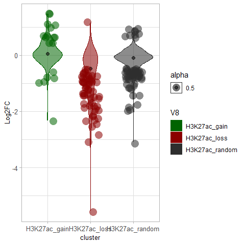
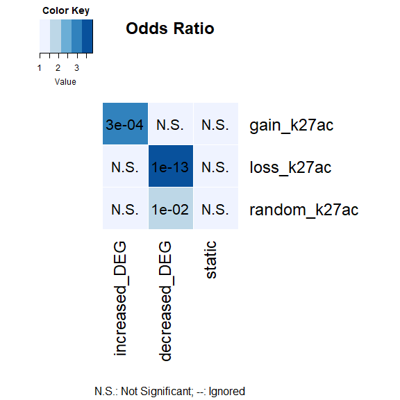
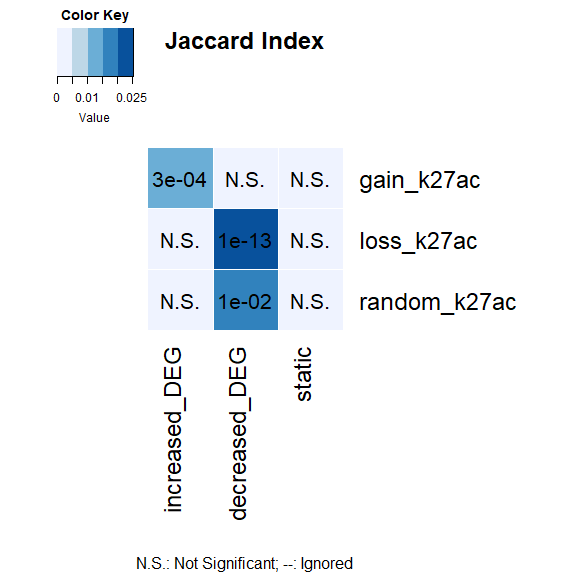
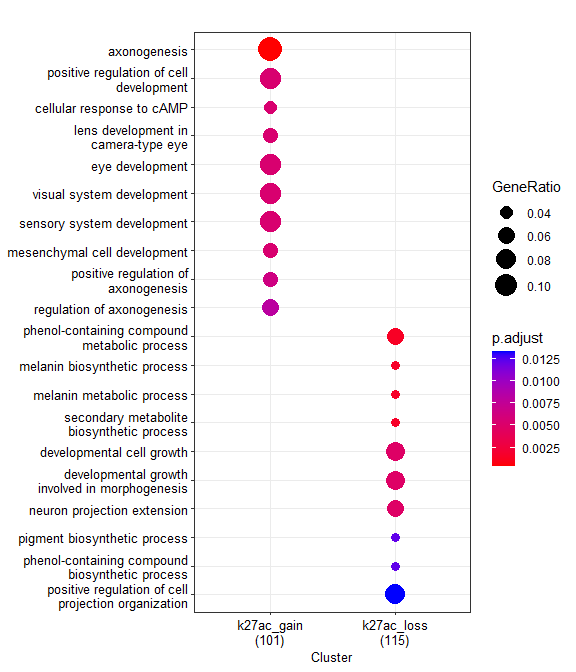
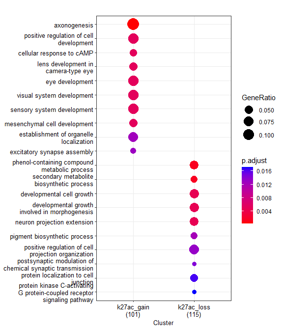
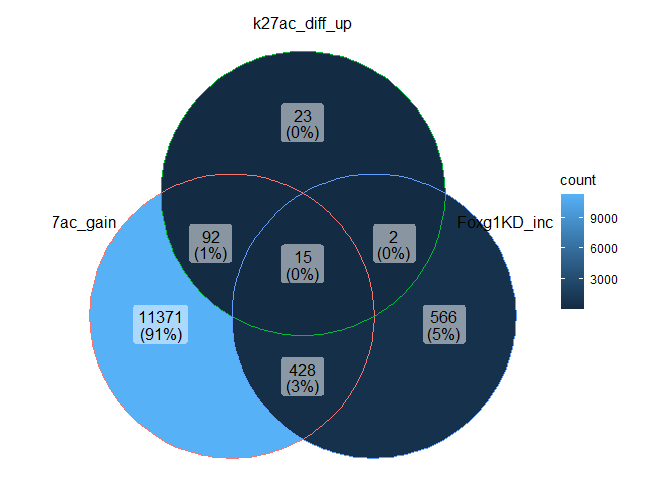

Differential H3K27ac upon FOXG1 KD (Supplementary figure 5)
================

``` r
library(RColorBrewer)
library(ggplot2)
library(clusterProfiler)
library(org.Mm.eg.db)
library(GeneOverlap)
library(ggVennDiagram)
library(VennDiagram)
```

### Differential H3K27ac upon FOXG1 Knockdown

*Differential binding sites are retrieved from csaw (snakepipes default
settings)*

<div class="figure" style="text-align: center">


<p class="caption">
Supp Fig5A: Differential H3K27ac changes upon reduced levels of FOXG1
</p>

</div>

#### Distribution of DEGs at differential H3K27ac (Gain/Loss) genes

``` r
# Input files
Foxg1_KD_DEGs<-read.table("~/Integrative-multi-omics-analyses-of-FOXG1-functions/Input Files/Figure 1/DE_genes_shrinked_apeglm_DIV11.tabular",
                          sep="\t", header = TRUE, fill = FALSE,)
Foxg1_KD_DEGs_df<- as.data.frame(Foxg1_KD_DEGs)
Foxg1_KD_DEGs_df$log2FoldChange<-as.numeric(gsub(",", ".", Foxg1_KD_DEGs_df$log2FoldChange))

# Filter increased and decreased DEGs upon FOXG1 KD in DIV11 hippocampal neurons
increased_DEG<-Foxg1_KD_DEGs_df[(Foxg1_KD_DEGs_df$log2FoldChange>=0.5 &
                                Foxg1_KD_DEGs_df$padj<=0.05),]
decreased_DEG<-Foxg1_KD_DEGs_df[(Foxg1_KD_DEGs_df$log2FoldChange<=(-0.5) &
                                  Foxg1_KD_DEGs_df$padj<=0.05),]
static_DEG<-Foxg1_KD_DEGs_df[(abs(Foxg1_KD_DEGs_df$log2FoldChange)< 0.5) & (Foxg1_KD_DEGs_df$padj>0.05),]

# List increased and decreased (and static) DEGs together
DEG_list<- list(increased_DEG= increased_DEG$X,
                decreased_DEG=decreased_DEG$X,
                static=static_DEG$X)

# Differential H3K27ac-DEG intersection file
k27ac_diff_DEGs= read.table("~/Integrative-multi-omics-analyses-of-FOXG1-functions/Input Files/SF3/Galaxy733-[diff_k27ac_DEG_intersection_long_file].tabular", 
                            sep="\t", quote="", fill=FALSE,)
k27ac_diff_DEG_df= as.data.frame(k27ac_diff_DEGs)
k27ac_diff_DEG_df[,'V8']<-factor(k27ac_diff_DEG_df[,'V8'])
k27ac_diff_DEG_df$V3<- as.numeric(k27ac_diff_DEG_df$V3)

# Filter increased and decreased DEGs upon FOXG1 KD in DIV11 hippocampal neurons
k27ac_diff_DEG_filt<- k27ac_diff_DEG_df[(abs(k27ac_diff_DEG_df$V3)>= 0.5 & (k27ac_diff_DEG_df$V6<= 0.01)),] 
    k27ac_diff_DEG_filt_df<- as.data.frame(k27ac_diff_DEG_filt)
k27ac_diff_DEG_filt_df[,'V8']<-factor(k27ac_diff_DEG_filt_df[,'V8'])
k27ac_diff_DEG_filt_df$V3<-as.numeric(k27ac_diff_DEG_filt_df$V3)

# violin plot of DEG distribution in each cluster (LFC.cutoff=0.5)
my_palette_2 <- c("darkgreen", "darkred", "gray18")

p_k27ac_diff <- ggplot(k27ac_diff_DEG_df, 
                  aes(x=V8, y=V3, fill=V8, color= V8, alpha=0.5, font=10))+ 
    scale_color_manual(values = my_palette_2, aesthetics = "fill")+
    scale_color_manual(values = my_palette_2, aesthetics = "colour")+
    geom_violin()+ 
    labs(x="cluster", y = "Log2FC")+ theme_light()+
    stat_summary(fun=median, geom="point", size=2, color="black")+
    theme(axis.text = element_text(size=10),
          axis.title = element_text(size=10))

violin_plot_k27ac_diff<- p_k27ac_diff + geom_jitter( data= k27ac_diff_DEG_filt_df, 
                                                     shape=16, 
                                                     size=5,
                                                     position=position_jitter(width=0.2, height= 0.1))
violin_plot_k27ac_diff
```



``` r
# export the violin plot to pdf (Supplementary Figure 5C)
pdf("~/Integrative-multi-omics-analyses-of-FOXG1-functions/Output/SF3/violin plot_diff_k27ac_DEGs_2006.pdf", 
    width=4, 
    height=4)
print(violin_plot_k27ac_diff)
dev.off()
```

    ## png 
    ##   2

#### GeneOverlap to test enrichment of DEGs in gain-loss-random clusters of H3K27ac enrichment

``` r
# Input files

# Gain of H3K27ac 
k27ac_diff_up<- read.table("~/Integrative-multi-omics-analyses-of-FOXG1-functions/Input Files/SF3/Galaxy64-[up_K27ac__Annotated_Peaks].tabular", 
                           sep="\t", header = TRUE, quote="", fill=FALSE,)

# Loss of H3K27ac
k27ac_diff_down<-read.table("~/Integrative-multi-omics-analyses-of-FOXG1-functions/Input Files/SF3/Galaxy66-[down_K27ac__Annotated_Peaks].tabular", 
                            sep="\t", header = TRUE, quote="", fill=FALSE,)

# Unchanged/Random H3K27ac
k27ac_random<-read.table("~/Integrative-multi-omics-analyses-of-FOXG1-functions/Input Files/SF3/random_k27ac_Annotated_Peaks.tabular", 
                         sep="\t", header = TRUE,)
```

    ## Warning in scan(file = file, what = what, sep = sep, quote = quote, dec = dec, :
    ## EOF within quoted string

    ## Warning in scan(file = file, what = what, sep = sep, quote = quote, dec = dec, :
    ## number of items read is not a multiple of the number of columns

``` r
# List them together
k27ac_diff_list<- list(gain_k27ac= k27ac_diff_up$geneId,
                       loss_k27ac= k27ac_diff_down$geneId,
                       random_k27ac= k27ac_random$geneId)

#H3K27ac clusters-DEGs over-representation matrix with GeneOverlap
GO_matrix_k27ac_diff<-newGOM(gsetA = k27ac_diff_list, 
                             gsetB=DEG_list)
GO_matrix_k27ac_diff
```

    ## A <3 x 3> GeneOverlapMatrix object
    ## Geneset A sizes:
    ##   gain_k27ac   loss_k27ac random_k27ac 
    ##          165          255          326 
    ## Geneset B sizes:
    ## increased_DEG decreased_DEG        static 
    ##          1012          2130         18772

``` r
# Oddsratio heatmap for looking at the association between the clusters-DEGs
heatmap_k27ac_diff<- drawHeatmap(GO_matrix_k27ac_diff, 
            what = c("odds.ratio"), 
            adj.p=TRUE, 
            cutoff=0.1, 
            ncolused = 5,
            grid.col = "Blues",
            note.col = "Black")
```



``` r
# Jaccard heatmap for looking at the similarities between clusters-DEGs
heatmap_k27ac_diff<- drawHeatmap(GO_matrix_k27ac_diff, 
            what = c("Jaccard"), 
            adj.p=TRUE, 
            cutoff=0.1, 
            ncolused = 5,
            grid.col = "Blues",
            note.col = "Black")
```


\#### Functional enrichment of differential H3K27ac peaks

``` r
# Symbol to ENTREZ ID annotation for clusterprofiler
k27ac_diff_up_id<-bitr(k27ac_diff_up$geneId,
                       fromType = "ENSEMBL",
                       toType = "ENTREZID", 
                       OrgDb ="org.Mm.eg.db", 
                       drop = TRUE)
```

    ## 'select()' returned 1:1 mapping between keys and columns

    ## Warning in bitr(k27ac_diff_up$geneId, fromType = "ENSEMBL", toType =
    ## "ENTREZID", : 18.94% of input gene IDs are fail to map...

``` r
k27ac_diff_down_id<-bitr(k27ac_diff_down$geneId,
                         fromType = "ENSEMBL", 
                         toType = "ENTREZID", 
                         OrgDb ="org.Mm.eg.db",
                         drop = TRUE)
```

    ## 'select()' returned 1:many mapping between keys and columns

    ## Warning in bitr(k27ac_diff_down$geneId, fromType = "ENSEMBL", toType =
    ## "ENTREZID", : 31.43% of input gene IDs are fail to map...

``` r
    # create geneCluster list
     list_k27ac_diff<-list(k27ac_gain= k27ac_diff_up_id$ENTREZID, 
                        k27ac_loss= k27ac_diff_down_id$ENTREZID)
     
# Differential Functional enrichment by comparecluster
  k27ac_diff_GO <- compareCluster(geneClusters = list_k27ac_diff,
                                 fun="enrichGO",
                                 OrgDb = "org.Mm.eg.db",
                                 ont = "BP",
                                 pAdjustMethod = "BH",
                                 qvalueCutoff = 0.05,
                                 pvalueCutoff = 0.05,
                                 readable = TRUE)
  
  # simplify the terms to avoid redundancy
k27ac_diff_GO_simp<-clusterProfiler::simplify(k27ac_diff_GO,
                                 cutoff = 0.5,
                                 by = "p.adjust",
                                 select_fun = min,
                                 measure = "Wang",
                                 semData = NULL)

    
# Dotplot of GO term analysis
dp_diff_K27ac = dotplot(k27ac_diff_GO,
             showCategory=10,
             font.size=10,
             includeAll=FALSE
             )
dp_diff_K27ac
```



``` r
# Dotplot of  simplified GO term analysis
dp_diff_K27ac_simp = dotplot(k27ac_diff_GO_simp,
             showCategory=10,
             font.size=10,
             includeAll=FALSE)
dp_diff_K27ac_simp
```



``` r
# create a reference table for GO terms and export to csv
    k27ac_diff_GO_df = as.data.frame(k27ac_diff_GO)
    write.table(k27ac_diff_GO_df, 
                file="~/Integrative-multi-omics-analyses-of-FOXG1-functions/Output/Figure 3/H3K27ac_diff_csaw_GOterms.txt",
                sep = "\t", quote = FALSE,)

# export the dotplots to pdf
pdf("~/Integrative-multi-omics-analyses-of-FOXG1-functions/Output/Figure 3/H3K27ac_diff_csaw_GOterms_dotplot_051022.pdf", width=5, height=6)
print(dp_diff_K27ac)
dev.off()
```

    ## png 
    ##   2

``` r
# Supplementary Figure5D
pdf("~/Integrative-multi-omics-analyses-of-FOXG1-functions/Output/Figure 3/k27ac_diff_csaw_GOterms_dotplot_simp_051022.pdf", width=5.5, height=5.8)
print(dp_diff_K27ac_simp)
dev.off()
```

    ## png 
    ##   2

#### Compare differential H3K27ac enrichment with H3k27ac enrichment at FOXG1 peaks by intersecting DEGs, k27ac changes at FOXG1 peaks and differential K27ac binding peaks

``` r
# Input K-means clustered H3K27ac files (from FIGURE 3A)
k27ac_c1<- read.table("~/Integrative-multi-omics-analyses-of-FOXG1-functions/Input Files/Figure 3/H3K27ac/Galaxy133-[K27ac_FOXG1_filtered_peaks_Cluster1].tabular",
                      header=TRUE, sep="\t", quote="", fill=FALSE,)
k27ac_c2<- read.table("~/Integrative-multi-omics-analyses-of-FOXG1-functions/Input Files/Figure 3/H3K27ac/Galaxy136-[K27ac_FOXG1_filtered_peaks_Cluster2].tabular", 
                      header=TRUE, sep="\t", quote="", fill=FALSE,)
k27ac_c3<- read.table("~/Integrative-multi-omics-analyses-of-FOXG1-functions/Input Files/Figure 3/H3K27ac/Galaxy139-[K27ac_FOXG1_filtered_peaks_Cluster3].tabular",
                      header=TRUE, sep="\t", quote="", fill=FALSE,)
k27ac_c4<- read.table("~/Integrative-multi-omics-analyses-of-FOXG1-functions/Input Files/Figure 3/H3K27ac/Galaxy142-[K27ac_FOXG1_filtered_peaks_Cluster4].tabular", 
                      header=TRUE, sep="\t", quote="", fill=FALSE,)

# Intersecting the increase of H3K27ac at FOXG1 peaks (cluster 2), differential gain of H3K27ac, and increased gene expression
venn_list_k27ac_up<- list(k27ac_gain=k27ac_c2$geneId,
                       k27ac_diff_up= k27ac_diff_up$geneId,
                       Foxg1KD_increased=increased_DEG$X)
venn_k27ac_up<-ggVennDiagram(venn_list_k27ac_up, 
                             n.sides = 3000)  
venn_k27ac_up
```



``` r
# list of intersecting genes (increase)
k27ac_up_intersect<-calculate.overlap(venn_list_k27ac_up)
intersect.k27ac.up<-bitr(k27ac_up_intersect$a3, 
                fromType = "ENSEMBL", 
                toType = "SYMBOL",
                OrgDb = org.Mm.eg.db)
```

    ## 'select()' returned 1:1 mapping between keys and columns

    ## Warning in bitr(k27ac_up_intersect$a3, fromType = "ENSEMBL", toType =
    ## "SYMBOL", : 13.04% of input gene IDs are fail to map...

``` r
intersect.k27ac.up
```

    ##               ENSEMBL        SYMBOL
    ## 1  ENSMUSG00000001911          Nfix
    ## 2  ENSMUSG00000003068         Stk11
    ## 3  ENSMUSG00000020770           Unk
    ## 4  ENSMUSG00000020873       Slc35b1
    ## 5  ENSMUSG00000023018       Smarcd1
    ## 6  ENSMUSG00000025468          Caly
    ## 7  ENSMUSG00000028211     Trp53inp1
    ## 8  ENSMUSG00000029346          Srrd
    ## 9  ENSMUSG00000029413          Naaa
    ## 10 ENSMUSG00000029580          Actb
    ## 11 ENSMUSG00000030323        Ift122
    ## 12 ENSMUSG00000031757           Mt4
    ## 13 ENSMUSG00000034640        Tiparp
    ## 14 ENSMUSG00000036565         Ttyh3
    ## 16 ENSMUSG00000041328         Pcf11
    ## 17 ENSMUSG00000041523          Upk2
    ## 18 ENSMUSG00000053877         Srcap
    ## 19 ENSMUSG00000070802        Pnma8b
    ## 20 ENSMUSG00000074203 G430095P16Rik
    ## 21 ENSMUSG00000078554       Fam229a

``` r
# Intersecting the decrease of H3K27ac at FOXG1 peaks (cluster 3), differential loss of H3K27ac, and decreased gene expression
venn_list_k27ac_down<- list(k27ac_loss=k27ac_c3$geneId,
                          k27ac_diff_down= k27ac_diff_down$geneId,
                          Foxg1KD_decreased=decreased_DEG$X)
venn_k27ac_down<-ggVennDiagram(venn_list_k27ac_down, 
                               n.sides = 3000)  
venn_k27ac_down
```


``` r
# list of intersecting genes (decrease)
k27ac_down_intersect<- calculate.overlap(venn_list_k27ac_down)
intersect.k27ac.down<-bitr(k27ac_down_intersect$a3, 
                fromType = "ENSEMBL", 
                toType = "SYMBOL", 
                OrgDb = org.Mm.eg.db)
```

    ## 'select()' returned 1:1 mapping between keys and columns

``` r
intersect.k27ac.down
```

    ##              ENSEMBL        SYMBOL
    ## 1 ENSMUSG00000029491         Pde6b
    ## 2 ENSMUSG00000034910         Pygo1
    ## 3 ENSMUSG00000064225         Paqr9
    ## 4 ENSMUSG00000093551 4930505G20Rik

``` r
sessionInfo()
```

    ## R version 4.2.0 (2022-04-22 ucrt)
    ## Platform: x86_64-w64-mingw32/x64 (64-bit)
    ## Running under: Windows 10 x64 (build 17763)
    ## 
    ## Matrix products: default
    ## 
    ## locale:
    ## [1] LC_COLLATE=English_Germany.1252  LC_CTYPE=English_Germany.1252   
    ## [3] LC_MONETARY=English_Germany.1252 LC_NUMERIC=C                    
    ## [5] LC_TIME=English_Germany.1252    
    ## 
    ## attached base packages:
    ## [1] grid      stats4    stats     graphics  grDevices utils     datasets 
    ## [8] methods   base     
    ## 
    ## other attached packages:
    ##  [1] VennDiagram_1.7.3     futile.logger_1.4.3   ggVennDiagram_1.2.2  
    ##  [4] GeneOverlap_1.32.0    org.Mm.eg.db_3.15.0   AnnotationDbi_1.58.0 
    ##  [7] IRanges_2.30.1        S4Vectors_0.34.0      Biobase_2.56.0       
    ## [10] BiocGenerics_0.42.0   clusterProfiler_4.4.4 ggplot2_3.4.0        
    ## [13] RColorBrewer_1.1-3   
    ## 
    ## loaded via a namespace (and not attached):
    ##   [1] fgsea_1.22.0           colorspace_2.0-3       ggtree_3.4.4          
    ##   [4] class_7.3-20           ellipsis_0.3.2         qvalue_2.28.0         
    ##   [7] XVector_0.36.0         aplot_0.1.9            proxy_0.4-27          
    ##  [10] rstudioapi_0.14        farver_2.1.1           graphlayouts_0.8.4    
    ##  [13] ggrepel_0.9.2          bit64_4.0.5            fansi_1.0.3           
    ##  [16] scatterpie_0.1.8       codetools_0.2-18       splines_4.2.0         
    ##  [19] cachem_1.0.6           GOSemSim_2.22.0        knitr_1.41            
    ##  [22] polyclip_1.10-4        jsonlite_1.8.3         GO.db_3.15.0          
    ##  [25] png_0.1-7              ggforce_0.4.1          compiler_4.2.0        
    ##  [28] httr_1.4.4             assertthat_0.2.1       Matrix_1.5-3          
    ##  [31] fastmap_1.1.0          lazyeval_0.2.2         cli_3.4.1             
    ##  [34] formatR_1.12           tweenr_2.0.2           htmltools_0.5.3       
    ##  [37] tools_4.2.0            igraph_1.3.5           gtable_0.3.1          
    ##  [40] glue_1.6.2             GenomeInfoDbData_1.2.8 reshape2_1.4.4        
    ##  [43] DO.db_2.9              dplyr_1.0.10           fastmatch_1.1-3       
    ##  [46] Rcpp_1.0.9             enrichplot_1.16.2      vctrs_0.5.1           
    ##  [49] Biostrings_2.64.1      ape_5.6-2              nlme_3.1-160          
    ##  [52] ggraph_2.1.0           xfun_0.35              stringr_1.4.1         
    ##  [55] lifecycle_1.0.3        gtools_3.9.3           DOSE_3.22.1           
    ##  [58] zlibbioc_1.42.0        MASS_7.3-58.1          scales_1.2.1          
    ##  [61] tidygraph_1.2.2        parallel_4.2.0         lambda.r_1.2.4        
    ##  [64] yaml_2.3.6             memoise_2.0.1          gridExtra_2.3         
    ##  [67] downloader_0.4         ggfun_0.0.9            yulab.utils_0.0.5     
    ##  [70] stringi_1.7.8          RSQLite_2.2.19         highr_0.9             
    ##  [73] e1071_1.7-12           tidytree_0.4.1         caTools_1.18.2        
    ##  [76] BiocParallel_1.30.4    GenomeInfoDb_1.32.4    rlang_1.0.6           
    ##  [79] pkgconfig_2.0.3        bitops_1.0-7           evaluate_0.18         
    ##  [82] lattice_0.20-45        sf_1.0-9               purrr_0.3.5           
    ##  [85] labeling_0.4.2         treeio_1.20.2          patchwork_1.1.2       
    ##  [88] shadowtext_0.1.2       bit_4.0.5              tidyselect_1.2.0      
    ##  [91] plyr_1.8.8             magrittr_2.0.3         R6_2.5.1              
    ##  [94] gplots_3.1.3           generics_0.1.3         DBI_1.1.3             
    ##  [97] pillar_1.8.1           withr_2.5.0            units_0.8-0           
    ## [100] KEGGREST_1.36.3        RCurl_1.98-1.9         tibble_3.1.8          
    ## [103] crayon_1.5.2           futile.options_1.0.1   KernSmooth_2.23-20    
    ## [106] utf8_1.2.2             RVenn_1.1.0            rmarkdown_2.18        
    ## [109] viridis_0.6.2          data.table_1.14.6      blob_1.2.3            
    ## [112] classInt_0.4-8         digest_0.6.30          tidyr_1.2.1           
    ## [115] gridGraphics_0.5-1     munsell_0.5.0          viridisLite_0.4.1     
    ## [118] ggplotify_0.1.0
