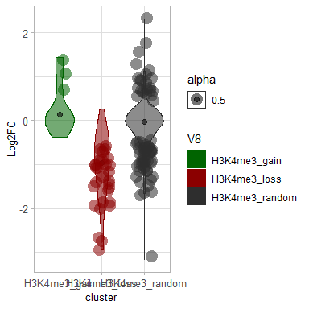
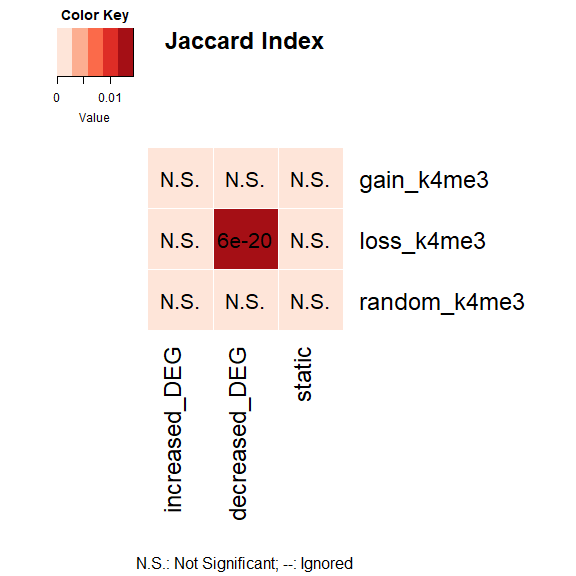
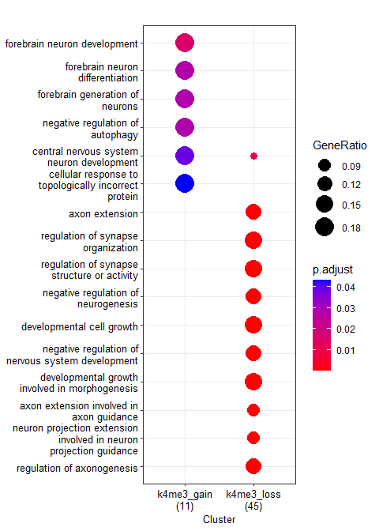
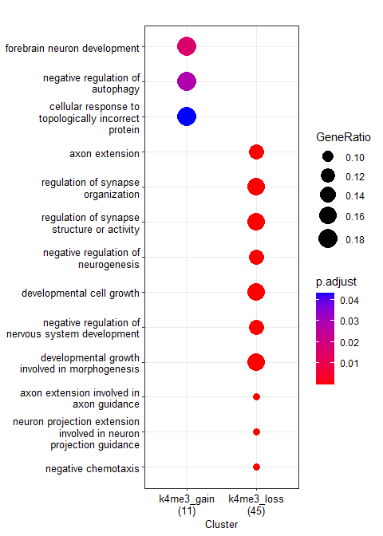

Differential H3K4me3 upon FOXG1 KD (supplementary figure 6)
================

load packages

``` r
library(RColorBrewer)
library(ggplot2)
library(clusterProfiler)
library(org.Mm.eg.db)
library(GeneOverlap)
library(ggVennDiagram)
library(VennDiagram)
```

# Differential H3K4me3 upon FOXG1 Knockdown

*Differential binding sites are retrieved from csaw (snakepipes default
settings)*

<div class="figure" style="text-align: center">


<p class="caption">
Supp Fig6A: Differential H3K4me3 changes upon reduced levels of FOXG1
</p>

</div>

#### Distribution of DEGs at differential H3K27ac (Gain/Loss) genes

``` r
# Input files
Foxg1_KD_DEGs<-read.table("~/Integrative-multi-omics-analyses-of-FOXG1-functions/Input Files/Figure 1/DE_genes_shrinked_apeglm_DIV11.tabular",
                          sep="\t", header = TRUE, fill = FALSE,)
Foxg1_KD_DEGs_df<- as.data.frame(Foxg1_KD_DEGs)
Foxg1_KD_DEGs_df$log2FoldChange<-as.numeric(gsub(",", ".", Foxg1_KD_DEGs_df$log2FoldChange))

# Filter increased and decreased DEGs upon FOXG1 KD in DIV11 hippocampal neurons
increased_DEG<-Foxg1_KD_DEGs_df[(Foxg1_KD_DEGs_df$log2FoldChange>=0.5 &
                                Foxg1_KD_DEGs_df$padj<=0.05),]
decreased_DEG<-Foxg1_KD_DEGs_df[(Foxg1_KD_DEGs_df$log2FoldChange<=(-0.5) &
                                  Foxg1_KD_DEGs_df$padj<=0.05),]
static_DEG<-Foxg1_KD_DEGs_df[(abs(Foxg1_KD_DEGs_df$log2FoldChange)< 0.5) & (Foxg1_KD_DEGs_df$padj>0.05),]

# List increased and decreased (and static) DEGs together
DEG_list<- list(increased_DEG= increased_DEG$X,
                decreased_DEG=decreased_DEG$X,
                static=static_DEG$X
                )

# Differential H3K4me3-DEG files
k4me3_diff_DEGs= read.table("~/Integrative-multi-omics-analyses-of-FOXG1-functions/Input Files/SF4/Galaxy77-[diff_k4me3_DEG_intersection_long_file].tabular", 
                            sep="\t", quote="", fill=FALSE,)
k4me3_diff_DEG_df= as.data.frame(k4me3_diff_DEGs)
k4me3_diff_DEG_df[,'V8']<-factor(k4me3_diff_DEG_df[,'V8'])
k4me3_diff_DEG_df$V3<- as.numeric(k4me3_diff_DEG_df$V3)

# Filter increased and decreased DEGs upon FOXG1 KD in DIV11 hippocampal neurons
k4me3_diff_DEG_filt<- k4me3_diff_DEG_df[(abs(k4me3_diff_DEG_df$V3)>= 0.5 & (k4me3_diff_DEG_df$V6<= 0.01)),] 
    k4me3_diff_DEG_filt_df<- as.data.frame(k4me3_diff_DEG_filt)
k4me3_diff_DEG_filt_df[,'V8']<-factor(k4me3_diff_DEG_filt_df[,'V8'])
k4me3_diff_DEG_filt_df$V3<-as.numeric(k4me3_diff_DEG_filt_df$V3)

# violin plot of DEG distribution in each cluster (LFC.cutoff=0.5)
my_palette_2 <- c("darkgreen", "darkred", "gray18")
p_k4me3_diff <- ggplot(k4me3_diff_DEG_df, 
                  aes(x=V8, y=V3, fill=V8, color= V8, alpha=0.5, font=10))+ 
    scale_color_manual(values = my_palette_2, aesthetics = "fill")+
    scale_color_manual(values = my_palette_2, aesthetics = "colour")+
    geom_violin()+ 
    labs(x="cluster", y = "Log2FC")+ theme_light()+
    stat_summary(fun=median, geom="point", size=2, color="black")+
    theme(axis.text = element_text(size=10),
          axis.title = element_text(size=10))
violin_plot_k4me3_diff<- p_k4me3_diff + geom_jitter( data= k4me3_diff_DEG_filt_df, 
                          shape=16, 
                          size=5,
                          position=position_jitter(width=0.2, height= 0.1))
violin_plot_k4me3_diff
```

<!-- -->

``` r
# export the violin plot to pdf (Supplementary Figure 6C)
pdf("~/Integrative-multi-omics-analyses-of-FOXG1-functions/Output/SF4/violin plot_differential_K4me3_DEGs_2006.pdf", 
    width=4, 
    height=4)
print(violin_plot_k4me3_diff)
dev.off()
```

    ## png 
    ##   2

### GeneOverlap to test enrichment of DEGs in gain-loss-random clusters of k4me3

``` r
# Input files

# Gain of H3K4me3 
k4me3_diff_up<- read.table("~/Integrative-multi-omics-analyses-of-FOXG1-functions/Input Files/SF4/k4me3_up_Annotated_Peaks].tabular", sep="\t", header = TRUE,)
# Loss of H3K4me3
k4me3_diff_down<-read.table("~/Integrative-multi-omics-analyses-of-FOXG1-functions/Input Files/SF4/k4me3_down_Annotated_Peaks].tabular", sep="\t", header = TRUE,)
# Unchnaged/Random H3K4me3
k4me3_random<-read.table("~/Integrative-multi-omics-analyses-of-FOXG1-functions/Input Files/SF4/random_k4me3_Annotated_Peaks.tabular", sep="\t", header = TRUE,)
```

    ## Warning in scan(file = file, what = what, sep = sep, quote = quote, dec = dec, :
    ## EOF within quoted string

    ## Warning in scan(file = file, what = what, sep = sep, quote = quote, dec = dec, :
    ## number of items read is not a multiple of the number of columns

``` r
# H3K4me3 cluster list
k4me3_diff_list<- list(gain_k4me3= k4me3_diff_up$geneId,
                  loss_k4me3= k4me3_diff_down$geneId,
                  random_k4me3= k4me3_random$geneId)
                  
# H3K4me3 clusters-DEGs over-representation matrix
GO_matrix_k4me3_diff<-newGOM(k4me3_diff_list, 
                             DEG_list, 
                             genome.size = NULL)
GO_matrix_k4me3_diff
```

    ## A <3 x 3> GeneOverlapMatrix object
    ## Geneset A sizes:
    ##   gain_k4me3   loss_k4me3 random_k4me3 
    ##           18           64          395 
    ## Geneset B sizes:
    ## increased_DEG decreased_DEG        static 
    ##          1012          2130         18772

``` r
# Oddsratio heatmap for looking at the association between the clusters-DEGs
heatmap_k4me3_diff<- drawHeatmap(GO_matrix_k4me3_diff, 
            what = c("odds.ratio"), 
            adj.p=TRUE, 
            cutoff=0.05, 
            ncolused = 5,
            grid.col = "Reds",
            note.col = "Black")
```


``` r
# Jaccard heatmap for looking at the similarities between clusters-DEGs
heatmap_k4me3_diff<- drawHeatmap(GO_matrix_k4me3_diff, 
            what = c("Jaccard"), 
            adj.p=TRUE, 
            cutoff=0.05, 
            ncolused = 5,
            grid.col = "Reds",
            note.col = "Black")
```


\### Functional terms of differential H3K4me3 regions (from Csaw output)

``` r
# Symbol to ENTREZ ID annotation
k4me3_diff_up_id<-bitr(k4me3_diff_up$geneId, 
                       fromType = "ENSEMBL", 
                       toType = "ENTREZID", 
                       OrgDb ="org.Mm.eg.db", 
                       drop = TRUE)
```

    ## 'select()' returned 1:1 mapping between keys and columns

``` r
k4me3_diff_down_id<-bitr(k4me3_diff_down$geneId, 
                         fromType = "ENSEMBL", 
                         toType = "ENTREZID", 
                         OrgDb ="org.Mm.eg.db",
                         drop = TRUE)
```

    ## 'select()' returned 1:1 mapping between keys and columns

    ## Warning in bitr(k4me3_diff_down$geneId, fromType = "ENSEMBL", toType =
    ## "ENTREZID", : 2.08% of input gene IDs are fail to map...

``` r
# create geneCluster list (gain and loss together)
     list_k4me3_diff<-list(k4me3_gain= k4me3_diff_up_id$ENTREZID, 
                        k4me3_loss= k4me3_diff_down_id$ENTREZID)

# GO term enrichment analysis of differential H3K4me3 peaks
  k4me3_diff_GO <- compareCluster(geneClusters = list_k4me3_diff,
                                 fun="enrichGO",
                                 OrgDb = "org.Mm.eg.db",
                                 ont = "BP",
                                 pAdjustMethod = "BH",
                                 qvalueCutoff = 0.05,
                                 pvalueCutoff = 0.05,
                                 readable = TRUE)
  # Simplify the terms to avoid redundancy
    k4me3_diff_GO_simp<-clusterProfiler::simplify(k4me3_diff_GO,
                                 cutoff = 0.5,
                                 by = "p.adjust",
                                 select_fun = min,
                                 measure = "Wang",
                                 semData = NULL)

# Dotplot of GO term analysis
dp_diff_k4me3 = dotplot(k4me3_diff_GO,
             showCategory=10,
             font.size=10
             )
dp_diff_k4me3
```



``` r
# Dotplot of simplified terms
dp_diff_k4me3_simp = dotplot(k4me3_diff_GO_simp,
             showCategory=10,
             font.size=10
             )
  dp_diff_k4me3_simp
```



``` r
# create reference table for GO terms and export to a tabular file
df_k4me3_diff_GO = as.data.frame(k4me3_diff_GO)
write.table(df_k4me3_diff_GO, 
          file="~/Integrative-multi-omics-analyses-of-FOXG1-functions/Output/SF4/K4me3_diff_GOterms.txt", sep = "\t", quote=FALSE,)


# export the dotplots to pdf
pdf("~/Integrative-multi-omics-analyses-of-FOXG1-functions/Output/SF4/K4me3_diff_GO terms_dotplot_2006.pdf", 
    width=6, height=7)
print(dp_diff_k4me3)
dev.off()
```

    ## png 
    ##   2

``` r
pdf("~/Integrative-multi-omics-analyses-of-FOXG1-functions/Output/SF4/k4me3_diff_csaw_GO terms_dotplot_simp_2006.pdf",
    width=7, height=6)
print(dp_diff_k4me3_simp)
dev.off()
```

    ## png 
    ##   2

``` r
sessionInfo()
```

    ## R version 4.2.0 (2022-04-22 ucrt)
    ## Platform: x86_64-w64-mingw32/x64 (64-bit)
    ## Running under: Windows 10 x64 (build 17763)
    ## 
    ## Matrix products: default
    ## 
    ## locale:
    ## [1] LC_COLLATE=English_Germany.1252  LC_CTYPE=English_Germany.1252   
    ## [3] LC_MONETARY=English_Germany.1252 LC_NUMERIC=C                    
    ## [5] LC_TIME=English_Germany.1252    
    ## 
    ## attached base packages:
    ## [1] grid      stats4    stats     graphics  grDevices utils     datasets 
    ## [8] methods   base     
    ## 
    ## other attached packages:
    ##  [1] VennDiagram_1.7.3     futile.logger_1.4.3   ggVennDiagram_1.2.2  
    ##  [4] GeneOverlap_1.32.0    org.Mm.eg.db_3.15.0   AnnotationDbi_1.58.0 
    ##  [7] IRanges_2.30.1        S4Vectors_0.34.0      Biobase_2.56.0       
    ## [10] BiocGenerics_0.42.0   clusterProfiler_4.4.4 ggplot2_3.4.0        
    ## [13] RColorBrewer_1.1-3   
    ## 
    ## loaded via a namespace (and not attached):
    ##   [1] fgsea_1.22.0           colorspace_2.0-3       ggtree_3.4.4          
    ##   [4] ellipsis_0.3.2         qvalue_2.28.0          XVector_0.36.0        
    ##   [7] aplot_0.1.9            rstudioapi_0.14        farver_2.1.1          
    ##  [10] graphlayouts_0.8.4     ggrepel_0.9.2          bit64_4.0.5           
    ##  [13] fansi_1.0.3            scatterpie_0.1.8       codetools_0.2-18      
    ##  [16] splines_4.2.0          cachem_1.0.6           GOSemSim_2.22.0       
    ##  [19] knitr_1.41             polyclip_1.10-4        jsonlite_1.8.3        
    ##  [22] GO.db_3.15.0           png_0.1-7              ggforce_0.4.1         
    ##  [25] compiler_4.2.0         httr_1.4.4             assertthat_0.2.1      
    ##  [28] Matrix_1.5-3           fastmap_1.1.0          lazyeval_0.2.2        
    ##  [31] cli_3.4.1              formatR_1.12           tweenr_2.0.2          
    ##  [34] htmltools_0.5.3        tools_4.2.0            igraph_1.3.5          
    ##  [37] gtable_0.3.1           glue_1.6.2             GenomeInfoDbData_1.2.8
    ##  [40] reshape2_1.4.4         DO.db_2.9              dplyr_1.0.10          
    ##  [43] fastmatch_1.1-3        Rcpp_1.0.9             enrichplot_1.16.2     
    ##  [46] vctrs_0.5.1            Biostrings_2.64.1      ape_5.6-2             
    ##  [49] nlme_3.1-160           ggraph_2.1.0           xfun_0.35             
    ##  [52] stringr_1.4.1          lifecycle_1.0.3        gtools_3.9.3          
    ##  [55] DOSE_3.22.1            zlibbioc_1.42.0        MASS_7.3-58.1         
    ##  [58] scales_1.2.1           tidygraph_1.2.2        parallel_4.2.0        
    ##  [61] lambda.r_1.2.4         yaml_2.3.6             memoise_2.0.1         
    ##  [64] gridExtra_2.3          downloader_0.4         ggfun_0.0.9           
    ##  [67] yulab.utils_0.0.5      stringi_1.7.8          RSQLite_2.2.19        
    ##  [70] highr_0.9              tidytree_0.4.1         caTools_1.18.2        
    ##  [73] BiocParallel_1.30.4    GenomeInfoDb_1.32.4    rlang_1.0.6           
    ##  [76] pkgconfig_2.0.3        bitops_1.0-7           evaluate_0.18         
    ##  [79] lattice_0.20-45        purrr_0.3.5            labeling_0.4.2        
    ##  [82] treeio_1.20.2          patchwork_1.1.2        shadowtext_0.1.2      
    ##  [85] bit_4.0.5              tidyselect_1.2.0       plyr_1.8.8            
    ##  [88] magrittr_2.0.3         R6_2.5.1               gplots_3.1.3          
    ##  [91] generics_0.1.3         DBI_1.1.3              pillar_1.8.1          
    ##  [94] withr_2.5.0            KEGGREST_1.36.3        RCurl_1.98-1.9        
    ##  [97] tibble_3.1.8           crayon_1.5.2           futile.options_1.0.1  
    ## [100] KernSmooth_2.23-20     utf8_1.2.2             RVenn_1.1.0           
    ## [103] rmarkdown_2.18         viridis_0.6.2          data.table_1.14.6     
    ## [106] blob_1.2.3             digest_0.6.30          tidyr_1.2.1           
    ## [109] gridGraphics_0.5-1     munsell_0.5.0          viridisLite_0.4.1     
    ## [112] ggplotify_0.1.0
