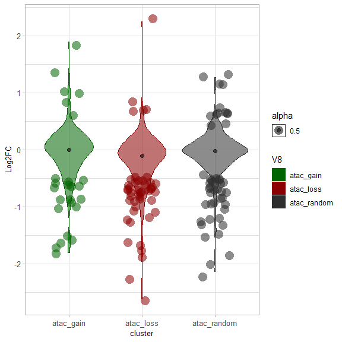
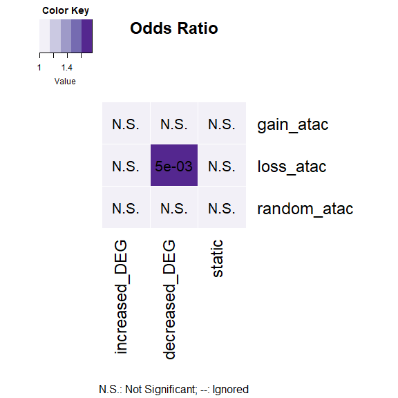
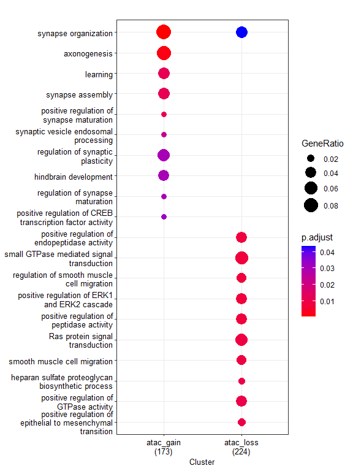
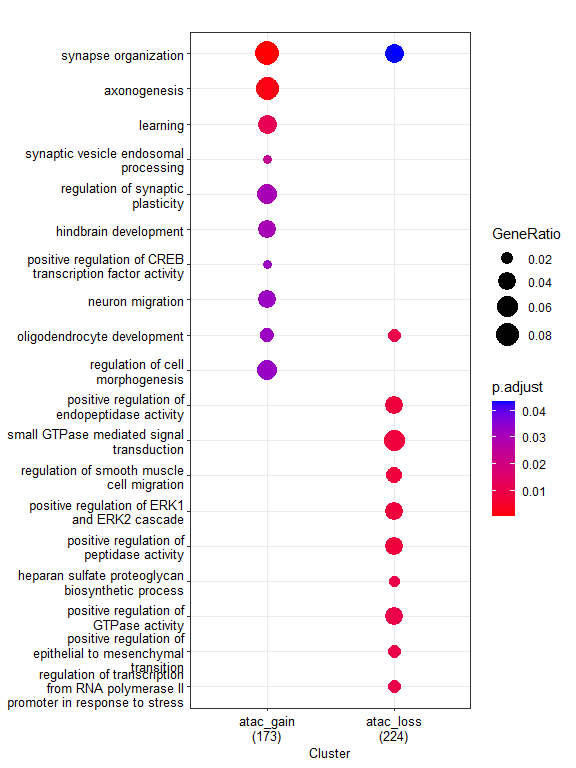
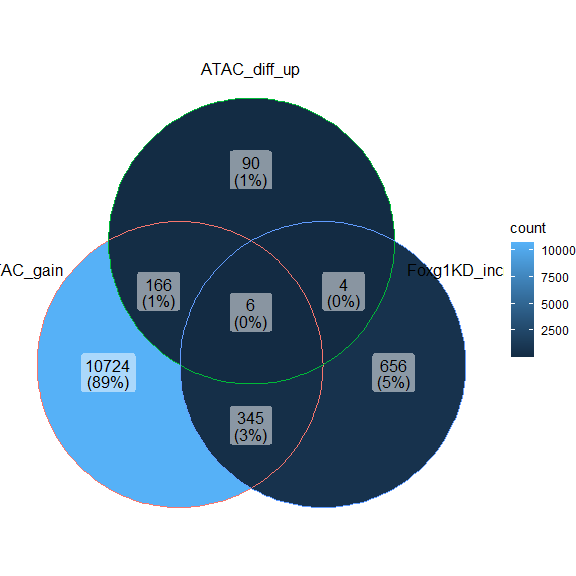

Dİfferential chromatin accessibility upon FOXG1 KD (Supplementary figure
6)
================

load packages

``` r
library(RColorBrewer)
library(ggplot2)
library(clusterProfiler)
library(org.Mm.eg.db)
library(GeneOverlap)
library(ggVennDiagram)
library(VennDiagram)
```

# Differential binding of ATAC upon Foxg1 knockdown

*Differential binding sites from csaw (snakepipes)* \## Heatmap of FOXG1
and ATAC scores over differential ATAC regions

``` r
knitr::include_graphics("C:/Users/admin.ia1014/Documents/Integrative-multi-omics-analyses-of-FOXG1-functions/Input Files/SF5/Diff_ATAC_FOXG1_mean and LFC.png")
```

<div class="figure" style="text-align: center">


<p class="caption">
Supp Fig 6A: Differential accessbility changes upon reduced levels of
FOXG1
</p>

</div>

#### Distribution of DEGs at differential ATAC (Gain/Loss) genes

``` r
# upload files
atac_diff_DEGs= read.table("~/Integrative-multi-omics-analyses-of-FOXG1-functions/Input Files/SF5/Galaxy735-[diff_atac_DEG_intersection_long_file].tabular",
                           sep="\t", quote="", fill=FALSE,)
atac_diff_DEG_df= as.data.frame(atac_diff_DEGs)
atac_diff_DEG_df[,'V8']<-factor(atac_diff_DEG_df[,'V8'])
atac_diff_DEG_df$V3<- as.numeric(atac_diff_DEG_df$V3)

#Filter
atac_diff_DEG_filt<- atac_diff_DEG_df[(abs(atac_diff_DEG_df$V3)>= 0.5 & (atac_diff_DEG_df$V6<= 0.01)),] 
    atac_diff_DEG_filt_df<- as.data.frame(atac_diff_DEG_filt)
atac_diff_DEG_filt_df[,'V8']<-factor(atac_diff_DEG_filt_df[,'V8'])
atac_diff_DEG_filt_df$V3<-as.numeric(atac_diff_DEG_filt_df$V3)

# plot DEG distribution in each cluster, LFC.cutoff= 0.5
my_palette_2 <- c("darkgreen", "darkred", "gray18")
p_atac_diff <- ggplot(atac_diff_DEG_df, 
                  aes(x=V8, y=V3, fill=V8, color= V8, alpha=0.5, font=10))+ 
    scale_color_manual(values = my_palette_2, aesthetics = "fill")+
    scale_color_manual(values = my_palette_2, aesthetics = "colour")+
    geom_violin()+ 
    labs(x="cluster", y = "Log2FC")+ theme_light()+
    stat_summary(fun=median, geom="point", size=2, color="black")+
    theme(axis.text = element_text(size=10),
          axis.title = element_text(size=10))
# Violin plot of the distribution of DEGs in gain/loss of accessibility clusters upon FOXG1 KD
violin_plot_atac<- p_atac_diff + geom_jitter( data= atac_diff_DEG_filt_df, 
                          shape=16, 
                          size=5,
                          position=position_jitter(width=0.2, height= 0.1))


violin_plot_atac
```



``` r
# export the violin plot to pdf
pdf("~/Integrative-multi-omics-analyses-of-FOXG1-functions/Output/SF5/violin plot_diff_atac_DEGs_051022.pdf", 
    width=4, 
    height=4
    )
print(violin_plot_atac)
dev.off()
```

    ## png 
    ##   2

### Test enrichment of DEGs in gain-loss-random clusters of ATAC

``` r
# upload files

# DEGs
Foxg1_KD_DEGs<-read.table("~/Integrative-multi-omics-analyses-of-FOXG1-functions/Input Files/Figure 1/DE_genes_shrinked_apeglm_DIV11.tabular", sep="\t", header = TRUE, fill = FALSE,)
Foxg1_KD_DEGs_df<- as.data.frame(Foxg1_KD_DEGs)
Foxg1_KD_DEGs_df$log2FoldChange<-as.numeric(gsub(",", ".", Foxg1_KD_DEGs_df$log2FoldChange))

# Filter the DEGs
increased_DEG<-Foxg1_KD_DEGs_df[(Foxg1_KD_DEGs_df$log2FoldChange>=0.5 &
                                Foxg1_KD_DEGs_df$padj<=0.05),]
decreased_DEG<-Foxg1_KD_DEGs_df[(Foxg1_KD_DEGs_df$log2FoldChange<=(-0.5) &
                                  Foxg1_KD_DEGs_df$padj<=0.05),]
static_DEG<-Foxg1_KD_DEGs_df[(abs(Foxg1_KD_DEGs_df$log2FoldChange)< 0.5) & (Foxg1_KD_DEGs_df$padj>0.05),]

# Put them together in a list
DEG_list<- list(increased_DEG= increased_DEG$X,
                decreased_DEG=decreased_DEG$X,
                static=static_DEG$X
                )

# Differential ATAC peak files (gain-loss-random)
atac_diff_up<- read.table("~/Integrative-multi-omics-analyses-of-FOXG1-functions/Input Files/SF5/Galaxy673-[atac_up__Annotated_Peaks].tabular",
                          sep="\t", header = TRUE, quote="", fill=FALSE,)
atac_diff_down<-read.table("~/Integrative-multi-omics-analyses-of-FOXG1-functions/Input Files/SF5/Galaxy674-[atac_down__Annotated_Peaks].tabular", 
                           sep="\t", header = TRUE, quote="", fill=FALSE,)
atac_random<-read.table("~/Integrative-multi-omics-analyses-of-FOXG1-functions/Input Files/SF5/atac_random__Annotated_Peaks.tabular", 
                        sep="\t", header = TRUE,)

# Put them together in a clustered list
atac_diff_list<- list(gain_atac= atac_diff_up$geneId,
                       loss_atac= atac_diff_down$geneId,
                       random_atac= atac_random$geneId)

# ATAC clusters-DEGs over-representation matrix
GO_matrix_atac_diff<-newGOM(gsetA = atac_diff_list, 
                            gsetB=DEG_list)
GO_matrix_atac_diff
```

    ## A <3 x 3> GeneOverlapMatrix object
    ## Geneset A sizes:
    ##   gain_atac   loss_atac random_atac 
    ##         322         347         257 
    ## Geneset B sizes:
    ## increased_DEG decreased_DEG        static 
    ##          1012          2130         18772

``` r
# Oddsratio heatmap
heatmap_atac_diff<- drawHeatmap(GO_matrix_atac_diff, 
            what = c("odds.ratio"), 
            adj.p=TRUE, 
            cutoff=0.1, 
            ncolused = 5,
            grid.col = "Purples",
            note.col = "Black")
```



``` r
# Jaccard heatmap
heatmap_atac_diff<- drawHeatmap(GO_matrix_atac_diff, 
            what = c("Jaccard"), 
            adj.p=TRUE, 
            cutoff=0.1, 
            ncolused = 5,
            grid.col = "Purples",
            note.col = "Black")
```


### Functional enrichment of differential ATAC regions

``` r
# Symbol to ENTREZ ID annotation

atac_diff_up_id<-bitr(atac_diff_up$geneId, fromType = "ENSEMBL", toType = "ENTREZID", OrgDb ="org.Mm.eg.db", drop = TRUE)
```

    ## 'select()' returned 1:1 mapping between keys and columns

    ## Warning in bitr(atac_diff_up$geneId, fromType = "ENSEMBL", toType =
    ## "ENTREZID", : 23.31% of input gene IDs are fail to map...

``` r
atac_diff_down_id<-bitr(atac_diff_down$geneId, fromType = "ENSEMBL", toType = "ENTREZID", OrgDb ="org.Mm.eg.db", drop = TRUE)
```

    ## 'select()' returned 1:1 mapping between keys and columns

    ## Warning in bitr(atac_diff_down$geneId, fromType = "ENSEMBL", toType =
    ## "ENTREZID", : 16.78% of input gene IDs are fail to map...

``` r
# create geneCluster list
 list_atac_diff<-list(atac_gain= atac_diff_up_id$ENTREZID, 
                      atac_loss= atac_diff_down_id$ENTREZID)

# Differential Functional enrichment by comparecluster
  atac_diff_GO <- compareCluster(geneClusters = list_atac_diff,
                                 fun="enrichGO",
                                 OrgDb = "org.Mm.eg.db",
                                 ont = "BP",
                                 pAdjustMethod = "BH",
                                 qvalueCutoff = 0.05,
                                 pvalueCutoff = 0.05,
                                 readable = TRUE)
  
# Simplify the terms to avoid redundancy
atac_diff_GO_simp<-simplify(atac_diff_GO,
                                 cutoff = 0.5,
                                 by = "p.adjust",
                                 select_fun = min,
                                 measure = "Wang",
                                 semData = NULL)


# Dotplot of GO term analysis
dp_diff_ATAC = dotplot(atac_diff_GO,
             showCategory=10,
             font.size=10
             )
dp_diff_ATAC
```



``` r
# Dotplot of simplified terms
dp_diff_ATAC_simp = dotplot(atac_diff_GO_simp,
             showCategory=10,
             font.size=10
             )
dp_diff_ATAC_simp
```



``` r
# export the dotplots to pdf
pdf("~/Integrative-multi-omics-analyses-of-FOXG1-functions/Output/SF5/atac_diff_csaw_GOterms_dotplot_2006.pdf", width=6, height=5)
print(dp_diff_ATAC)
dev.off()
```

    ## png 
    ##   2

``` r
pdf("~/Integrative-multi-omics-analyses-of-FOXG1-functions/Output/SF5/atac_diff_csaw_GOterms_dotplot_simp_2006.pdf", width=6, height=5)
print(dp_diff_ATAC_simp)
dev.off()
```

    ## png 
    ##   2

``` r
# create reference table for clustered differential GO terms and export to csv
atac_diff_GO_df = as.data.frame(atac_diff_GO)
write.table(atac_diff_GO_df, file="~/Integrative-multi-omics-analyses-of-FOXG1-functions/Output/SF5/atac_diff_csaw_GOterms.txt", 
            sep = "\t", quote = F,)
```

### Intersect DEGs, ATAC changes at FOXG1 peaks and differential ATAC binding peaks

``` r
# Venn diagrams of ATAC and DEGs
# load peak clustered ATAC at FOXG1 peaks

ATAC_c1<- read.table("~/Integrative-multi-omics-analyses-of-FOXG1-functions/Input Files/Figure 3/ATAC/Galaxy134-[ATAC_FOXG1_filtered_peaks_Cluster1].tabular",
                     header=TRUE, sep="\t", quote="", fill=FALSE,)
ATAC_c2<- read.table("~/Integrative-multi-omics-analyses-of-FOXG1-functions/Input Files/Figure 3/ATAC/Galaxy137-[ATAC_FOXG1_filtered_peaks_Cluster2].tabular", 
                     header=TRUE, sep="\t", quote="", fill=FALSE,)
ATAC_c3<- read.table("~/Integrative-multi-omics-analyses-of-FOXG1-functions/Input Files/Figure 3/ATAC/Galaxy140-[ATAC_FOXG1_filtered_peaks_Cluster3].tabular",
                     header=TRUE, sep="\t", quote="", fill=FALSE,)
ATAC_c4<- read.table("~/Integrative-multi-omics-analyses-of-FOXG1-functions/Input Files/Figure 3/ATAC/Galaxy143-[ATAC_FOXG1_filtered_peaks_Cluster4].tabular",
                     header=TRUE, sep="\t", quote="", fill=FALSE,)
ATAC_c5<- read.table("~/Integrative-multi-omics-analyses-of-FOXG1-functions/Input Files/Figure 3/ATAC/Galaxy144-[ATAC_FOXG1_filtered_peaks_Cluster5].tabular", 
                     header=TRUE, sep="\t", quote="", fill=FALSE,)

#Increased DEGs-Increased ATAC at FOXG1 peaks- Gain of ATAC
venn_list_ATAC_up<- list(ATAC_gain=ATAC_c4$geneId,
                       ATAC_diff_up= atac_diff_up$geneId,
                       Foxg1KD_increased=increased_DEG$X)
venn_ATAC_up<-ggVennDiagram(venn_list_ATAC_up)
venn_ATAC_up
```



``` r
# Intersected gene list
ATAC_up_intersect<- calculate.overlap(venn_list_ATAC_up)
ATAC_up_intersect_symbol<-bitr(ATAC_up_intersect$a5, 
                               fromType = "ENSEMBL", 
                               toType = "SYMBOL", 
                               OrgDb = org.Mm.eg.db, 
                               drop=TRUE)
```

    ## 'select()' returned 1:1 mapping between keys and columns

``` r
ATAC_up_intersect_symbol
```

    ##              ENSEMBL SYMBOL
    ## 1 ENSMUSG00000024347   Psd2
    ## 2 ENSMUSG00000031026 Trim66
    ## 3 ENSMUSG00000032796  Lama1
    ## 4 ENSMUSG00000035580  Kcnh8
    ## 5 ENSMUSG00000055214   Pld5
    ## 6 ENSMUSG00000060579   Fhit

``` r
# Decreased DEGs-Increased ATAC at FOXG1 peaks- gain of ATAC
venn_list_ATAC_up_DEG_down<- list(ATAC_gain=ATAC_c4$geneId,
                          ATAC_diff_up= atac_diff_up$geneId,
                          Foxg1KD_decreased=decreased_DEG$X)
venn_ATAC_up_DEG_down<-ggVennDiagram(venn_list_ATAC_up_DEG_down,
                                     n.sides = 3000)  
venn_ATAC_up_DEG_down
```


``` r
# intersected gene list
ATAC_up_DEG_down_intersect<- calculate.overlap(venn_list_ATAC_up_DEG_down)
ATAC_up_DEG_down_intersect_symbol<-bitr(ATAC_up_DEG_down_intersect$a5, 
                                        fromType = "ENSEMBL",
                                        toType = "SYMBOL", 
                                        OrgDb = org.Mm.eg.db, 
                                        drop=TRUE)
```

    ## 'select()' returned 1:1 mapping between keys and columns

``` r
ATAC_up_DEG_down_intersect_symbol
```

    ##               ENSEMBL        SYMBOL
    ## 1  ENSMUSG00000009734        Pou6f2
    ## 2  ENSMUSG00000021534 1700001L19Rik
    ## 3  ENSMUSG00000023800         Tiam2
    ## 4  ENSMUSG00000026156        B3gat2
    ## 5  ENSMUSG00000026640        Plxna2
    ## 6  ENSMUSG00000026726          Cubn
    ## 7  ENSMUSG00000029093        Sorcs2
    ## 8  ENSMUSG00000033569        Adgrb3
    ## 9  ENSMUSG00000039637         Coro7
    ## 10 ENSMUSG00000042659        Arrdc4
    ## 11 ENSMUSG00000047261         Gap43
    ## 12 ENSMUSG00000049556        Lingo1
    ## 13 ENSMUSG00000049871         Nlrc3
    ## 14 ENSMUSG00000050640      Tmem150c
    ## 15 ENSMUSG00000051331       Cacna1c
    ## 16 ENSMUSG00000052512          Nav2
    ## 17 ENSMUSG00000053024         Cntn2
    ## 18 ENSMUSG00000053477          Tcf4
    ## 19 ENSMUSG00000058589        Anks1b
    ## 20 ENSMUSG00000086006       Gm13293

``` r
# Decreased DEGs-Decreased ATAC at FOXG1 peaks- Loss of ATAC
venn_list_ATAC_down<- list(ATAC_loss=ATAC_c5$geneId,
                          ATAC_diff_down= atac_diff_down$geneId,
                          Foxg1KD_decreased=decreased_DEG$X)
venn_ATAC_down<-ggVennDiagram(venn_list_ATAC_down, 
                              n.sides = 3000)  
venn_ATAC_down
```


``` r
# Intersected gene list
ATAC_down_intersect<- calculate.overlap(venn_list_ATAC_down)
ATAC_down_intersect_symbol<-bitr(ATAC_down_intersect$a5, 
                                 fromType = "ENSEMBL",
                                 toType = "SYMBOL", 
                                 OrgDb = org.Mm.eg.db, 
                                 drop=TRUE)
```

    ## 'select()' returned 1:1 mapping between keys and columns

``` r
ATAC_down_intersect_symbol
```

    ##               ENSEMBL   SYMBOL
    ## 1  ENSMUSG00000002020    Ltbp2
    ## 2  ENSMUSG00000003541     Ier3
    ## 3  ENSMUSG00000005087     Cd44
    ## 4  ENSMUSG00000014592   Camta1
    ## 5  ENSMUSG00000018008    Cyth4
    ## 6  ENSMUSG00000020644      Id2
    ## 7  ENSMUSG00000020658    Efr3b
    ## 8  ENSMUSG00000021070   Bdkrb2
    ## 9  ENSMUSG00000022861     Dgkg
    ## 10 ENSMUSG00000026879      Gsn
    ## 11 ENSMUSG00000027195 Hsd17b12
    ## 12 ENSMUSG00000027803    Wwtr1
    ## 13 ENSMUSG00000028249    Sdcbp
    ## 14 ENSMUSG00000028634   Hivep3
    ## 15 ENSMUSG00000029153   Ociad2
    ## 16 ENSMUSG00000029359     Tesc
    ## 17 ENSMUSG00000029641  Rasl11a
    ## 18 ENSMUSG00000030096   Slc6a6
    ## 19 ENSMUSG00000032017    Grik4
    ## 20 ENSMUSG00000032501    Trib1
    ## 21 ENSMUSG00000032724    Abtb2
    ## 22 ENSMUSG00000032860    P2ry2
    ## 23 ENSMUSG00000033066     Gas7
    ## 24 ENSMUSG00000033788     Dysf
    ## 25 ENSMUSG00000034593    Myo5a
    ## 26 ENSMUSG00000034751    Mast4
    ## 27 ENSMUSG00000044164   Rnf182
    ## 28 ENSMUSG00000046709   Mapk10
    ## 29 ENSMUSG00000047842   Diras2
    ## 30 ENSMUSG00000048001     Hes5
    ## 31 ENSMUSG00000052942    Glis3
    ## 32 ENSMUSG00000053519   Kcnip1
    ## 33 ENSMUSG00000053702     Nebl
    ## 34 ENSMUSG00000055652   Klhl25
    ## 35 ENSMUSG00000091387    Gcnt4

``` r
sessionInfo()
```

    ## R version 4.2.0 (2022-04-22 ucrt)
    ## Platform: x86_64-w64-mingw32/x64 (64-bit)
    ## Running under: Windows 10 x64 (build 17763)
    ## 
    ## Matrix products: default
    ## 
    ## locale:
    ## [1] LC_COLLATE=English_Germany.1252  LC_CTYPE=English_Germany.1252   
    ## [3] LC_MONETARY=English_Germany.1252 LC_NUMERIC=C                    
    ## [5] LC_TIME=English_Germany.1252    
    ## 
    ## attached base packages:
    ## [1] grid      stats4    stats     graphics  grDevices utils     datasets 
    ## [8] methods   base     
    ## 
    ## other attached packages:
    ##  [1] VennDiagram_1.7.3     futile.logger_1.4.3   ggVennDiagram_1.2.2  
    ##  [4] GeneOverlap_1.32.0    org.Mm.eg.db_3.15.0   AnnotationDbi_1.58.0 
    ##  [7] IRanges_2.30.1        S4Vectors_0.34.0      Biobase_2.56.0       
    ## [10] BiocGenerics_0.42.0   clusterProfiler_4.4.4 ggplot2_3.4.0        
    ## [13] RColorBrewer_1.1-3   
    ## 
    ## loaded via a namespace (and not attached):
    ##   [1] fgsea_1.22.0           colorspace_2.0-3       ggtree_3.4.4          
    ##   [4] class_7.3-20           ellipsis_0.3.2         qvalue_2.28.0         
    ##   [7] XVector_0.36.0         aplot_0.1.9            proxy_0.4-27          
    ##  [10] rstudioapi_0.14        farver_2.1.1           graphlayouts_0.8.4    
    ##  [13] ggrepel_0.9.2          bit64_4.0.5            fansi_1.0.3           
    ##  [16] scatterpie_0.1.8       codetools_0.2-18       splines_4.2.0         
    ##  [19] cachem_1.0.6           GOSemSim_2.22.0        knitr_1.41            
    ##  [22] polyclip_1.10-4        jsonlite_1.8.3         GO.db_3.15.0          
    ##  [25] png_0.1-7              ggforce_0.4.1          compiler_4.2.0        
    ##  [28] httr_1.4.4             assertthat_0.2.1       Matrix_1.5-3          
    ##  [31] fastmap_1.1.0          lazyeval_0.2.2         cli_3.4.1             
    ##  [34] formatR_1.12           tweenr_2.0.2           htmltools_0.5.3       
    ##  [37] tools_4.2.0            igraph_1.3.5           gtable_0.3.1          
    ##  [40] glue_1.6.2             GenomeInfoDbData_1.2.8 reshape2_1.4.4        
    ##  [43] DO.db_2.9              dplyr_1.0.10           fastmatch_1.1-3       
    ##  [46] Rcpp_1.0.9             enrichplot_1.16.2      vctrs_0.5.1           
    ##  [49] Biostrings_2.64.1      ape_5.6-2              nlme_3.1-160          
    ##  [52] ggraph_2.1.0           xfun_0.35              stringr_1.4.1         
    ##  [55] lifecycle_1.0.3        gtools_3.9.3           DOSE_3.22.1           
    ##  [58] zlibbioc_1.42.0        MASS_7.3-58.1          scales_1.2.1          
    ##  [61] tidygraph_1.2.2        parallel_4.2.0         lambda.r_1.2.4        
    ##  [64] yaml_2.3.6             memoise_2.0.1          gridExtra_2.3         
    ##  [67] downloader_0.4         ggfun_0.0.9            yulab.utils_0.0.5     
    ##  [70] stringi_1.7.8          RSQLite_2.2.19         highr_0.9             
    ##  [73] e1071_1.7-12           tidytree_0.4.1         caTools_1.18.2        
    ##  [76] BiocParallel_1.30.4    GenomeInfoDb_1.32.4    rlang_1.0.6           
    ##  [79] pkgconfig_2.0.3        bitops_1.0-7           evaluate_0.18         
    ##  [82] lattice_0.20-45        sf_1.0-9               purrr_0.3.5           
    ##  [85] labeling_0.4.2         treeio_1.20.2          patchwork_1.1.2       
    ##  [88] shadowtext_0.1.2       bit_4.0.5              tidyselect_1.2.0      
    ##  [91] plyr_1.8.8             magrittr_2.0.3         R6_2.5.1              
    ##  [94] gplots_3.1.3           generics_0.1.3         DBI_1.1.3             
    ##  [97] pillar_1.8.1           withr_2.5.0            units_0.8-0           
    ## [100] KEGGREST_1.36.3        RCurl_1.98-1.9         tibble_3.1.8          
    ## [103] crayon_1.5.2           futile.options_1.0.1   KernSmooth_2.23-20    
    ## [106] utf8_1.2.2             RVenn_1.1.0            rmarkdown_2.18        
    ## [109] viridis_0.6.2          data.table_1.14.6      blob_1.2.3            
    ## [112] classInt_0.4-8         digest_0.6.30          tidyr_1.2.1           
    ## [115] gridGraphics_0.5-1     munsell_0.5.0          viridisLite_0.4.1     
    ## [118] ggplotify_0.1.0
