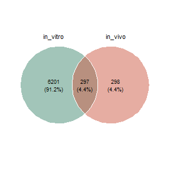
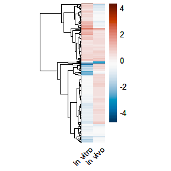
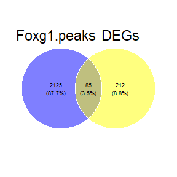
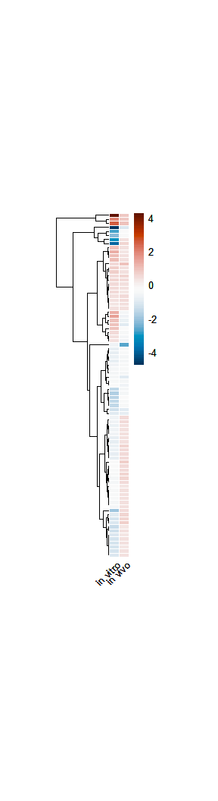
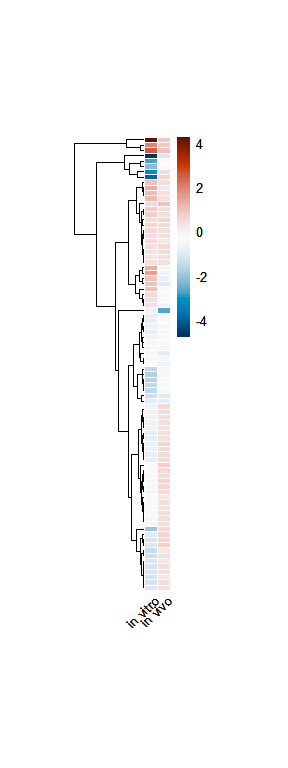
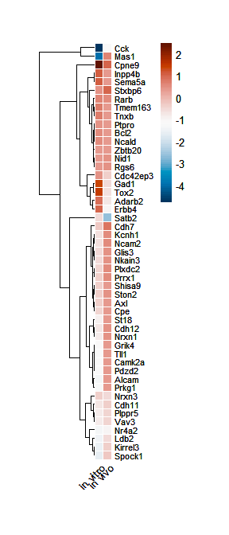
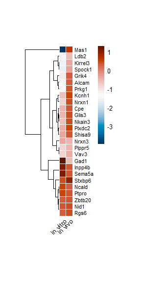
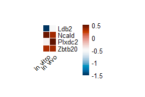

*Ldb2* and *Ncald* as target genes for the determination of FOXG1 and
NEUROD1 regulatory function
================

Packages

``` r
library(GeneOverlap)
library(clusterProfiler)
library(org.Mm.eg.db)
library(ggplot2)
library(ggvenn)
library(ggVennDiagram)
library(VennDiagram)
library(reshape2)
library(scales)
library(plyr)
library(pheatmap)
```

Read in the files - These files were generated by filtering of the
bioinformatics datasets (RNA-seq and FOXG1 ChIP-seq) and literature
scanning (done by TV).

``` r
#invivo Foxg1Het/WT RNAseq DEseq2 data
invivo.rna<-read.table("~/Integrative-multi-omics-analyses-of-FOXG1-functions/Input Files/Revision/ldb2_ncald/ncald lbd2 justification_invivo_RNAseq.txt", sep="\t", header = TRUE, fill = FALSE,)
invivo.rna<- as.data.frame(invivo.rna)
invivo.rna$log2FoldChange<-as.numeric(gsub(",", ".", invivo.rna$log2FoldChange))

rownames(invivo.rna) <- invivo.rna$symbol
#filter DEGs wit +/- 0.3 LFC
invivo.rna_03<-invivo.rna[abs(invivo.rna$log2FoldChange)>= 0.3,]
#cut columns and transform to matrix
invivo.rna_03<- invivo.rna_03[-(1:2)]
invivo.rna_03<- invivo.rna_03[-(2:4)]
invivo.rna.m<- as.matrix(invivo.rna_03)

#invitro shFoxg1/shLuciferase RNAseq DEseq2 data
invitro.rna<-read.table("~/Integrative-multi-omics-analyses-of-FOXG1-functions/Input Files/Revision/ldb2_ncald/ncald lbd2 justification_invitro_RNAseq.txt", sep="\t", header = TRUE, fill = FALSE,)

invitro.rna<- as.data.frame(invitro.rna)
invitro.rna$log2FoldChange<-as.numeric(gsub(",", ".", invitro.rna$log2FoldChange))
rownames(invitro.rna) <- invitro.rna$symbol
#filter DEGs wit +/- 0.3 LFC
invitro.rna_03<-invitro.rna[abs(invitro.rna$log2FoldChange)>= 0.3,]
#cut columns and transform to matrix
invitro.rna_03<- invitro.rna_03[-(1:2)]
invitro.rna_03<- invitro.rna_03[-(2:4)]
invitro.rna.m<- as.matrix(invitro.rna_03)
#merge invivo and invitro LFC tables with 0.3 LFC cutoff value
invitro.vivo.lfc<-invitro.rna_03 %>% inner_join(invivo.rna_03, by = "symbol")
row.names(invitro.vivo.lfc)<-invitro.vivo.lfc$symbol
invitro.vivo.lfc.m<- as.matrix(invitro.vivo.lfc[,-2])
#Common DEGs between in vivo and in vitro RNAseq with 0.3 LFC cutoff
invitro.invivo.rna_03<-read.table("~/Integrative-multi-omics-analyses-of-FOXG1-functions/Input Files/Revision/ldb2_ncald/invivo_invitro_0.3LFC_genes.txt", sep="\t", header = TRUE, fill = FALSE,)

#annotated FOXG1 peaks (in vivo and in vitro common) 
Foxg1.peaks<-read.table("~/Integrative-multi-omics-analyses-of-FOXG1-functions/Input Files/Revision/ldb2_ncald/in vivo_vitro_FOXG1_peaks.txt", sep="\t", header = TRUE, fill = FALSE,)

#Intersection of annotated to FOXG1 peaks (in vivo and in vitro common) and DEGs  
DEG.peak<-read.table("~/Integrative-multi-omics-analyses-of-FOXG1-functions/Input Files/Revision/ldb2_ncald/rnaseq_peak_intersection.txt", sep="\t", header = TRUE, fill = FALSE,)

DEG.peak.lfc<-DEG.peak %>% inner_join(invitro.vivo.lfc, by = "symbol")
row.names(DEG.peak.lfc)<-DEG.peak.lfc$symbol
DEG.peak.lfc.m<-as.matrix(DEG.peak.lfc[,-1])

#DEGs annotated to FOXG1 peaks  "in gene" in all data sets 
foxg1.DEGs.ingene<-read.table("~/Integrative-multi-omics-analyses-of-FOXG1-functions/Input Files/Revision/ldb2_ncald/degs_with_peaks_ingene.txt", sep="\t", header = TRUE, fill = FALSE,)
foxg1.DEGs.ingene<- as.data.frame(foxg1.DEGs.ingene)

DEG.peak.ingene.lfc<-foxg1.DEGs.ingene %>% inner_join(invitro.vivo.lfc, by = "symbol")
row.names(DEG.peak.ingene.lfc)<-DEG.peak.ingene.lfc$symbol
DEG.peak.ingene.lfc.m<-as.matrix(DEG.peak.lfc[,-1])
#DEGs annotating to brain and neuron related functional terms
DEGs.neuronal<-read.table("~/Integrative-multi-omics-analyses-of-FOXG1-functions/Input Files/Revision/ldb2_ncald/brain relevant_DEGs.txt", sep="\t", header = TRUE, fill = FALSE,)
DEGs.neuronal<- as.data.frame(DEGs.neuronal)

DEG.peak.neuronal.lfc<-DEGs.neuronal %>% inner_join(invitro.vivo.lfc, by = "symbol")
row.names(DEG.peak.neuronal.lfc)<-DEG.peak.neuronal.lfc$symbol
DEG.peak.neuronal.lfc.m<-as.matrix(DEG.peak.neuronal.lfc[,-1])
##DEGs annotating to brain and neuron related functional terms AND with NEUROD1 motif "CAGATGG"
DEGs.neuronal.motif<-read.table("~/Integrative-multi-omics-analyses-of-FOXG1-functions/Input Files/Revision/ldb2_ncald/brain relevant_DEGs_with_NEUROD1 motifs.txt", sep="\t", header = TRUE, fill = FALSE,)
DEGs.neuronal.motif<- as.data.frame(DEGs.neuronal.motif)

DEG.peak.neuronal.mot.lfc<-DEGs.neuronal.motif %>% inner_join(invitro.vivo.lfc, by = "symbol")
row.names(DEG.peak.neuronal.mot.lfc)<-DEG.peak.neuronal.mot.lfc$symbol
DEG.peak.neuronal.mot.lfc.m<-as.matrix(DEG.peak.neuronal.mot.lfc[,-1])

##DEGs annotating to brain and neuron related functional terms AND with NEUROD1 motif "CAGATGG" AND linked to neuronal subtype specification
DEGs.motif.subtype<- DEG.peak.neuronal.mot.lfc[DEG.peak.neuronal.mot.lfc$symbol %in% c("Ncald","Ldb2", "Zbtb20", "Plxdc2"), ]
DEGs.motif.subtype.m<-as.matrix(DEGs.motif.subtype[,-1])
```

#### *in vivo* and *in vitro* DEGs with LFC +/- 0.3 cutoff intersection (Venn visualisation)

``` r
vivo.vitro.deg.venn<-list(in_vitro=invitro.rna_03$symbol, in_vivo=invivo.rna_03$symbol)

venn.vitro.vivo.deg<- ggvenn(vivo.vitro.deg.venn, c("in_vitro", "in_vivo"), stroke_size = 0, stroke_color = "white", text_size = 2.5, set_name_size = 3, fill_color = c("aquamarine4", "coral3"))
pdf("~/Integrative-multi-omics-analyses-of-FOXG1-functions/Output/Revision/ldb2_ncald_reasoning/venn_vitro_vivo_DEGs.pdf", 
    width=2, 
    height=2)
print(venn.vitro.vivo.deg) 
dev.off()
```

    ## png 
    ##   2

``` r
venn.vitro.vivo.deg
```



#### *in vivo* and *in vitro* DEGs with LFC +/- 0.3 cutoff (297 genes)

``` r
invitro.vivo.lfc.heatmap<- pheatmap(invitro.vivo.lfc.m, 
                                    cluster_cols = FALSE, 
                                    cellwidth = 15, 
                                    border_color = "white", 
                                    clustering_distance_rows = "euclidean", 
                                    color = hcl.colors(80, "RdBu", rev=TRUE, fixup = TRUE), 
                                    scale = "none",
                                    labels_col = c("in vitro", "in vivo"), 
                                    angle_col = 45,
                                    show_rownames = FALSE, 
                                    fontsize = 10)
                                    
invitro.vivo.lfc.heatmap
```



``` r
pdf("~/Integrative-multi-omics-analyses-of-FOXG1-functions/Output/Revision/ldb2_ncald_reasoning/invitro_vivo_lfc_03_heatmap_231122.pdf", 
    width=3, 
    height=3)
print(invitro.vivo.lfc.heatmap)
dev.off()
```

    ## png 
    ##   2

#### Intersection of *in vivo* and *in vitro* DEGs with LFC +/- 0.3 cutoff and FOXG1 peaks

``` r
peak.deg<-list(Foxg1.peaks=Foxg1.peaks$symbol, DEGs=invitro.vivo.lfc$symbol)

venn.peak.deg<- ggvenn(peak.deg, c("Foxg1.peaks", "DEGs"), stroke_size = 0, stroke_color = "white", text_size = 2.5)
pdf("~/Integrative-multi-omics-analyses-of-FOXG1-functions/Output/Revision/ldb2_ncald_reasoning/venn_peaks_DEGs.pdf", 
    width=2, 
    height=2)
print(venn.peak.deg) 
dev.off()
```

    ## png 
    ##   2

``` r
venn.peak.deg
```



#### *in vivo* and *in vitro* DEGs with LFC +/- 0.3 cutoff that have a FOXG1 annotated to the DEG (85 genes)

``` r
DEG.peak.lfc.heatmap<- pheatmap(DEG.peak.lfc.m,
                                cellwidth = 10, cellheight = 4,
                                cluster_cols = FALSE, 
                                show_rownames = F, 
                                border_color = "white", 
                                clustering_distance_rows = "euclidean", 
                                color = hcl.colors(80, "RdBu", rev=TRUE, fixup = TRUE), 
                                labels_col = c("in vitro", "in vivo"),
                                angle_col = 45, scale = "none",
                                fontsize_row = 6, fontsize = 10)
                                    
DEG.peak.lfc.heatmap
```



``` r
pdf("~/Integrative-multi-omics-analyses-of-FOXG1-functions/Output/Revision/ldb2_ncald_reasoning/invitro_vivo_lfc_peak_heatmap_231122.pdf", 
    width=3, 
    height=8)
print(DEG.peak.lfc.heatmap)
dev.off()
```

    ## png 
    ##   2

#### *in vivo* and *in vitro* DEGs with LFC +/- 0.3 cutoff that have a FOXG1 annotated to the DEG **within the gene body** (64 genes)

``` r
DEG.peak.ingene.lfc.heatmap<- pheatmap(DEG.peak.ingene.lfc.m, 
                                       cluster_cols = FALSE, 
                                       cellheight = 4, cellwidth = 10,
                                       border_color = "white", 
                                       clustering_distance_rows = "euclidean", 
                                       color = hcl.colors(80, "RdBu", rev=TRUE, fixup = TRUE), scale = "none",
                                       labels_col = c("in vitro", "in vivo"), angle_col = 45, fontsize = 10, show_rownames = FALSE)
                                    
DEG.peak.ingene.lfc.heatmap
```



``` r
pdf("~/Integrative-multi-omics-analyses-of-FOXG1-functions/Output/Revision/ldb2_ncald_reasoning/invitro_vivo_lfc_peak_ingene_heatmap_231122.pdf", 
    width=3, 
    height=8)
print(DEG.peak.ingene.lfc.heatmap)
dev.off()
```

    ## png 
    ##   2

#### *in vivo* and *in vitro* DEGs with LFC +/- 0.3 cutoff that have a FOXG1 annotated to the DEG **within the gene body** that have **neuronal function relevance** (46 genes)

``` r
DEG.peak.neuronal.lfc.heatmap<- pheatmap(DEG.peak.neuronal.lfc.m, 
                                         cellwidth = 8, cellheight = 8,
                                         cluster_cols = FALSE, border_color = "white", 
                                         clustering_distance_rows = "euclidean", 
                                         color = hcl.colors(80, "RdBu", rev=TRUE, fixup = TRUE),
                                         scale = "none", labels_col = c("in vitro", "in vivo"), 
                                         angle_col = 45, fontsize = 10, fontsize_row = 8)
                                    
DEG.peak.neuronal.lfc.heatmap
```



``` r
pdf("~/Integrative-multi-omics-analyses-of-FOXG1-functions/Output/Revision/ldb2_ncald_reasoning/invitro_vivo_lfc_peak_neuronal_heatmap_231122.pdf", 
    width=3, 
    height=7)
print(DEG.peak.neuronal.lfc.heatmap)
dev.off()
```

    ## png 
    ##   2

#### *in vivo* and *in vitro* DEGs with LFC +/- 0.3 cutoff that have a FOXG1 annotated to the DEG **within the gene body** that have **neuronal function relevance** that include a **bHLH TF consensus motif** (26 genes)

``` r
DEG.peak.neuronal.mot.lfc.heatmap<- pheatmap(DEG.peak.neuronal.mot.lfc.m,
                                             cellwidth = 10, cellheight = 10,
                                             cluster_cols = FALSE, border_color = "white", 
                                             clustering_distance_rows = "euclidean", color = hcl.colors(80, "RdBu", rev=TRUE, fixup = TRUE), scale = "none", labels_col = c("in vitro", "in vivo"), angle_col = 45, fontsize = 10, fontsize_row = 8)
```



``` r
pdf("~/Integrative-multi-omics-analyses-of-FOXG1-functions/Output/Revision/ldb2_ncald_reasoning/invitro_vivo_lfc_peak_neuronal_mot_heatmap_231122.pdf", 
    width=3, 
    height=3)
print(DEG.peak.neuronal.mot.lfc.heatmap)
dev.off() 
```

    ## png 
    ##   2

These genes were further filtered according to specific functional
relevance found in the literature with a specific focus on genes
affecting the generation or subtype specification of neurons - which is
what FOXG1 and NEUROD1 affect.  
*Ldb2* stands as the only gene which was downregulated upon reduced
levels of FOXG1 (activator function of FOXG1), while *Ncald*, *Zbtb20*
and *Plxdc2* were downregulated upon FOXG1 knockdown (repressor function
of FOXG1).

#### *in vivo* and *in vitro* DEGs with LFC +/- 0.3 cutoff that have a FOXG1 annotated to the DEG **within the gene body** that have **neuronal function relevance** that include a **bHLH TF consensus motif** and linked to **neuronal subtype specification** (4 genes)

``` r
DEGs.motif.subtype.heatmap<- pheatmap(DEGs.motif.subtype.m,
                                      cellwidth = 10, cellheight = 10,
                                      cluster_cols = FALSE, border_color = "white", cluster_rows = FALSE, color = hcl.colors(80, "RdBu", rev=TRUE, fixup = TRUE), scale = "none", labels_col = c("in vitro", "in vivo"), angle_col = 45, fontsize = 10, fontsize_row = 10 )
```



``` r
pdf("~/Integrative-multi-omics-analyses-of-FOXG1-functions/Output/Revision/ldb2_ncald_reasoning/invitro_vivo_lfc_peak_neuronal_motif_subtype_heatmap_4genes_231122.pdf", 
    width=3, 
    height=2 )
print(DEGs.motif.subtype.heatmap)
dev.off() 
```

    ## png 
    ##   2

-   In order to choose 1 gene to test the activator function of FOXG1
    (downregulated upon Foxg1KD), we have searched specific motifs for
    bHLH and Fkh proteins within the gene bodies that are near
    overlapping with FOXG1 and NEUROD1 peaks.  
-   Searched motifs were:  
-   E-box: CAGATG (CANNTG=E47)
-   E-box: CATCTG (CANNTG=E47)  
-   FoxA1: TAAATAAATA  
-   FoxO1: AGAAACAG  
-   Foxg1: TGTTTAC  
-   Foxg1: ATAAATT  
-   Foxg1: TGTTGCC  
-   Above motifs were searched using IGV *find motif* function and the
    gene bodies were scanned for:  

1.  Overlapping NEUROD1-FOXG1 peaks AND  
2.  Adjacent motifs of at least 1 E-box and 1 Fkh motif within **maximum
    200 bp** of each other AND the overlapping peaks.

#### Ncald

``` r
knitr::include_graphics("./Input Files/Revision/ldb2_ncald/igv_snapshot_ncald.png")
```


-   4 regions were found on Ncald that meet the above criteria.

#### Zbtb20

``` r
knitr::include_graphics("./Input Files/Revision/ldb2_ncald/igv_snapshot_zbtb20.png")
```


4 regions were found on Zbtb20 with overlapping motifs, yet only 1 of
these regions corresponded to overlapping and pronounced NEUROD1-FOXG1
peaks (red). Additionally, the distance between e-box/Fkh motifs were
higher than that of Ncald regions.

#### Plxdc2

``` r
knitr::include_graphics("./Input Files/Revision/ldb2_ncald/igv_snapshot_plxdc2.png")
```


Only 2 regions on *Plxdc2* met the criteria, while 1 of these regions
was missing a NEUROD1 peak in our dataset. Additionally, *Plxdc2* had
opposing expression levels in in vivo and in vitro datasets, making it a
less desirable candidate.

``` r
sessionInfo()
```

    ## R version 4.2.0 (2022-04-22 ucrt)
    ## Platform: x86_64-w64-mingw32/x64 (64-bit)
    ## Running under: Windows 10 x64 (build 17763)
    ## 
    ## Matrix products: default
    ## 
    ## locale:
    ## [1] LC_COLLATE=English_Germany.1252  LC_CTYPE=English_Germany.1252   
    ## [3] LC_MONETARY=English_Germany.1252 LC_NUMERIC=C                    
    ## [5] LC_TIME=English_Germany.1252    
    ## 
    ## attached base packages:
    ## [1] grid      stats4    stats     graphics  grDevices utils     datasets 
    ## [8] methods   base     
    ## 
    ## other attached packages:
    ##  [1] pheatmap_1.0.12       plyr_1.8.8            scales_1.2.1         
    ##  [4] reshape2_1.4.4        VennDiagram_1.7.3     futile.logger_1.4.3  
    ##  [7] ggVennDiagram_1.2.2   ggvenn_0.1.9          dplyr_1.0.10         
    ## [10] ggplot2_3.4.0         org.Mm.eg.db_3.15.0   AnnotationDbi_1.58.0 
    ## [13] IRanges_2.30.1        S4Vectors_0.34.0      Biobase_2.56.0       
    ## [16] BiocGenerics_0.42.0   clusterProfiler_4.4.4 GeneOverlap_1.32.0   
    ## 
    ## loaded via a namespace (and not attached):
    ##   [1] fgsea_1.22.0           colorspace_2.0-3       ggtree_3.4.4          
    ##   [4] qvalue_2.28.0          XVector_0.36.0         aplot_0.1.9           
    ##   [7] rstudioapi_0.14        farver_2.1.1           graphlayouts_0.8.4    
    ##  [10] ggrepel_0.9.2          bit64_4.0.5            fansi_1.0.3           
    ##  [13] scatterpie_0.1.8       codetools_0.2-18       splines_4.2.0         
    ##  [16] cachem_1.0.6           GOSemSim_2.22.0        knitr_1.41            
    ##  [19] polyclip_1.10-4        jsonlite_1.8.3         GO.db_3.15.0          
    ##  [22] png_0.1-7              ggforce_0.4.1          compiler_4.2.0        
    ##  [25] httr_1.4.4             assertthat_0.2.1       Matrix_1.5-3          
    ##  [28] fastmap_1.1.0          lazyeval_0.2.2         cli_3.4.1             
    ##  [31] formatR_1.12           tweenr_2.0.2           htmltools_0.5.3       
    ##  [34] tools_4.2.0            igraph_1.3.5           gtable_0.3.1          
    ##  [37] glue_1.6.2             GenomeInfoDbData_1.2.8 DO.db_2.9             
    ##  [40] fastmatch_1.1-3        Rcpp_1.0.9             enrichplot_1.16.2     
    ##  [43] vctrs_0.5.1            Biostrings_2.64.1      ape_5.6-2             
    ##  [46] nlme_3.1-160           ggraph_2.1.0           xfun_0.35             
    ##  [49] stringr_1.4.1          lifecycle_1.0.3        gtools_3.9.3          
    ##  [52] DOSE_3.22.1            zlibbioc_1.42.0        MASS_7.3-58.1         
    ##  [55] tidygraph_1.2.2        parallel_4.2.0         lambda.r_1.2.4        
    ##  [58] RColorBrewer_1.1-3     yaml_2.3.6             memoise_2.0.1         
    ##  [61] gridExtra_2.3          downloader_0.4         ggfun_0.0.9           
    ##  [64] yulab.utils_0.0.5      stringi_1.7.8          RSQLite_2.2.19        
    ##  [67] highr_0.9              tidytree_0.4.1         caTools_1.18.2        
    ##  [70] BiocParallel_1.30.4    GenomeInfoDb_1.32.4    rlang_1.0.6           
    ##  [73] pkgconfig_2.0.3        bitops_1.0-7           evaluate_0.18         
    ##  [76] lattice_0.20-45        purrr_0.3.5            labeling_0.4.2        
    ##  [79] treeio_1.20.2          patchwork_1.1.2        shadowtext_0.1.2      
    ##  [82] bit_4.0.5              tidyselect_1.2.0       magrittr_2.0.3        
    ##  [85] R6_2.5.1               gplots_3.1.3           generics_0.1.3        
    ##  [88] DBI_1.1.3              pillar_1.8.1           withr_2.5.0           
    ##  [91] KEGGREST_1.36.3        RCurl_1.98-1.9         tibble_3.1.8          
    ##  [94] crayon_1.5.2           futile.options_1.0.1   KernSmooth_2.23-20    
    ##  [97] utf8_1.2.2             RVenn_1.1.0            rmarkdown_2.18        
    ## [100] viridis_0.6.2          data.table_1.14.6      blob_1.2.3            
    ## [103] digest_0.6.30          tidyr_1.2.1            gridGraphics_0.5-1    
    ## [106] munsell_0.5.0          viridisLite_0.4.1      ggplotify_0.1.0
