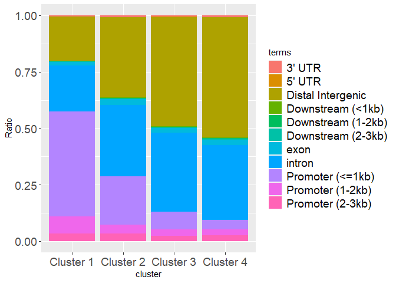
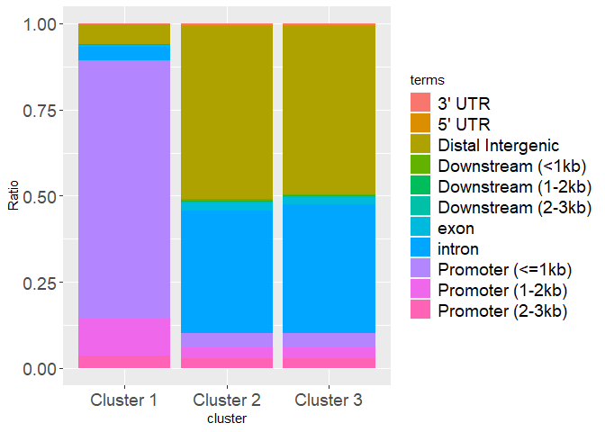
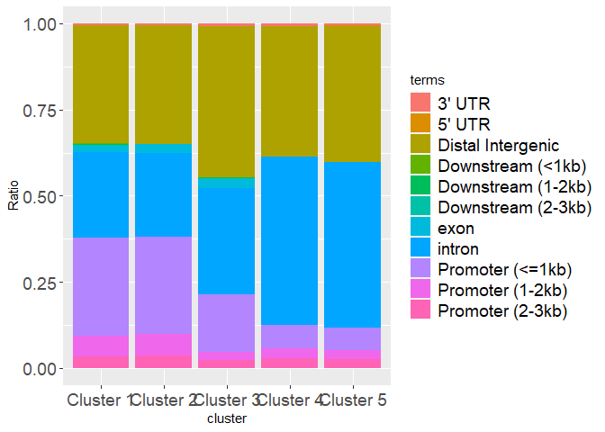
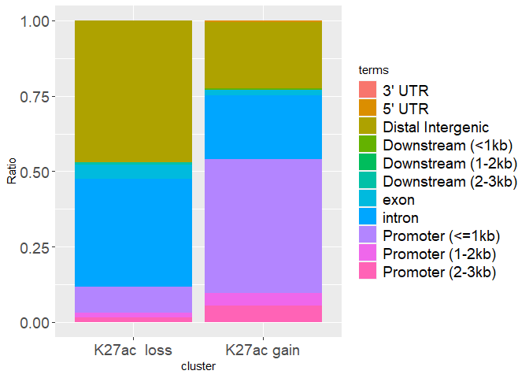
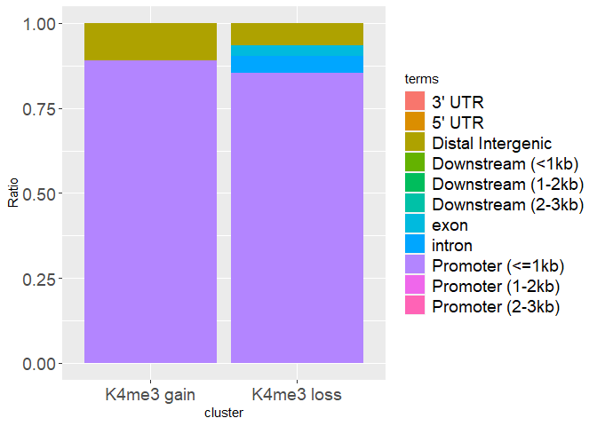
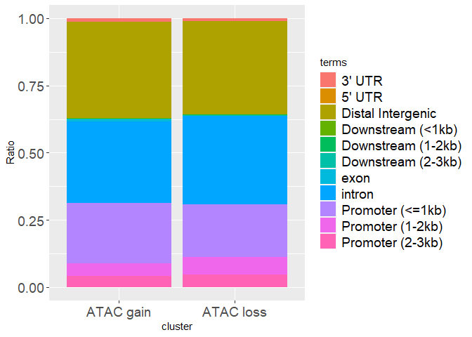

Genomic distributions of the Epigenetic landscape markers and
accessibility
================
2022-20-12

load packages

``` r
library(RColorBrewer)
library(ggplot2)
```

    ## Warning: package 'ggplot2' was built under R version 4.2.2

### Stacked bar graphs for clustered ATAC-, H3K27ac-, H3K4me3- enrichments (FIGURE 3 and Supplementary figures 5, 6, 7)

``` r
# Input files
ATAC_dist= read.table("~/Integrative-multi-omics-analyses-of-FOXG1-functions/Input Files/Figure 3/genomic distribution/atac_stacked distribution_r.txt", 
                      sep="\t", quote="", fill=FALSE, header=TRUE,)
ATAC_dist= as.data.frame(ATAC_dist)

k27ac_dist= read.table("~/Integrative-multi-omics-analyses-of-FOXG1-functions/Input Files/Figure 3/genomic distribution/k27ac_stacked distribution_r.txt", 
                       sep="\t", quote="", fill=FALSE, header=TRUE,)
k27ac_dist= as.data.frame(k27ac_dist)

k4me3_dist= read.table("~/Integrative-multi-omics-analyses-of-FOXG1-functions/Input Files/Figure 3/genomic distribution/k4me3_stacked distribution_r.txt", 
                       sep="\t", quote="", fill=FALSE, header=TRUE,)
k4me3_dist= as.data.frame(k4me3_dist)

diff_ATAC_dist= read.table("~/Integrative-multi-omics-analyses-of-FOXG1-functions/Input Files/Figure 3/genomic distribution/diff_atac_stacked distribution_r.txt", 
                           sep="\t", quote="", fill=FALSE, header=TRUE,)
diff_ATAC_dist= as.data.frame(diff_ATAC_dist)

diff_k27ac_dist= read.table("~/Integrative-multi-omics-analyses-of-FOXG1-functions/Input Files/Figure 3/genomic distribution/diff_k27ac_stacked distribution_r.txt", 
                            sep="\t", quote="", fill=FALSE, header=TRUE,)
diff_k27ac_dist= as.data.frame(diff_k27ac_dist)

diff_k4me3_dist= read.table("~/Integrative-multi-omics-analyses-of-FOXG1-functions/Input Files/Figure 3/genomic distribution/diff_k4me3_stacked distribution_r.txt", 
                            sep="\t", quote="", fill=FALSE, header=TRUE,)
diff_k4me3_dist= as.data.frame(diff_k4me3_dist)
```

#### Plot the stacked bar graphs for clustered epigenetic markers at FOXG1 peaks (FIGURE 3)

``` r
#Plot the stacked bar graph for clustered H3K27ac peaks (Figure 3B)
k27ac.dist.bar<-ggplot(k27ac_dist, aes(x=Clusters , y=number, fill = terms, font=14)) + 
  geom_bar(position="fill", stat="identity")+
    theme(axis.text = element_text(size=14),
         legend.text=element_text(size=14))+
    labs(x="cluster", y = "Ratio")
k27ac.dist.bar
```

<!-- -->

``` r
#Plot the stacked bar graph for clustered H3K4me3 peaks (Figure 3G)
k4me3.dist.bar<-ggplot(k4me3_dist, aes(x=Clusters , y=number, fill = terms, font=14)) + 
  geom_bar(position="fill", stat="identity")+
    theme(axis.text = element_text(size=14),
         legend.text=element_text(size=14))+
    labs(x="cluster", y = "Ratio")
k4me3.dist.bar
```

<!-- -->

``` r
#Plot the stacked bar graph for clustered ATAC peaks (Figure 3L)
ATAC.dist.bar<-ggplot(ATAC_dist, aes(x=Clusters, y=number, fill = terms, font=14)) + 
  geom_bar(position="fill", stat="identity")+
    theme(axis.text = element_text(size=14),
         legend.text=element_text(size=14))+
    labs(x="cluster", y = "Ratio")

ATAC.dist.bar
```

<!-- -->

``` r
# export to pdf
pdf("~/Integrative-multi-omics-analyses-of-FOXG1-functions/Output/Figure 3/k27ac_genomic dist_stackedbar_051022.pdf", 
    width=5, 
    height=3)
print(k27ac.dist.bar)
dev.off()
```

    ## png 
    ##   2

``` r
pdf("~/Integrative-multi-omics-analyses-of-FOXG1-functions/Output/Figure 3/k4me3_genomic dist_stackedbar_051022.pdf", 
    width=5, 
    height=3)
print(k4me3.dist.bar)
dev.off()
```

    ## png 
    ##   2

``` r
pdf("~/Integrative-multi-omics-analyses-of-FOXG1-functions/Output/Figure 3/ATAC_genomic dist_stackedbar_051022.pdf", 
    width=5, 
    height=3)
print(ATAC.dist.bar)
dev.off()
```

    ## png 
    ##   2

#### Plot the stacked bar graphs for differential epigenetic markers (SUPPLEMENTARY FIGURES 5, 6 and 7)

``` r
# Plot the stacked bar graphs for differential H3K27ac (gain/loss) (Supp fig. 5B)
diff.k27ac.dist.bar<-ggplot(diff_k27ac_dist, aes(x=Clusters , y=number, fill = terms, font=14)) + 
  geom_bar(position="fill", stat="identity")+
    theme(axis.text = element_text(size=14),
         legend.text=element_text(size=14))+
    labs(x="cluster", y = "Ratio")
diff.k27ac.dist.bar
```

<!-- -->

``` r
# Plot the stacked bar graphs for differential H3K4me3 (gain/loss) (Supp fig. 6B)
diff.k4me3.dist.bar<-ggplot(diff_k4me3_dist, aes(x=Clusters , y=number, fill = terms, font=14)) + 
  geom_bar(position="fill", stat="identity")+
   theme(axis.text = element_text(size=14),
         legend.text=element_text(size=14))+
    labs(x="cluster", y = "Ratio")
diff.k4me3.dist.bar
```

<!-- -->

``` r
# Plot the stacked bar graphs for differential ATAC (gain/loss) (Supp fig. 7B)
diff.ATAC.dist.bar<-ggplot(diff_ATAC_dist, aes(x=Clusters , y=number, fill = terms, font=14)) + 
  geom_bar(position="fill", stat="identity")+
    theme(axis.text = element_text(size=14),
         legend.text=element_text(size=14))+
    labs(x="cluster", y = "Ratio")
diff.ATAC.dist.bar
```

<!-- -->

``` r
### export to pdf
pdf("~/Integrative-multi-omics-analyses-of-FOXG1-functions/Output/Figure 3/diff_k27ac_genomic dist_stackedbar_051022.pdf", 
    width=4, 
    height=3)
print(diff.k27ac.dist.bar)
dev.off()
```

    ## png 
    ##   2

``` r
pdf("~/Integrative-multi-omics-analyses-of-FOXG1-functions/Output/Figure 3/diff.k4me3_genomic dist_stackedbar_051022.pdf", 
    width=4, 
    height=3)
print(diff.k4me3.dist.bar)
dev.off()
```

    ## png 
    ##   2

``` r
pdf("~/Integrative-multi-omics-analyses-of-FOXG1-functions/Output/Figure 3/diff_ATAC_genomic dist_stackedbar_051022.pdf", 
    width=4, 
    height=3)
print(diff.ATAC.dist.bar)
dev.off()
```

    ## png 
    ##   2

``` r
sessionInfo()
```

    ## R version 4.2.0 (2022-04-22 ucrt)
    ## Platform: x86_64-w64-mingw32/x64 (64-bit)
    ## Running under: Windows 10 x64 (build 17763)
    ## 
    ## Matrix products: default
    ## 
    ## locale:
    ## [1] LC_COLLATE=English_Germany.1252  LC_CTYPE=English_Germany.1252   
    ## [3] LC_MONETARY=English_Germany.1252 LC_NUMERIC=C                    
    ## [5] LC_TIME=English_Germany.1252    
    ## 
    ## attached base packages:
    ## [1] stats     graphics  grDevices utils     datasets  methods   base     
    ## 
    ## other attached packages:
    ## [1] ggplot2_3.4.0      RColorBrewer_1.1-3
    ## 
    ## loaded via a namespace (and not attached):
    ##  [1] highr_0.9        pillar_1.8.1     compiler_4.2.0   tools_4.2.0     
    ##  [5] digest_0.6.30    evaluate_0.18    lifecycle_1.0.3  tibble_3.1.8    
    ##  [9] gtable_0.3.1     pkgconfig_2.0.3  rlang_1.0.6      cli_3.4.1       
    ## [13] DBI_1.1.3        rstudioapi_0.14  yaml_2.3.6       xfun_0.35       
    ## [17] fastmap_1.1.0    withr_2.5.0      stringr_1.4.1    dplyr_1.0.10    
    ## [21] knitr_1.41       generics_0.1.3   vctrs_0.5.1      grid_4.2.0      
    ## [25] tidyselect_1.2.0 glue_1.6.2       R6_2.5.1         fansi_1.0.3     
    ## [29] rmarkdown_2.18   farver_2.1.1     magrittr_2.0.3   scales_1.2.1    
    ## [33] htmltools_0.5.3  assertthat_0.2.1 colorspace_2.0-3 labeling_0.4.2  
    ## [37] utf8_1.2.2       stringi_1.7.8    munsell_0.5.0
