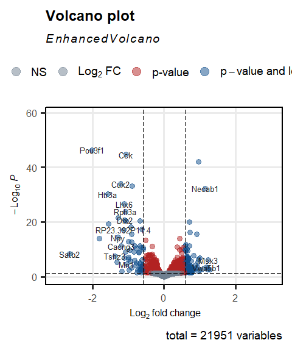
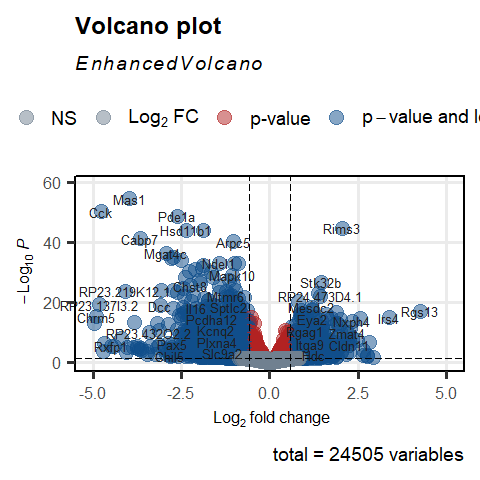

Foxg1cre/+ and shRNA-mediated knockdown alters the transcriptome of the
mouse hippocampus during development in vivo and in vitro.
================

load packages

``` r
library(EnhancedVolcano)
library(clusterProfiler)
library(org.Mm.eg.db)
```

### Volcano plot for differentially expressed genes upon Foxg1 haploinsufficiency *in vivo*

``` r
# Read in DESeq2 output for in vivo RNA-seq (coming from snakepipes default settings. 
# design: ~genotype
foxg1.invivo= read.table("~/Integrative-multi-omics-analyses-of-FOXG1-functions/Input Files/Figure 1/DE_genes_shrinked_apeglm_in vivo.tsv",
                         header=TRUE, sep="\t", quote="", fill=FALSE,)
foxg1.invivo.df=data.frame(foxg1.invivo)
foxg1.invivo.df$padj <- as.numeric(foxg1.invivo.df$padj)
foxg1.invivo.df$log2FoldChange <- as.numeric(foxg1.invivo.df$log2FoldChange)
symbol= foxg1.invivo.df$symbol
row.names(foxg1.invivo.df) <- make.names(foxg1.invivo.df[,"symbol"],TRUE) 

# colour key
keyvals.vivo <- ifelse(
    abs(foxg1.invivo.df$log2FoldChange) < 0.58 & foxg1.invivo.df$padj<0.01, 'firebrick',
    ifelse(abs(foxg1.invivo.df$log2FoldChange) >= 1 & foxg1.invivo.df$padj<=0.01, 'seagreen',
           'grey'))
keyvals.vivo[is.na(keyvals.vivo)] <- 'grey'
names(keyvals.vivo)[keyvals.vivo == 'firebrick'] <- 'mid'
names(keyvals.vivo)[keyvals.vivo == 'seagreen'] <- 'high'
names(keyvals.vivo)[keyvals.vivo == 'grey'] <- 'low'

pdf("~/Integrative-multi-omics-analyses-of-FOXG1-functions/Output/Figure 1/volcano_plot_invivo_apeglm_051022.pdf", width=3.5, height=6, compress = TRUE)

volcano.plot.invivo<- EnhancedVolcano(foxg1.invivo.df,
                lab = rownames(foxg1.invivo.df), 
                x = "log2FoldChange",
                y = "padj",
                xlab = bquote(~Log[2]~ 'fold change'),
                ylab = bquote(~-Log[10]~italic(P)),
                selectLab = rownames(foxg1.invivo.df)[which(names(keyvals.vivo) %in% c('high'))],
                axisLabSize = 12,
                labSize = 3.5,
                labCol = 'grey12',
                labFace = 'plain',
                boxedLabels = FALSE,
                pointSize= 3,
                pCutoff = 0.05,
                FCcutoff = 0.58,
                xlim=c(-3, 3),
                ylim=c(0,-log10(10e-60)),
                colAlpha = 1/2,
                col = c("slategray", "slategray", "firebrick", "dodgerblue4"),
                colGradient = NULL,
                shadeAlpha = 1/2,
                shadeFill = 'grey',
                shadeSize = 0.01,
                shadeBins = 2,
                vlineType = 'dashed',
                vlineCol = 'black',
                vlineWidth = 0.4,
                hline = c(0.05),
                hlineType = 'longdash',
                hlineCol = 'black',
                hlineWidth = 0.4,
                gridlines.major = TRUE,
                gridlines.minor = FALSE,
                border = "full",
                borderWidth = 0.8,
                borderColour = "black",
                drawConnectors=FALSE,
                widthConnectors = 0.5)
                print(volcano.plot.invivo)
dev.off()
```

    ## png 
    ##   2

``` r
plot(volcano.plot.invivo)
```

<!-- -->

### GO term enrichment analysis of differentially expressed genes *in vivo*

``` r
# filter increased and decreased DEGs
invivo.up<- foxg1.invivo.df[(foxg1.invivo.df$log2FoldChange>= 0.5 & foxg1.invivo.df$padj<=0.01),]
invivo.down<- foxg1.invivo.df[(foxg1.invivo.df$log2FoldChange<= (-0.5) & foxg1.invivo.df$padj<=0.01),]

# Entrezid annotation of the filtered DEGs
invivo.up.entrezid<- bitr(invivo.up$symbol, fromType = "SYMBOL", toType = "ENTREZID", OrgDb = org.Mm.eg.db, drop=TRUE)
```

    ## 'select()' returned 1:1 mapping between keys and columns

    ## Warning in bitr(invivo.up$symbol, fromType = "SYMBOL", toType = "ENTREZID", :
    ## 3.64% of input gene IDs are fail to map...

``` r
invivo.down.entrezid<- bitr(invivo.down$symbol, fromType = "SYMBOL", toType = "ENTREZID", OrgDb = org.Mm.eg.db, drop=TRUE)
```

    ## 'select()' returned 1:1 mapping between keys and columns

    ## Warning in bitr(invivo.down$symbol, fromType = "SYMBOL", toType = "ENTREZID", :
    ## 8.22% of input gene IDs are fail to map...

``` r
# list increased and decreased DEGs together
invivo.list<- list(increase=invivo.up.entrezid$ENTREZID,
                   decrease=invivo.down.entrezid$ENTREZID)

# Differential GO term analysis (biological processes) of increased and decreased DEGs
invivo.compare<- compareCluster(geneClusters = invivo.list,
                                fun = "enrichGO",
                                OrgDb = "org.Mm.eg.db",
                                keyType = "ENTREZID",
                                ont = "BP",
                                pAdjustMethod = "BH",
                                qvalueCutoff = 0.05,
                                pvalueCutoff = 0.05,
                                readable = TRUE)

# Simplify the terms to avoid redundancy
invivo.compare.simp<-simplify(invivo.compare,
                                 cutoff = 0.5,
                                 by = "p.adjust",
                                 select_fun = min,
                                 measure = "Wang",
                                 semData = NULL)

# Dotplot of differential GO terms in vivo
dp.vivo = dotplot(invivo.compare,
             showCategory=10,
             font.size=10,
)

# Dotplot of simplified terms
dp.vivo.simp = dotplot(invivo.compare.simp,
             showCategory=10,
             font.size=10,
             )

# Export the dotplots to pdf
pdf("~/Integrative-multi-omics-analyses-of-FOXG1-functions/Output/Figure 1/dotplot_invivo-diff-goterms_051022.pdf", width=4.2, height=6)
print(dp.vivo)
dev.off()
```

    ## png 
    ##   2

``` r
pdf("~/Integrative-multi-omics-analyses-of-FOXG1-functions/Output/Figure 1/dotplot_invivo-diff-goterms_simp_051022.pdf", width=4.2, height=6)
print(dp.vivo.simp)
dev.off()
```

    ## png 
    ##   2

``` r
# Export the reference table of differential GO terms to tabular file
df.invivo.compare = as.data.frame(invivo.compare.simp)
write.table(df.invivo.compare, 
            file="~/Integrative-multi-omics-analyses-of-FOXG1-functions/Output/Figure 1/invivo_rna-GOterms_reference_table_051022.txt", 
            sep = "\t", quote = FALSE,)
```

### Volcano plot for differentially expressed genes upon Foxg1 Knockdown (KD) at DIV11 *in vitro*

``` r
# Read in DESeq2 output for in vivo RNA-seq (coming from snakepipes default settings. 
# design: ~treatment(KD)
Foxg1KD.DEGs<-read.table("~/Integrative-multi-omics-analyses-of-FOXG1-functions/Input Files/Figure 1/DE_genes_shrinked_apeglm_DIV11.tabular", 
                          dec=".",sep="\t", header = TRUE, quote="", fill=FALSE,)
foxg1.DIV11.df=data.frame(Foxg1KD.DEGs)
foxg1.DIV11.df$padj <- as.numeric(foxg1.DIV11.df$padj)
foxg1.DIV11.df$log2FoldChange <- as.numeric(foxg1.DIV11.df$log2FoldChange)
symbol= foxg1.DIV11.df$symbol
row.names(foxg1.DIV11.df) <- make.names(foxg1.DIV11.df[,"symbol"],TRUE)

#colour key
keyvals.DIV11 <- ifelse(
    abs(foxg1.DIV11.df$log2FoldChange) <= 0.58 & foxg1.DIV11.df$padj<=0.05, 'firebrick',
    ifelse(abs(foxg1.DIV11.df$log2FoldChange) >= 1 & foxg1.DIV11.df$padj<=0.01, 'seagreen',
           'grey'))
keyvals.DIV11[is.na(keyvals.DIV11)] <- 'grey'
names(keyvals.DIV11)[keyvals.DIV11 == 'firebrick'] <- 'mid'
names(keyvals.DIV11)[keyvals.DIV11 == 'seagreen'] <- 'high'
names(keyvals.DIV11)[keyvals.DIV11 == 'grey'] <- 'low'

pdf("~/Integrative-multi-omics-analyses-of-FOXG1-functions/Output/Figure 1/volcano_plot_DIV11_apeglm_051022.pdf", width=3.5, height=5, compress = TRUE)
volcano.plot.DIV11<- EnhancedVolcano(foxg1.DIV11.df,
                                      lab = rownames(foxg1.DIV11.df), 
                                      x = "log2FoldChange",
                                      y = "padj",
                                      xlab = bquote(~Log[2]~ 'fold change'),
                                      ylab = bquote(~-Log[10]~italic(P)),
                                    selectLab = rownames(foxg1.DIV11.df)[which(names(keyvals.DIV11) %in% c('high'))],
                                    axisLabSize = 12,
                                      labSize = 3.5,
                                      labCol = 'grey12',
                                      labFace = 'plain',
                                      boxedLabels = FALSE,
                                      pointSize= 5.0,
                                      pCutoff = 0.05,
                                      FCcutoff = 0.58,
                                      xlim=c(-5, 5),
                                      ylim=c(0,-log10(10e-60)),
                                       colAlpha = 1/2,
                                      colCustom = NULL,
                                    col = c("slategray", "slategray", "firebrick", "dodgerblue4"),
                                    colGradient = NULL,
                                    shadeAlpha = 1/2,
                                    shadeFill = 'grey',
                                    shadeSize = 0.01,
                                    shadeBins = 2,
                                    vlineType = 'dashed',
                                    vlineCol = 'black',
                                    vlineWidth = 0.4,
                                    hline = c(0.05),
                                    hlineType = 'longdash',
                                    hlineCol = 'black',
                                    hlineWidth = 0.4,
                                    gridlines.major = TRUE,
                                    gridlines.minor = FALSE,
                                    border = 'full',
                                    borderWidth = 0.8,
                                    borderColour = "black",
                                    drawConnectors=FALSE,
                                    widthConnectors = 0.5)
print(volcano.plot.DIV11)
dev.off()
```

    ## png 
    ##   2

``` r
volcano.plot.DIV11
```

<!-- -->
\### GO term enrichment analysis of differentially expressed genes *in
vitro*

``` r
# filter increased and decreased DEGs
invitro.up<- foxg1.DIV11.df[(foxg1.DIV11.df$log2FoldChange>= 0.5 & foxg1.DIV11.df$padj<=0.01),]
invitro.down<- foxg1.DIV11.df[(foxg1.DIV11.df$log2FoldChange<= (-0.5) & foxg1.DIV11.df$padj<=0.01),]
# Entrezid annotation of filtered DEGs
invitro.up.entrezid<- bitr(invitro.up$X, fromType = "ENSEMBL", toType = "ENTREZID", OrgDb = org.Mm.eg.db, drop=TRUE)
```

    ## 'select()' returned 1:many mapping between keys and columns

    ## Warning in bitr(invitro.up$X, fromType = "ENSEMBL", toType = "ENTREZID", : 7.68%
    ## of input gene IDs are fail to map...

``` r
invitro.down.entrezid<- bitr(invitro.down$X, fromType = "ENSEMBL", toType = "ENTREZID", OrgDb = org.Mm.eg.db, drop=TRUE)
```

    ## 'select()' returned 1:many mapping between keys and columns

    ## Warning in bitr(invitro.down$X, fromType = "ENSEMBL", toType = "ENTREZID", :
    ## 6.8% of input gene IDs are fail to map...

``` r
universe.entrezid<- bitr(foxg1.DIV11.df$X, fromType = "ENSEMBL", toType = "ENTREZID", OrgDb = org.Mm.eg.db, drop=TRUE)
```

    ## 'select()' returned 1:many mapping between keys and columns

    ## Warning in bitr(foxg1.DIV11.df$X, fromType = "ENSEMBL", toType = "ENTREZID", :
    ## 21.72% of input gene IDs are fail to map...

``` r
# list increased and decreased DEGs together
invitro.list<- list(increase=invitro.up.entrezid$ENTREZID,
                   decrease=invitro.down.entrezid$ENTREZID)
# Differential Go term analysis in vitro
invitro.compare<- compareCluster(geneClusters = invitro.list,
                                    fun = "enrichGO",
                                    OrgDb = "org.Mm.eg.db",
                                    keyType = "ENTREZID",
                                    ont = "BP",
                                    pAdjustMethod = "BH",
                                    qvalueCutoff = 0.05,
                                    pvalueCutoff = 0.05,
                                    readable = TRUE)

# simplify the terms to avoid redundancy
invitro.compare.simp<-simplify(invitro.compare,
                                 cutoff = 0.5,
                                 by = "p.adjust",
                                 select_fun = min,
                                 measure = "Wang",
                                 semData = NULL)

# Dotplot of differential GO term analysis in vitro
dp.rna.vitro = dotplot(invitro.compare,
             showCategory=10,
             font.size=10, 
             includeAll=FALSE
             )

# Dotplot of simplified GO terms in vitro
dp.vitro.simp = dotplot(invitro.compare.simp,
             showCategory=10,
             font.size=10,
             )

# Export the dotplots to pdf
pdf("~/Integrative-multi-omics-analyses-of-FOXG1-functions/Output/Figure 1/dotplot_invitro-diff-goterms_0510222.pdf", width=4.2, height=5.5)
print(dp.rna.vitro)
dev.off()
```

    ## png 
    ##   2

``` r
pdf("~/Integrative-multi-omics-analyses-of-FOXG1-functions/Output/Figure 1/invitr-rnaseq-diff-goterms_simp_051022.pdf", width=4.2, height=6)
print(dp.vitro.simp)
dev.off()
```

    ## png 
    ##   2

``` r
# Export the table differential GO terms and related genes as csv
df.invitro.compare = as.data.frame(invitro.compare.simp)
write.table(df.invitro.compare,
            file="~/Integrative-multi-omics-analyses-of-FOXG1-functions/Output/Figure 1/invitro_rna-GOterms_simp_reference_table_051022.csv",
            sep = "\t", quote = FALSE,)
```

### Differential GO term analysis between increased and decreased DEGs of *in vitro* and *in vivo* datasets

``` r
# list increased and decreased DEGs from adult *in vivo* and FOXG1 KD *in vitro* datasets together
invivo.vitro.list<- list(inc.in.vivo=invivo.up.entrezid$ENTREZID,
                   dec.in.vivo=invivo.down.entrezid$ENTREZID,
                   inc.in.vitro=invitro.up.entrezid$ENTREZID,
                   dec.in.vitro=invitro.down.entrezid$ENTREZID)

# Differential Go term analysis
all.compare<- compareCluster(geneClusters = invivo.vitro.list,
                                fun = "enrichGO",
                                OrgDb = "org.Mm.eg.db",
                                keyType = "ENTREZID",
                                ont = "BP",
                                pAdjustMethod = "BH",
                                qvalueCutoff = 0.05,
                                pvalueCutoff = 0.05,
                                readable = TRUE)

# simplify the terms to avoid redundancy
all.compare.simp<-simplify(all.compare,
                                 cutoff = 0.5,
                                 by = "p.adjust",
                                 select_fun = min,
                                 measure = "Wang",
                                 semData = NULL)

# Dotplot of differential GO terms in both datasets
dp.all = dotplot(all.compare,
             showCategory=5,
             font.size=9
             )

# Dotplot of simplified differential GO terms in both datasets
dp.all.simp=dotplot(all.compare.simp,
             showCategory=10,
             font.size=8,
             includeAll=TRUE
                          )


# export the dotplots to pdf
pdf("~/Integrative-multi-omics-analyses-of-FOXG1-functions/Output/Figure 1/invitro-invivo_rnaseq-diff-goterms_051022.pdf", width=4, height=5)
print(dp.all)
dev.off()
```

    ## png 
    ##   2

``` r
pdf("~/Integrative-multi-omics-analyses-of-FOXG1-functions/Output/Figure 1/invitro-invivo_rnaseq-diff-goterms_simp_051022.pdf", width=4.2, height=6)
print(dp.all.simp)
dev.off()
```

    ## png 
    ##   2

------------------------------------------------------------------------

``` r
sessionInfo()
```

    ## R version 4.2.0 (2022-04-22 ucrt)
    ## Platform: x86_64-w64-mingw32/x64 (64-bit)
    ## Running under: Windows 10 x64 (build 17763)
    ## 
    ## Matrix products: default
    ## 
    ## locale:
    ## [1] LC_COLLATE=English_Germany.1252  LC_CTYPE=English_Germany.1252   
    ## [3] LC_MONETARY=English_Germany.1252 LC_NUMERIC=C                    
    ## [5] LC_TIME=English_Germany.1252    
    ## 
    ## attached base packages:
    ## [1] stats4    stats     graphics  grDevices utils     datasets  methods  
    ## [8] base     
    ## 
    ## other attached packages:
    ##  [1] org.Mm.eg.db_3.15.0    AnnotationDbi_1.58.0   IRanges_2.30.1        
    ##  [4] S4Vectors_0.34.0       Biobase_2.56.0         BiocGenerics_0.42.0   
    ##  [7] clusterProfiler_4.4.4  EnhancedVolcano_1.14.0 ggrepel_0.9.2         
    ## [10] ggplot2_3.4.0         
    ## 
    ## loaded via a namespace (and not attached):
    ##   [1] nlme_3.1-160           bitops_1.0-7           ggtree_3.4.4          
    ##   [4] enrichplot_1.16.2      bit64_4.0.5            RColorBrewer_1.1-3    
    ##   [7] httr_1.4.4             GenomeInfoDb_1.32.4    tools_4.2.0           
    ##  [10] utf8_1.2.2             R6_2.5.1               lazyeval_0.2.2        
    ##  [13] DBI_1.1.3              colorspace_2.0-3       withr_2.5.0           
    ##  [16] tidyselect_1.2.0       gridExtra_2.3          bit_4.0.5             
    ##  [19] compiler_4.2.0         cli_3.4.1              scatterpie_0.1.8      
    ##  [22] labeling_0.4.2         shadowtext_0.1.2       scales_1.2.1          
    ##  [25] yulab.utils_0.0.5      stringr_1.4.1          digest_0.6.30         
    ##  [28] rmarkdown_2.18         DOSE_3.22.1            XVector_0.36.0        
    ##  [31] pkgconfig_2.0.3        htmltools_0.5.3        highr_0.9             
    ##  [34] fastmap_1.1.0          rlang_1.0.6            rstudioapi_0.14       
    ##  [37] RSQLite_2.2.19         gridGraphics_0.5-1     generics_0.1.3        
    ##  [40] farver_2.1.1           jsonlite_1.8.3         BiocParallel_1.30.4   
    ##  [43] GOSemSim_2.22.0        dplyr_1.0.10           RCurl_1.98-1.9        
    ##  [46] magrittr_2.0.3         ggplotify_0.1.0        GO.db_3.15.0          
    ##  [49] GenomeInfoDbData_1.2.8 patchwork_1.1.2        Matrix_1.5-3          
    ##  [52] Rcpp_1.0.9             munsell_0.5.0          fansi_1.0.3           
    ##  [55] ape_5.6-2              viridis_0.6.2          lifecycle_1.0.3       
    ##  [58] stringi_1.7.8          yaml_2.3.6             ggraph_2.1.0          
    ##  [61] MASS_7.3-58.1          zlibbioc_1.42.0        plyr_1.8.8            
    ##  [64] qvalue_2.28.0          grid_4.2.0             blob_1.2.3            
    ##  [67] parallel_4.2.0         DO.db_2.9              crayon_1.5.2          
    ##  [70] lattice_0.20-45        graphlayouts_0.8.4     Biostrings_2.64.1     
    ##  [73] splines_4.2.0          KEGGREST_1.36.3        knitr_1.41            
    ##  [76] pillar_1.8.1           fgsea_1.22.0           igraph_1.3.5          
    ##  [79] reshape2_1.4.4         codetools_0.2-18       fastmatch_1.1-3       
    ##  [82] glue_1.6.2             evaluate_0.18          ggfun_0.0.9           
    ##  [85] downloader_0.4         data.table_1.14.6      treeio_1.20.2         
    ##  [88] png_0.1-7              vctrs_0.5.1            tweenr_2.0.2          
    ##  [91] gtable_0.3.1           purrr_0.3.5            polyclip_1.10-4       
    ##  [94] tidyr_1.2.1            assertthat_0.2.1       cachem_1.0.6          
    ##  [97] xfun_0.35              ggforce_0.4.1          tidygraph_1.2.2       
    ## [100] tidytree_0.4.1         viridisLite_0.4.1      tibble_3.1.8          
    ## [103] aplot_0.1.9            memoise_2.0.1          ellipsis_0.3.2
