Visualisations for FOXG1 ChIP-seq in vivo: Figure 2
================

-   load packages

``` r
library(RColorBrewer)
library(ggplot2)
library(clusterProfiler)
library(org.Mm.eg.db)
library(GeneOverlap)
```

## FOXG1 ChIP in vivo in CA and DG regions

*from 6-week old WT mice* *Datasets:  
+ 2 replicates for CA ChIP + 1 replicate for DG ChIP + Pooled Input  
* Mapping: Bowtie2, using snakepipes defaults (FF)  
\*\*\* \## Quality Control (FF) 1. Deeptools QC

<div class="figure" style="text-align: center">


<p class="caption">
Plot Read Coverage
</p>

</div>

<div class="figure" style="text-align: center">


<p class="caption">
Multibamsummary correlation, spearman
</p>

</div>

<div class="figure" style="text-align: center">


<p class="caption">
PCA plot
</p>

</div>

<div class="figure" style="text-align: center">


<p class="caption">
Plot Fingerprint, IP strength
</p>

</div>

2.  Filtered .bam Files (from snakepipes)

-   Filtering rules: **-F 1024 -q 3**  
-   meaning: remove optical PCR duplicates (-F 1024), remove reads with
    MAPQ\<3 (-q 3)  

3.  BamCoverage (from snakepipes) Depth normalisation of samples. *These
    were not used in downstream analyses (IA).*  
4.  BamCompare (from snakepipes) Input (control) and depth normalisation
    of ChIP-seq samples. 2 different calculations:  

-   log2Ratio of Sample over Input
-   Subtraction of Input from ChIP-sample  
    *These were preferred for downstream analyses and visualisations
    (IA).*  

6.  MACS2- Peak Calling (from snakepipes) Narrow peaks and summits were
    called for each replicate separately. Models are in:  
    *These peak files were used for downstream analyses.*  
    \# Downstream Analyses \## Genomic Distribution of FOXG1 peaks
    \*From usegalaxy.eu, Tool: ChIPSeeker (v 1.28.3)
    <div class="figure" style="text-align: center">

    
    <p class="caption">
    Genomic Distribution of FOXG1 peaks, CA region
    </p>

    </div>

    <div class="figure" style="text-align: center">

    
    <p class="caption">
    Genomic Distribution of FOXG1 peaks, DG region
    </p>

    </div>

    ## FOXG1 Occupancy at Transcription start sites (TSS)

-   From usegalaxy.eu  
-   Tools: computeMatrix, plotHeatmap w/ K-means clustering k=5,
    ChIPSeeker for region annotation  
    <div class="figure" style="text-align: center">

    
    <p class="caption">
    FOXG1 peaks at TSS, invivo
    </p>

    </div>

    <div class="figure" style="text-align: center">

    
    <p class="caption">
    FOXG1 peaks at TSS, invivo and invitro comparison
    </p>

    </div>

    ### Differential GO term enrichment analysis of FOXG1 clustered enrichment at TSS (transcription start sites)

``` r
## read in separate files for each cluster obtained from k-means clustering at TSS (from usegalaxy.eu)
c1_peaks_vivo<-read.table("~/Integrative-multi-omics-analyses-of-FOXG1-functions/Input Files/Figure 2/inputs from galaxy/Galaxy46-[CA_DG_FOXG1_ChIP_c1].tabular", header=TRUE, sep="\t", quote="", fill=FALSE,)
c2_peaks_vivo<-read.table("~/Integrative-multi-omics-analyses-of-FOXG1-functions/Input Files/Figure 2/inputs from galaxy/Galaxy48-[CA-DG_peaks_c2].tabular", header=TRUE, sep="\t", quote="", fill=FALSE,)
c3_peaks_vivo<-read.table("~/Integrative-multi-omics-analyses-of-FOXG1-functions/Input Files/Figure 2/inputs from galaxy/Galaxy50-[CA-DG_peaks_c3].tabular", header=TRUE, sep="\t", quote="", fill=FALSE,)
c4_peaks_vivo<-read.table("~/Integrative-multi-omics-analyses-of-FOXG1-functions/Input Files/Figure 2/inputs from galaxy/Galaxy52-[CA-DG_peaks_c4].tabular", header=TRUE, sep="\t", quote="", fill=FALSE,)
c5_peaks_vivo<-read.table("~/Integrative-multi-omics-analyses-of-FOXG1-functions/Input Files/Figure 2/inputs from galaxy/Galaxy54-[CA-DG_peaks_c5].tabular", header=TRUE, sep="\t",quote="", fill=FALSE,)
```

``` r
# translate Ensembl IDs to ENTREZID
c1_peaks_vivo_id<-bitr(c1_peaks_vivo$geneId, fromType = "ENSEMBL",
         toType = "ENTREZID",
         OrgDb = org.Mm.eg.db,
         drop = TRUE)
```

    ## 'select()' returned 1:many mapping between keys and columns

    ## Warning in bitr(c1_peaks_vivo$geneId, fromType = "ENSEMBL", toType =
    ## "ENTREZID", : 3.95% of input gene IDs are fail to map...

``` r
c2_peaks_vivo_id<-bitr(c2_peaks_vivo$geneId, fromType = "ENSEMBL",
         toType = "ENTREZID",
         OrgDb = org.Mm.eg.db,
         drop = TRUE)
```

    ## 'select()' returned 1:many mapping between keys and columns

    ## Warning in bitr(c2_peaks_vivo$geneId, fromType = "ENSEMBL", toType =
    ## "ENTREZID", : 2.23% of input gene IDs are fail to map...

``` r
c3_peaks_vivo_id<-bitr(c3_peaks_vivo$geneId, fromType = "ENSEMBL",
         toType = "ENTREZID",
         OrgDb = org.Mm.eg.db,
         drop = TRUE)
```

    ## 'select()' returned 1:many mapping between keys and columns

    ## Warning in bitr(c3_peaks_vivo$geneId, fromType = "ENSEMBL", toType =
    ## "ENTREZID", : 2.94% of input gene IDs are fail to map...

``` r
c4_peaks_vivo_id<-bitr(c4_peaks_vivo$geneId, fromType = "ENSEMBL",
         toType = "ENTREZID",
         OrgDb = org.Mm.eg.db,
         drop = TRUE)
```

    ## 'select()' returned 1:many mapping between keys and columns

    ## Warning in bitr(c4_peaks_vivo$geneId, fromType = "ENSEMBL", toType =
    ## "ENTREZID", : 2.73% of input gene IDs are fail to map...

``` r
c5_peaks_vivo_id<-bitr(c5_peaks_vivo$geneId, fromType = "ENSEMBL",
         toType = "ENTREZID",
         OrgDb = org.Mm.eg.db,
         drop = TRUE)
```

    ## 'select()' returned 1:many mapping between keys and columns

    ## Warning in bitr(c5_peaks_vivo$geneId, fromType = "ENSEMBL", toType =
    ## "ENTREZID", : 6.64% of input gene IDs are fail to map...

``` r
# compare functional terms among annotated peaks in each cluster
list_peaks_vivo<- list(cluster_1=c1_peaks_vivo_id$ENTREZID,
                  cluster_2=c2_peaks_vivo_id$ENTREZID,
                  cluster_3=c3_peaks_vivo_id$ENTREZID,
                  cluster_4=c4_peaks_vivo_id$ENTREZID,
                  cluster_5=c5_peaks_vivo_id$ENTREZID)
peak_compare_vivo<-compareCluster(geneClusters= list_peaks_vivo,
                            fun = "enrichGO",
                            OrgDb = "org.Mm.eg.db",
                             ont = "BP",
                             pAdjustMethod = "BH",
                             qvalueCutoff = 0.01,
                             pvalueCutoff = 0.01,
                             readable = TRUE)
```

``` r
# create reference table for GO terms and export to csv
FOXG1_chip_peaks_vivo_df<- as.data.frame(peak_compare_vivo)
write.csv(FOXG1_chip_peaks_vivo_df, file="~/Integrative-multi-omics-analyses-of-FOXG1-functions/Output/Figure 2/FOXG1_chip_peaks_TSS_GO terms_vivo.csv")
```

``` r
# simplify the terms to avoid redundancy
FOXG1_chip_peaks_vivo_simp<-simplify(peak_compare_vivo,
                                 cutoff = 0.7,
                                 by = "p.adjust",
                                 select_fun = min,
                                 measure = "Wang",
                                 semData = NULL)
```

``` r
# dotplot of simplified terms

dp_vivo_simp = dotplot(FOXG1_chip_peaks_vivo_simp,
             includeAll=FALSE,
             showCategory=5,
            font.size=10)
dp_vivo_simp
```

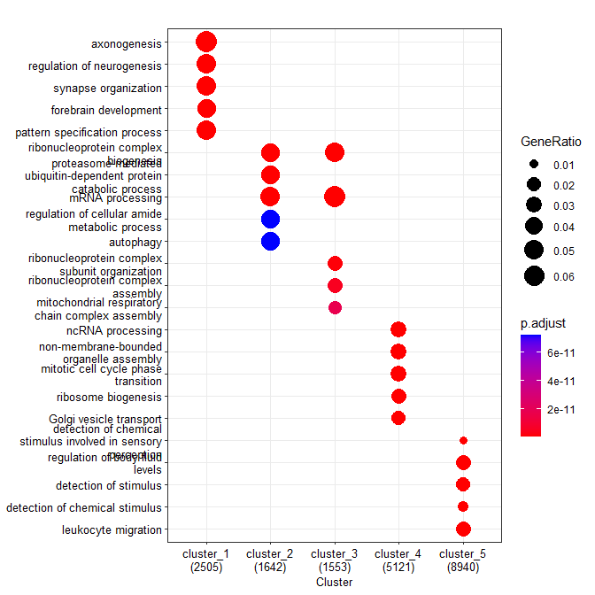<!-- -->

``` r
dp_vivo = dotplot(peak_compare_vivo,
             showCategory=5,
             includeAll=FALSE,
            font.size=10)
dp_vivo
```

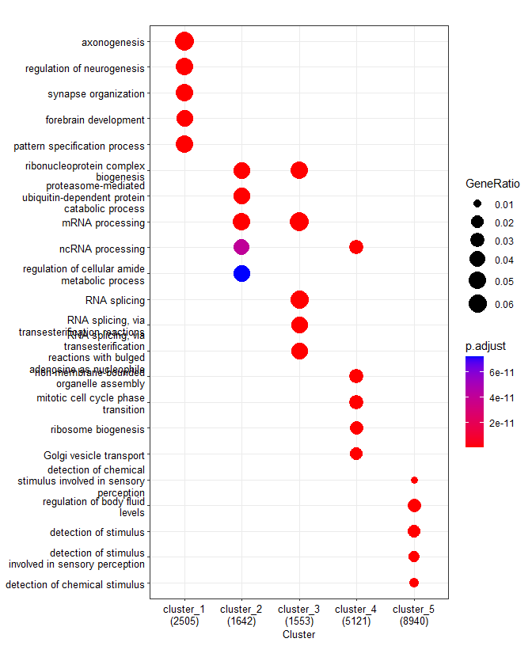<!-- -->

``` r
# export the simplified dotplot to pdf
pdf("~/Integrative-multi-omics-analyses-of-FOXG1-functions/Output/Figure 2/FOXG1_chip_peaks_TSS_simp_vivo_dotplot_2206.pdf", width=5, height=6.5)
print(dp_vivo_simp)
dev.off()
```

    ## png 
    ##   2

``` r
# export the dotplot to pdf
pdf("~/Integrative-multi-omics-analyses-of-FOXG1-functions/Output/Figure 2/FOXG1_chip_peaks_TSS_vivo_dotplot_2206.pdf", width=4.5, height=6)
print(dp_vivo)
dev.off()
```

    ## png 
    ##   2

### Distribution of Differentially Expressed Genes (DEGs) at clusters of FOXG1-occupied TSS

``` r
# read in DEG table clustered (Foxg1cre/+ / Foxg1+/+)
FOXG1_chip_vivo_DEG<- read.table("~/Integrative-multi-omics-analyses-of-FOXG1-functions/Input Files/Figure 2/inputs from galaxy/Galaxy92-[CA-DG_FOXG1_peak-DEG_long_file].tabular", header=TRUE, sep="\t", stringsAsFactors=FALSE, dec = ".")
FOXG1_chip_vivo_DEG_df= as.data.frame(FOXG1_chip_vivo_DEG)
FOXG1_chip_vivo_DEG_df[,'cluster_1']<-factor(FOXG1_chip_vivo_DEG_df[,'cluster_1'])
FOXG1_chip_vivo_DEG_df$lfcSE<-as.numeric(gsub(",", ".", FOXG1_chip_vivo_DEG_df$lfcSE))
FOXG1_chip_vivo_DEG_df$lfcSE<-as.numeric(as.character(FOXG1_chip_vivo_DEG_df$lfcSE))

# Filter according to LFC and p.adj values
FOXG1_chip_vivo_LFC<-FOXG1_chip_vivo_DEG_df[
    (abs(FOXG1_chip_vivo_DEG_df$lfcSE)>= 0.24 & 
         FOXG1_chip_vivo_DEG_df$symbol<=0.05),]
FOXG1_chip_vivo_LFC_df<- as.data.frame(FOXG1_chip_vivo_LFC)
FOXG1_chip_vivo_LFC_df[,'cluster_1']<-factor(FOXG1_chip_vivo_LFC_df[,'cluster_1'])
FOXG1_chip_vivo_LFC_df$lfcSE<-as.numeric(FOXG1_chip_vivo_LFC_df$lfcSE)
```

``` r
# violin plot of DEGS correlating with k-means clustered FOXG1 peaks at TSS using ggplot2
my_palette <- brewer.pal(name="Oranges",n=9)[4:9]
violin_plot_vivo <- ggplot(FOXG1_chip_vivo_DEG_df, aes(x=cluster_1, y=lfcSE, fill=cluster_1, color= cluster_1, alpha=0.8, font=10))+ 
    scale_color_manual(values = my_palette, aesthetics = "fill")+
    scale_color_manual(values = my_palette, aesthetics = "colour")+
    geom_violin()+ 
    labs(x="clusters", y = "Log2FC", font=10)+ theme_light()+
    stat_summary(fun=median, 
                 geom="point", 
                 size=1.5, 
                 color="black")
violin_plot_vivo_dots<-violin_plot_vivo +
    geom_jitter(data= FOXG1_chip_vivo_LFC_df, shape=16,
                 size=3.5, 
                 position=position_jitter(width=0.2, height= 0.1))
```

``` r
# violin plot
violin_plot_vivo_dots
```

    ## Warning: Removed 3 rows containing missing values (`geom_point()`).

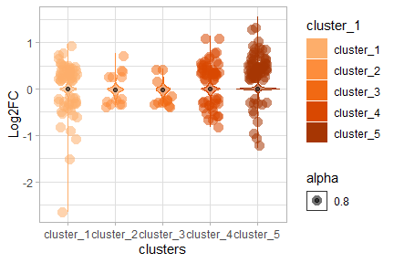<!-- -->

``` r
# export to pdf
pdf("~/Integrative-multi-omics-analyses-of-FOXG1-functions/Output/Figure 2/violin plot_invivo_FOXG1_DEG_clusters.pdf", 
    width=4, 
    height=3)
print(violin_plot_vivo_dots)
dev.off()
```

    ## png 
    ##   2

``` r
# create GeneOverlap matrix to test the enrichment of DEGs in clusters
Foxg1_vivo_DEGs<-read.table("~/Integrative-multi-omics-analyses-of-FOXG1-functions/Input Files/Figure 2/inputs from galaxy/Galaxy90-[FOXG1HetvsWT_apeglm].tabular", sep="\t", header = TRUE,)
Foxg1_vivo_DEGs<- cbind(rownames(Foxg1_vivo_DEGs), data.frame(Foxg1_vivo_DEGs, row.names=NULL))
increased_DEG<-Foxg1_vivo_DEGs[(Foxg1_vivo_DEGs$log2FoldChange>=0.5 &
                                Foxg1_vivo_DEGs$padj<=0.05),]
decreased_DEG<-Foxg1_vivo_DEGs[(Foxg1_vivo_DEGs$log2FoldChange<=(-0.5) &
                                Foxg1_vivo_DEGs$padj<=0.05),]
static_DEG<-Foxg1_vivo_DEGs[(abs(Foxg1_vivo_DEGs$log2FoldChange)<0.5 &
                                Foxg1_vivo_DEGs$padj>=0.05),]
# list of clustered DEGs
DEG_list<- list(increased_DEG= increased_DEG$`rownames(Foxg1_vivo_DEGs)`,
                decreased_DEG=decreased_DEG$`rownames(Foxg1_vivo_DEGs)`,
                static_DEG=static_DEG$`rownames(Foxg1_vivo_DEGs)`)

#list of clustered peaks
cluster_peak_list<- list(c1_peaks=c1_peaks_vivo$geneId,
                         c2_peaks=c2_peaks_vivo$geneId,
                         c3_peaks=c3_peaks_vivo$geneId,
                         c4_peaks=c4_peaks_vivo$geneId,
                         c5_peaks=c5_peaks_vivo$geneId
                         )
# Geneoverlap matrix object
GO_matrix_foxg1_tss<-newGOM(DEG_list, cluster_peak_list)
GO_matrix_foxg1_tss
```

    ## A <3 x 5> GeneOverlapMatrix object
    ## Geneset A sizes:
    ## increased_DEG decreased_DEG    static_DEG 
    ##           161            81         20538 
    ## Geneset B sizes:
    ## c1_peaks c2_peaks c3_peaks c4_peaks c5_peaks 
    ##     2886     1791     1730     5724    11208

``` r
# Oddsratio plot
heatmap_FOXG1<- drawHeatmap(GO_matrix_foxg1_tss, 
            what = c("odds.ratio"), 
            adj.p=TRUE, 
            cutoff=0.05, 
            ncolused = 5,
            grid.col = "Oranges",
            note.col = "Black")
```

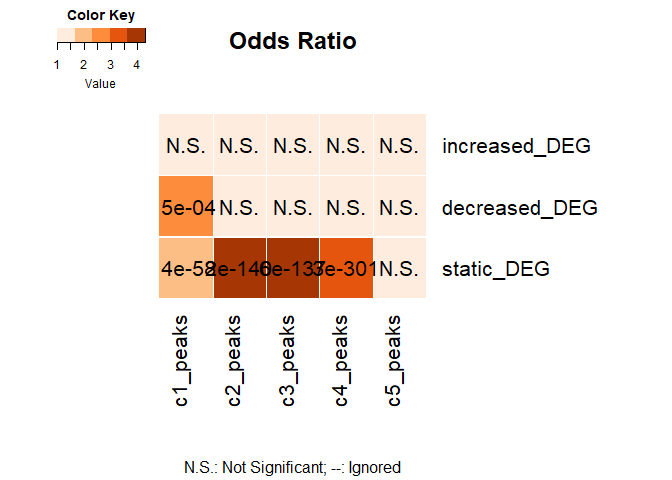<!-- -->

``` r
# Jaccard Index
heatmap_FOXG1<- drawHeatmap(GO_matrix_foxg1_tss, 
            what = c("Jaccard"), 
            adj.p=TRUE, 
            cutoff=0.05, 
            ncolused = 5,
            grid.col = "Oranges",
            note.col = "Black")
```

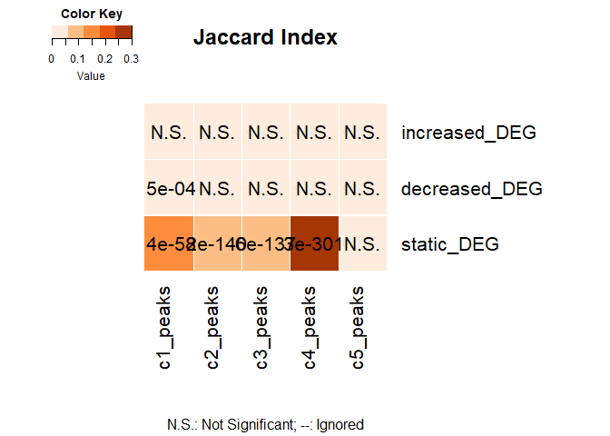

``` r
# upload separate files for each cluster of DEGs from K-means clustering at TSS, i.e intersection of DEGs with annotation of the clustered peaks
FOXG1_vivo_DEG_c1 <- read.table("~/Integrative-multi-omics-analyses-of-FOXG1-functions/Input Files/Figure 2/inputs from galaxy/Galaxy98-[CA-DG_DEG_c1].tabular", 
                                header=FALSE, sep="\t", fill = FALSE, quote="",)
FOXG1_vivo_DEG_c2 <- read.table("~/Integrative-multi-omics-analyses-of-FOXG1-functions/Input Files/Figure 2/inputs from galaxy/Galaxy99-[CA-DG_DEG_c2].tabular", 
                                header=FALSE, sep="\t", fill = FALSE, quote="",)
FOXG1_vivo_DEG_c3 <- read.table("~/Integrative-multi-omics-analyses-of-FOXG1-functions/Input Files/Figure 2/inputs from galaxy/Galaxy100-[CA-DG_DEG_c3].tabular", 
                                header=FALSE, sep="\t", fill = FALSE, quote="",)
FOXG1_vivo_DEG_c4 <- read.table("~/Integrative-multi-omics-analyses-of-FOXG1-functions/Input Files/Figure 2/inputs from galaxy/Galaxy101-[CA-DG_DEG_c4].tabular",
                                header=FALSE, sep="\t", fill = FALSE, quote="",)
FOXG1_vivo_DEG_c5 <- read.table("~/Integrative-multi-omics-analyses-of-FOXG1-functions/Input Files/Figure 2/inputs from galaxy/Galaxy102-[CA-DG_DEG_c5].tabular", 
                                header = FALSE, sep="\t", fill = FALSE, quote="",)

FOXG1_vivo_DEG_c1$V16<-as.numeric(gsub(",", ".", FOXG1_vivo_DEG_c1$V16))
```

    ## Warning: NAs introduced by coercion

``` r
FOXG1_vivo_DEG_c1$V16<-as.numeric(as.character(FOXG1_vivo_DEG_c1$V16))

FOXG1_vivo_DEG_c2$V16<-as.numeric(gsub(",", ".", FOXG1_vivo_DEG_c2$V16))
```

    ## Warning: NAs introduced by coercion

``` r
FOXG1_vivo_DEG_c2$V16<-as.numeric(as.character(FOXG1_vivo_DEG_c2$V16))

FOXG1_vivo_DEG_c3$V16<-as.numeric(gsub(",", ".", FOXG1_vivo_DEG_c3$V16))
```

    ## Warning: NAs introduced by coercion

``` r
FOXG1_vivo_DEG_c3$V16<-as.numeric(as.character(FOXG1_vivo_DEG_c3$V16))

FOXG1_vivo_DEG_c4$V16<-as.numeric(gsub(",", ".", FOXG1_vivo_DEG_c4$V16))
```

    ## Warning: NAs introduced by coercion

``` r
FOXG1_vivo_DEG_c4$V16<-as.numeric(as.character(FOXG1_vivo_DEG_c4$V16))

FOXG1_vivo_DEG_c5$V16<-as.numeric(gsub(",", ".", FOXG1_vivo_DEG_c5$V16))
```

    ## Warning: NAs introduced by coercion

``` r
FOXG1_vivo_DEG_c5$V16<-as.numeric(as.character(FOXG1_vivo_DEG_c5$V16))

# annotate DEGs belonging to different clusters to entrezid
c1<-bitr(FOXG1_vivo_DEG_c1$V1, fromType = "ENSEMBL",
         toType = "ENTREZID",
         OrgDb = org.Mm.eg.db,
         drop = TRUE)
```

    ## 'select()' returned 1:many mapping between keys and columns

    ## Warning in bitr(FOXG1_vivo_DEG_c1$V1, fromType = "ENSEMBL", toType =
    ## "ENTREZID", : 1.55% of input gene IDs are fail to map...

``` r
c2<-bitr(FOXG1_vivo_DEG_c2$V1, fromType = "ENSEMBL",
         toType = "ENTREZID",
         OrgDb = org.Mm.eg.db,
         drop = TRUE)
```

    ## 'select()' returned 1:many mapping between keys and columns

    ## Warning in bitr(FOXG1_vivo_DEG_c2$V1, fromType = "ENSEMBL", toType =
    ## "ENTREZID", : 0.95% of input gene IDs are fail to map...

``` r
c3<-bitr(FOXG1_vivo_DEG_c3$V1, fromType = "ENSEMBL",
         toType = "ENTREZID",
         OrgDb = org.Mm.eg.db,
         drop = TRUE)
```

    ## 'select()' returned 1:many mapping between keys and columns

    ## Warning in bitr(FOXG1_vivo_DEG_c3$V1, fromType = "ENSEMBL", toType =
    ## "ENTREZID", : 1.06% of input gene IDs are fail to map...

``` r
c4<-bitr(FOXG1_vivo_DEG_c4$V1, fromType = "ENSEMBL",
         toType = "ENTREZID",
         OrgDb = org.Mm.eg.db,
         drop = TRUE)
```

    ## 'select()' returned 1:many mapping between keys and columns

    ## Warning in bitr(FOXG1_vivo_DEG_c4$V1, fromType = "ENSEMBL", toType =
    ## "ENTREZID", : 0.89% of input gene IDs are fail to map...

``` r
c5<-bitr(FOXG1_vivo_DEG_c5$V1, fromType = "ENSEMBL",
         toType = "ENTREZID",
         OrgDb = org.Mm.eg.db,
         drop = TRUE)
```

    ## 'select()' returned 1:many mapping between keys and columns

    ## Warning in bitr(FOXG1_vivo_DEG_c5$V1, fromType = "ENSEMBL", toType =
    ## "ENTREZID", : 2.06% of input gene IDs are fail to map...

``` r
# compare functional terms among DEGs belonging to different clusters
#list of clustered DEGs
list_FOXG1_chip_vivo_DEG<-list(cluster1=c1$ENTREZID,
                          cluster2=c2$ENTREZID,
                          cluster3=c3$ENTREZID,
                          cluster4=c4$ENTREZID,
                          cluster5=c5$ENTREZID)

# Differential GO term enrichment analysis
FOXG1_chip_DEG_vivo_cc<-compareCluster(
                            geneClusters= list_FOXG1_chip_vivo_DEG,
                            fun = "enrichGO",
                            OrgDb = "org.Mm.eg.db",
                             ont = "BP",
                             pAdjustMethod = "BH",
                             qvalueCutoff = 0.01,
                             pvalueCutoff = 0.01,
                             readable = TRUE)

# create dataframe for GO terms and export to csv
FOXG1_chip_DEG_vivo_cc_df<- as.data.frame(FOXG1_chip_DEG_vivo_cc)
write.csv(FOXG1_chip_DEG_vivo_cc_df, file="~/Integrative-multi-omics-analyses-of-FOXG1-functions/Output/Figure 2/FOXG1_chip_DEG_clusters_TSS_GOterms_vivo.csv")
```

``` r
# simplify the terms to avoid redundancy
FOXG1_chip_DEG_cc_simp<-simplify(FOXG1_chip_DEG_vivo_cc,
                                 cutoff = 0.5,
                                 by = "p.adjust",
                                 select_fun = min,
                                 measure = "Wang",
                                 semData = NULL)
```

``` r
# dotplot with simplified terms
dp_vivo_DEG_vivo_simp = dotplot(FOXG1_chip_DEG_cc_simp,
             showCategory=5,
             font.size=10,
             )
dp_vivo_DEG_vivo_simp
```

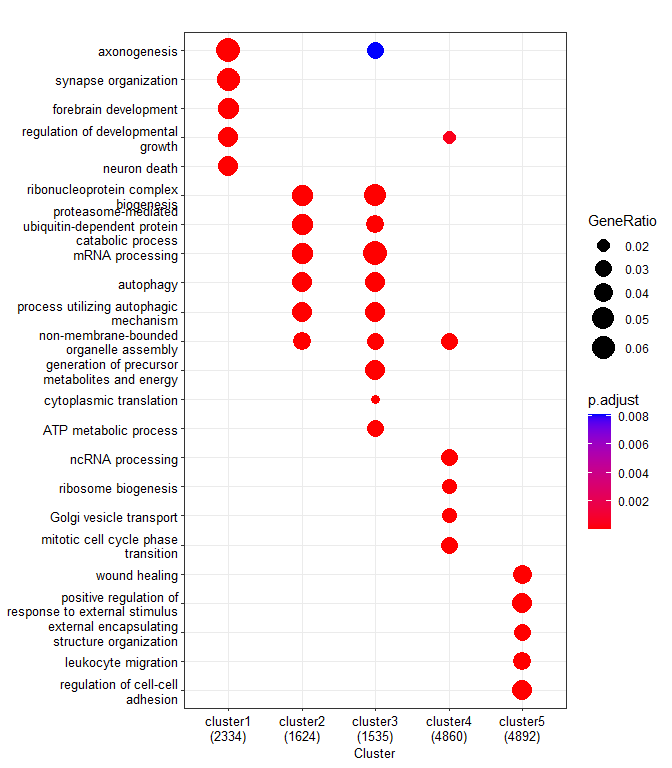<!-- -->

``` r
# export the dotplot to pdf
pdf("~/Integrative-multi-omics-analyses-of-FOXG1-functions/Output/Figure 2/FOXG1_chip_DEG_clusters_TSS_GOterms_vivo_simp_includeall_true_2206.pdf", width=4, height=4)
print(dp_vivo_DEG_vivo_simp)
dev.off()
```

    ## png 
    ##   2

# FOXG1-ChIP-seq: WT DIV11 Hippocampal neurons (in vitro)

*Datasets:  
+ 2 replicates for ChIP: N1, N2  
+ 2 inputs: N1_Input, N2_Input  
* Mapping: Bowtie2, using snakepipes defaults  
*** 1. Filtered Bam Files (snakepipes) * Filtering rules: **-F 1024 -q
3\*\*  
+ meaning: remove optical PCR duplicates (-F 1024), remove reads with
MAPQ\<3 (-q 3)  
++ filtered Bam files were missing from the drive (corrupted download?),
bam outputs from Bowtie2 were filtered again according to the filtering
rules.  
2. BamCoverage (snakepipes) Depth normalisation of samples. *These were
not used in downstream analyses (IA).*  
3. BamCompare (snakepipes) Input (control) and depth normalisation of
ChIP-seq samples. 2 different calculations:  
\* log2Ratio of Sample over Input \* Subtraction of Input from
ChIP-sample  
*These were preferred for downstream analyses and visualisations
(IA).*  
6. MACS2- Peak Calling (FF) Narrow peaks and summits were called for
each replicate separately. *These peak files were used for downstream
analyses.*  
\# Downstream Analyses For the downstream analyses, filtered N1
FOXG1-ChIP peaks were used. \## Genomic Distribution of FOXG1 peaks  
\*From usegalaxy.eu, Tool: ChIPSeeker (v 1.28.3)

<div class="figure" style="text-align: center">


<p class="caption">
Genomic Distribution of FOXG1 peaks, DIV11, WT
</p>

</div>

## FOXG1 Occupancy at Transcription start sites (TSS) in vitro

-   From usegalaxy.eu
-   Tools: computeMatrix, plotHeatmap w/ K-means clustering k=5,
    ChIPSeeker for region annotation
    <div class="figure" style="text-align: center">

    
    <p class="caption">
    FOXG1 peaks at TSS, DIV11
    </p>

    </div>

    ### Differential GO term Enrichment Analysis of FOXG1 clusters at TSS

``` r
# read in separate files for each cluster

c1_peaks<-read.table("~/Integrative-multi-omics-analyses-of-FOXG1-functions/Input Files/Figure 2/inputs from galaxy/Galaxy45-[N1_FOXG1_ChIP_c1].tabular", 
                     header=TRUE, sep="\t", quote="", fill=FALSE,)
c2_peaks<-read.table("~/Integrative-multi-omics-analyses-of-FOXG1-functions/Input Files/Figure 2/inputs from galaxy/Galaxy47-[N1_FOXG1_peaks_c2].tabular", 
                     header=TRUE, sep="\t", quote="", fill=FALSE,)
c3_peaks<-read.table("~/Integrative-multi-omics-analyses-of-FOXG1-functions/Input Files/Figure 2/inputs from galaxy/Galaxy49-[N1_FOXG1_peaks_c3].tabular",
                     header=TRUE, sep="\t", quote="", fill=FALSE,)
c4_peaks<-read.table("~/Integrative-multi-omics-analyses-of-FOXG1-functions/Input Files/Figure 2/inputs from galaxy/Galaxy51-[N1_FOXG1_peaks_c4].tabular",
                     header=TRUE, sep="\t", quote="", fill=FALSE,)
c5_peaks<-read.table("~/Integrative-multi-omics-analyses-of-FOXG1-functions/Input Files/Figure 2/inputs from galaxy/Galaxy53-[N1_FOXG1_peaks_c5].tabular",
                     header=TRUE, sep="\t", quote="", fill=FALSE,)

# translate EnsemblIDs to ENTREZIDs
c1_peaks_id<-bitr(c1_peaks$geneId, fromType = "ENSEMBL",
         toType = "ENTREZID",
         OrgDb = org.Mm.eg.db,
         drop = TRUE)
```

    ## 'select()' returned 1:many mapping between keys and columns

    ## Warning in bitr(c1_peaks$geneId, fromType = "ENSEMBL", toType = "ENTREZID", :
    ## 4.29% of input gene IDs are fail to map...

``` r
c2_peaks_id<-bitr(c2_peaks$geneId, fromType = "ENSEMBL",
         toType = "ENTREZID",
         OrgDb = org.Mm.eg.db,
         drop = TRUE)
```

    ## 'select()' returned 1:many mapping between keys and columns

    ## Warning in bitr(c2_peaks$geneId, fromType = "ENSEMBL", toType = "ENTREZID", :
    ## 2.12% of input gene IDs are fail to map...

``` r
c3_peaks_id<-bitr(c3_peaks$geneId, fromType = "ENSEMBL",
         toType = "ENTREZID",
         OrgDb = org.Mm.eg.db,
         drop = TRUE)
```

    ## 'select()' returned 1:many mapping between keys and columns

    ## Warning in bitr(c3_peaks$geneId, fromType = "ENSEMBL", toType = "ENTREZID", :
    ## 2.34% of input gene IDs are fail to map...

``` r
c4_peaks_id<-bitr(c4_peaks$geneId, fromType = "ENSEMBL",
         toType = "ENTREZID",
         OrgDb = org.Mm.eg.db,
         drop = TRUE)
```

    ## 'select()' returned 1:many mapping between keys and columns

    ## Warning in bitr(c4_peaks$geneId, fromType = "ENSEMBL", toType = "ENTREZID", :
    ## 3.01% of input gene IDs are fail to map...

``` r
c5_peaks_id<-bitr(c5_peaks$geneId, fromType = "ENSEMBL",
         toType = "ENTREZID",
         OrgDb = org.Mm.eg.db,
         drop = TRUE)
```

    ## 'select()' returned 1:many mapping between keys and columns

    ## Warning in bitr(c5_peaks$geneId, fromType = "ENSEMBL", toType = "ENTREZID", :
    ## 6.9% of input gene IDs are fail to map...

``` r
# compare functional terms among annotated clusters
#list clustered peaks from in vitro FOXG1 ChIP-seq
list_peaks_vitro<- list(cluster_1=c1_peaks_id$ENTREZID,
                  cluster_2=c2_peaks_id$ENTREZID,
                  cluster_3=c3_peaks_id$ENTREZID,
                  cluster_4=c4_peaks_id$ENTREZID,
                  cluster_5=c5_peaks_id$ENTREZID)
#Differential functional enrihcment analysis
peak_compare_vitro<-compareCluster(geneClusters= list_peaks_vitro,
                            fun = "enrichGO",
                            OrgDb = "org.Mm.eg.db",
                            ont = "BP",
                            pAdjustMethod = "BH",
                            qvalueCutoff = 0.01,
                            pvalueCutoff = 0.01,
                            readable = TRUE)

# create dataframe for GO terms and export to csv  
FOXG1_chip_peaks_df<- as.data.frame(peak_compare_vitro)
write.csv(FOXG1_chip_peaks_df, file="~/Integrative-multi-omics-analyses-of-FOXG1-functions/Output/Figure 2/FOXG1_invitro_chip_peaks_clustered_goterms_df.csv")

# simplify the terms to avoid redundancy  
FOXG1_chip_peaks_vitro_simp<-simplify(peak_compare_vitro,
                                 cutoff = 0.7,
                                 by = "p.adjust",
                                 select_fun = min,
                                 measure = "Wang",
                                 semData = NULL)

# dotplot of simplified GO terms enriched in k-means clusters in vitro  
dp_vitro_simp = dotplot(FOXG1_chip_peaks_vitro_simp,
             showCategory=5,
             includeAll=FALSE,
             font.size=10
             )
dp_vitro_simp
```

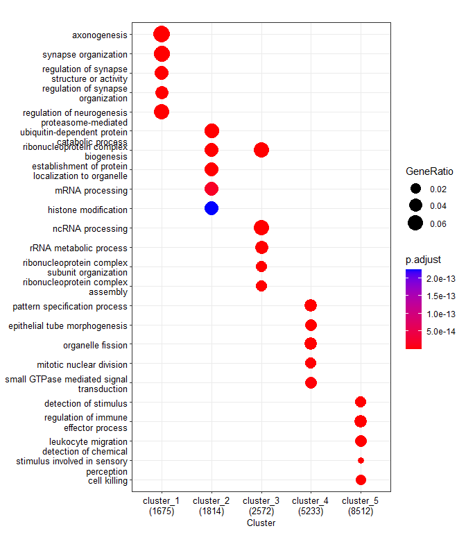<!-- -->

``` r
# export the dotplot to pdf  
pdf("~/Integrative-multi-omics-analyses-of-FOXG1-functions/Output/Figure 2/FOXG1_invitro_chip_peaks_GO_dotplot_simp_2206.pdf", width=5, height=6.2)
print(dp_vitro_simp)
dev.off()
```

    ## png 
    ##   2

``` r
# dotplot of simplified terms (5 categories)  
dp_5 = dotplot(FOXG1_chip_peaks_vitro_simp,
             showCategory=5,
             font.size=10,
      includeAll=FALSE
             )
```

``` r
# export the dotplot to pdf (5 categories)  
pdf("~/Integrative-multi-omics-analyses-of-FOXG1-functions/Output/Figure 2/FOXG1_vitro_chip_peaks_GO_dotplot_simp_5 categories.pdf", width=3, height=4)
print(dp_5)
dev.off()
```

    ## png 
    ##   2

### Distribution of Differentially Expressed Genes (DEGs) at clusters of FOXG1-occupied TSS in vitro

``` r
# read in DEG table (shFoxg1/shControl, DIV11 Hippocampal neurons)  
FOXG1_chip_DEG<- read.table("~/Integrative-multi-omics-analyses-of-FOXG1-functions/Input Files/Figure 2/inputs from galaxy/Galaxy87-[N1_FOXG1_DEG_long_file].tabular", 
                            dec=".", header=FALSE, sep="\t", quote="", fill=FALSE,)
FOXG1_chip_DEG_df= as.data.frame(FOXG1_chip_DEG)
FOXG1_chip_DEG_df[,'V5']<-factor(FOXG1_chip_DEG_df[,'V5'])
FOXG1_chip_DEG_df$V16<-as.numeric(gsub(",", ".", FOXG1_chip_DEG_df$V16))
```

    ## Warning: NAs introduced by coercion

``` r
FOXG1_chip_DEG_df$V16<-as.numeric(as.character(FOXG1_chip_DEG_df$V16))

# Filter according to LFC and adjusted padj cutoffs  
FOXG1_chip_vitro_LFC<-FOXG1_chip_DEG_df[
    (abs(FOXG1_chip_DEG_df$V16)>= 0.5 & 
         FOXG1_chip_DEG_df$V19<=0.01),]
FOXG1_chip_vitro_LFC_df<- as.data.frame(FOXG1_chip_vitro_LFC)
FOXG1_chip_vitro_LFC_df[,'V5']<-factor(FOXG1_chip_vitro_LFC_df[,'V5'])
FOXG1_chip_vitro_LFC_df$V16<-as.numeric(FOXG1_chip_vitro_LFC_df$V16)
```

``` r
# Plot the distribution of DEGs in FOXG1-binding TSS clusters in vitro (Violin Plot)  

my_palette <- brewer.pal(name="Greens",n=9)[4:9]
vp_vitro <- ggplot(FOXG1_chip_DEG_df,
                            aes(x=V5, y=V16, fill=V5, color= V5, alpha=0.8, font=10))+ 
    scale_color_manual(values = my_palette, aesthetics = "fill")+
    scale_color_manual(values = my_palette, aesthetics = "colour")+
    geom_violin()+ 
    labs(x= "clusters", y = "Log2FC", font=10)+ theme_light()+
    stat_summary(fun=median, 
                 geom="point", 
                 size=1.5, 
                 color="black")
vp_vitro_jitter<-vp_vitro +
    geom_jitter(data= FOXG1_chip_vitro_LFC_df, shape=16,
                 size=3.5, 
                 position=position_jitter(width=0.2, height= 0.1))
vp_vitro_jitter
```

    ## Warning: Removed 1 rows containing non-finite values (`stat_ydensity()`).

    ## Warning: Removed 1 rows containing non-finite values (`stat_summary()`).

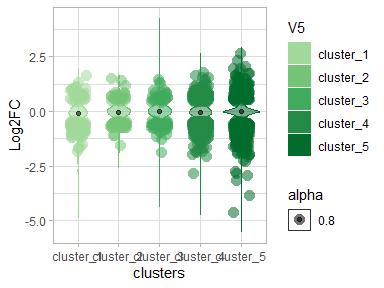

``` r
# export the violin plot to pdf  
pdf("~/Integrative-multi-omics-analyses-of-FOXG1-functions/Output/Figure 2/violin plot_invitro_FOXG1_DEG_clusters.pdf", 
    width=4, 
    height=3)
print(vp_vitro_jitter)
```

    ## Warning: Removed 1 rows containing non-finite values (`stat_ydensity()`).

    ## Warning: Removed 1 rows containing non-finite values (`stat_summary()`).

``` r
dev.off()
```

    ## png 
    ##   2

### Test the enrichment of DEGs in each cluster

``` r
Foxg1_KD_DEGs<-read.table("~/Integrative-multi-omics-analyses-of-FOXG1-functions/Input Files/Figure 1/DE_genes_shrinked_apeglm_DIV11.tabular", 
                          sep="\t", header = TRUE, fill = FALSE,)
Foxg1_KD_DEGs_df<- as.data.frame(Foxg1_KD_DEGs)
Foxg1_KD_DEGs_df$log2FoldChange<-as.numeric(gsub(",", ".", Foxg1_KD_DEGs_df$log2FoldChange))

increased_DEG<-Foxg1_KD_DEGs_df[(Foxg1_KD_DEGs_df$log2FoldChange>=0.5 &
                                Foxg1_KD_DEGs_df$padj<=0.01),]
decreased_DEG<-Foxg1_KD_DEGs_df[(Foxg1_KD_DEGs_df$log2FoldChange<=(-0.5) &
                                  Foxg1_KD_DEGs_df$padj<=0.01),]
static_DEG<-Foxg1_KD_DEGs_df[(abs(Foxg1_KD_DEGs_df$log2FoldChange)< 0.5) & (Foxg1_KD_DEGs_df$padj>0.01),]
DEG_list<- list(increased_DEG= increased_DEG$X,
                decreased_DEG=decreased_DEG$X,
                static=static_DEG$X
                )
cluster_peak_list<- list(cluster_1=c1_peaks$geneId,
                         cluster_2=c2_peaks$geneId,
                         cluster_3=c3_peaks$geneId,
                         cluster_4=c4_peaks$geneId,
                         cluster_5=c5_peaks$geneId
                         )
# create GeneOverlap matrix  
GO_matrix_foxg1_vitro_tss<-newGOM(DEG_list, cluster_peak_list, genome.size =nrow(Foxg1_KD_DEGs_df))
GO_matrix_foxg1_vitro_tss
```

    ## A <3 x 5> GeneOverlapMatrix object
    ## Geneset A sizes:
    ## increased_DEG decreased_DEG        static 
    ##           730          1782         19930 
    ## Geneset B sizes:
    ## cluster_1 cluster_2 cluster_3 cluster_4 cluster_5 
    ##      1929      1968      2828      5896     10718

``` r
# Oddsratio plot of GeneOverlap matrix (comparison of each cluster against genomic background)  
heatmap_FOXG1<- drawHeatmap(GO_matrix_foxg1_vitro_tss, 
            what = c("odds.ratio"), 
            adj.p=TRUE, 
            cutoff=0.05, 
            ncolused = 5,
            grid.col = "Greens",
            note.col = "Black")
```

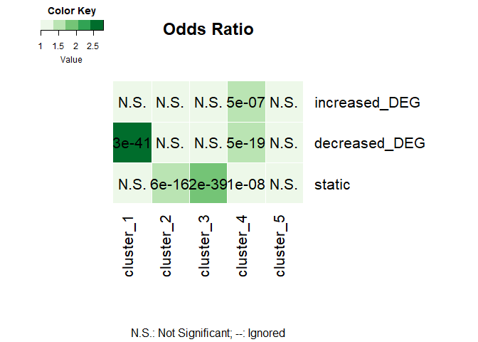

``` r
# Jaccard index plot of GeneOverlap matrix (similarity between clusters)  
heatmap_FOXG1<- drawHeatmap(GO_matrix_foxg1_vitro_tss, 
            what = c("Jaccard"), 
            adj.p=TRUE, 
            cutoff=0.01, 
            ncolused = 5,
            grid.col = "Greens",
            note.col = "Black")
```

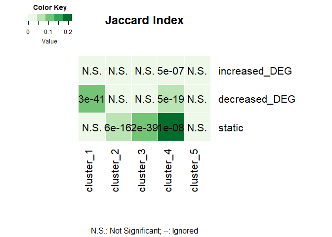 +
Clusters 1 is enriched in genes with decreased expression upon Foxg1
knockdown (KD). Cluster 4 is enriched in genes with increased and
decreasedgene expression upon Foxg1 KD.  
\### Differential Functional Enrichment Analysis of DEGs annotating to
FOXG1 clusters at TSS

``` r
# read in separate files for clustered DEGs
FOXG1_vitro_c1 <- read.table("~/Integrative-multi-omics-analyses-of-FOXG1-functions/Input Files/Figure 2/inputs from galaxy/Galaxy75-[N1_FOXG1_DEG_c1_unique].tabular", 
                             header=FALSE, sep="\t", quote="",fill=FALSE,)
FOXG1_vitro_c2 <- read.table("~/Integrative-multi-omics-analyses-of-FOXG1-functions/Input Files/Figure 2/inputs from galaxy/Galaxy77-[N1_FOXG1_DEG_c2_unique].tabular", 
                             header=FALSE, sep="\t",quote="",fill=FALSE,)
FOXG1_vitro_c3 <- read.table("~/Integrative-multi-omics-analyses-of-FOXG1-functions/Input Files/Figure 2/inputs from galaxy/Galaxy79-[N1_FOXG1_DEG_c3_unique].tabular", 
                             header=FALSE, sep="\t",quote="",fill=FALSE,)
FOXG1_vitro_c4 <- read.table("~/Integrative-multi-omics-analyses-of-FOXG1-functions/Input Files/Figure 2/inputs from galaxy/Galaxy81-[N1_FOXG1_DEG_c4_unique].tabular", 
                             header=FALSE, sep="\t",quote="",fill=FALSE,)
FOXG1_vitro_c5 <- read.table("~/Integrative-multi-omics-analyses-of-FOXG1-functions/Input Files/Figure 2/inputs from galaxy/Galaxy83-[N1_FOXG1_DEG_c5_unique].tabular", 
                             header = FALSE, sep="\t",quote="",fill=FALSE,)
FOXG1_vitro_c1$V8<-as.numeric(FOXG1_vitro_c1$V8)
FOXG1_vitro_c2$V8<-as.numeric(FOXG1_vitro_c2$V8)
FOXG1_vitro_c3$V8<-as.numeric(FOXG1_vitro_c3$V8)
FOXG1_vitro_c4$V8<-as.numeric(FOXG1_vitro_c4$V8)
FOXG1_vitro_c5$V8<-as.numeric(FOXG1_vitro_c5$V8)
c1_DEG_thr<- FOXG1_vitro_c1[FOXG1_vitro_c1$V11<=0.01,]
c2_DEG_thr<- FOXG1_vitro_c2[FOXG1_vitro_c2$V11<=0.01,]
c3_DEG_thr<- FOXG1_vitro_c3[FOXG1_vitro_c3$V11<=0.01,]
c4_DEG_thr<- FOXG1_vitro_c4[FOXG1_vitro_c4$V11<=0.01,]
c5_DEG_thr<- FOXG1_vitro_c5[FOXG1_vitro_c5$V11<=0.01,]

# translate ENSEMBL IDs of DEGs belonging to different clusters to ENTREZID  
c1<-bitr(FOXG1_vitro_c1$V1, fromType = "ENSEMBL",
         toType = "ENTREZID",
         OrgDb = org.Mm.eg.db,
         drop = TRUE)
```

    ## 'select()' returned 1:many mapping between keys and columns

``` r
c2<-bitr(FOXG1_vitro_c2$V1, fromType = "ENSEMBL",
         toType = "ENTREZID",
         OrgDb = org.Mm.eg.db,
         drop = TRUE)
```

    ## 'select()' returned 1:many mapping between keys and columns

``` r
c3<-bitr(FOXG1_vitro_c3$V1, fromType = "ENSEMBL",
         toType = "ENTREZID",
         OrgDb = org.Mm.eg.db,
         drop = TRUE)
```

    ## 'select()' returned 1:many mapping between keys and columns

``` r
c4<-bitr(FOXG1_vitro_c4$V1, fromType = "ENSEMBL",
         toType = "ENTREZID",
         OrgDb = org.Mm.eg.db,
         drop = TRUE)
```

    ## 'select()' returned 1:many mapping between keys and columns

``` r
c5<-bitr(FOXG1_vitro_c5$V1, fromType = "ENSEMBL",
         toType = "ENTREZID",
         OrgDb = org.Mm.eg.db,
         drop = TRUE)
```

    ## 'select()' returned 1:many mapping between keys and columns

``` r
list_FOXG1_chip_vitro_DEG<-list(cluster1=c1$ENTREZID,
                          cluster2=c2$ENTREZID,
                          cluster3=c3$ENTREZID,
                          cluster4=c4$ENTREZID,
                          cluster5=c5$ENTREZID)

# comparecluster differential functionla enrichment analysis (DEGs within clusters)  
FOXG1_chip_vitro_DEG_cc<-compareCluster(geneClusters= list_FOXG1_chip_vitro_DEG,
                            fun = "enrichGO",
                            OrgDb = "org.Mm.eg.db",
                             ont = "BP",
                             pAdjustMethod = "BH",
                             qvalueCutoff = 0.01,
                             pvalueCutoff = 0.01,
                             readable = TRUE)


# create dataframe for GO terms and export to csv  
FOXG1_chip_vitro_DEG_cc_df<- as.data.frame(FOXG1_chip_vitro_DEG_cc)
write.csv(FOXG1_chip_vitro_DEG_cc_df, file="~/Integrative-multi-omics-analyses-of-FOXG1-functions/Output/Figure 2/FOXG1_chip_vitro_clustered_DEG_GOterms_1606.csv")
```

``` r
# simplify the terms to avoid redundancy  
FOXG1_chip_vitro_DEG_cc_simp<-simplify(FOXG1_chip_vitro_DEG_cc,
                                 cutoff = 0.5,
                                 by = "p.adjust",
                                 select_fun = min,
                                 measure = "Wang",
                                 semData = NULL)

# dotplot of simplified functional terms (5 categories, includeAll=FALSE)  
dp_vitro_exc = dotplot(FOXG1_chip_vitro_DEG_cc_simp,
             showCategory=5,
             includeAll=FALSE,
             font.size=10
             )
dp_vitro_exc
```

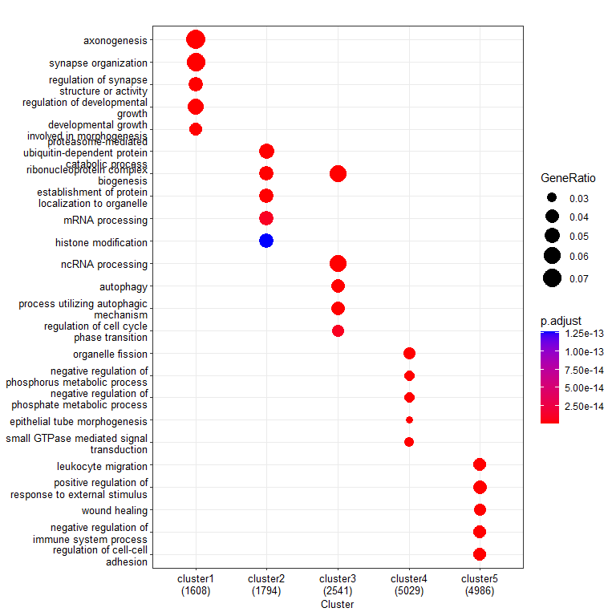

``` r
# export to pdf  
pdf("~/Integrative-multi-omics-analyses-of-FOXG1-functions/Output/Figure 2/FOXG1_chip_vitro_clustered_DEG_GO_dotplot_simp_exc_1606.pdf", width=5, height=6)
print(dp_vitro_exc)
dev.off()
```

    ## png 
    ##   2

``` r
# dotplot of simplified terms_includeALL=TRUE (5 categories)  
dp_5_vitro = dotplot(FOXG1_chip_vitro_DEG_cc_simp,
             showCategory=5,
             includeAll=TRUE,
             font.size=10
             )

# export to pdf  
pdf("~/Integrative-multi-omics-analyses-of-FOXG1-functions/Output/Figure 2/FOXG1_chip_vitro_DEG_GO_dotplot_simp_5 categories_1606.pdf", width=5, height=6)
print(dp_5_vitro)
dev.off()
```

    ## png 
    ##   2

### Session info

``` r
sessionInfo()
```

    ## R version 4.2.0 (2022-04-22 ucrt)
    ## Platform: x86_64-w64-mingw32/x64 (64-bit)
    ## Running under: Windows 10 x64 (build 17763)
    ## 
    ## Matrix products: default
    ## 
    ## locale:
    ## [1] LC_COLLATE=English_Germany.1252  LC_CTYPE=English_Germany.1252   
    ## [3] LC_MONETARY=English_Germany.1252 LC_NUMERIC=C                    
    ## [5] LC_TIME=English_Germany.1252    
    ## 
    ## attached base packages:
    ## [1] stats4    stats     graphics  grDevices utils     datasets  methods  
    ## [8] base     
    ## 
    ## other attached packages:
    ##  [1] RColorBrewer_1.1-3    ggplot2_3.4.0         GeneOverlap_1.32.0   
    ##  [4] org.Mm.eg.db_3.15.0   AnnotationDbi_1.58.0  IRanges_2.30.1       
    ##  [7] S4Vectors_0.34.0      Biobase_2.56.0        BiocGenerics_0.42.0  
    ## [10] clusterProfiler_4.4.4
    ## 
    ## loaded via a namespace (and not attached):
    ##   [1] fgsea_1.22.0           colorspace_2.0-3       ggtree_3.4.4          
    ##   [4] ellipsis_0.3.2         qvalue_2.28.0          XVector_0.36.0        
    ##   [7] aplot_0.1.9            rstudioapi_0.14        farver_2.1.1          
    ##  [10] graphlayouts_0.8.4     ggrepel_0.9.2          bit64_4.0.5           
    ##  [13] fansi_1.0.3            scatterpie_0.1.8       codetools_0.2-18      
    ##  [16] splines_4.2.0          cachem_1.0.6           GOSemSim_2.22.0       
    ##  [19] knitr_1.41             polyclip_1.10-4        jsonlite_1.8.3        
    ##  [22] GO.db_3.15.0           png_0.1-7              ggforce_0.4.1         
    ##  [25] compiler_4.2.0         httr_1.4.4             assertthat_0.2.1      
    ##  [28] Matrix_1.5-3           fastmap_1.1.0          lazyeval_0.2.2        
    ##  [31] cli_3.4.1              tweenr_2.0.2           htmltools_0.5.3       
    ##  [34] tools_4.2.0            igraph_1.3.5           gtable_0.3.1          
    ##  [37] glue_1.6.2             GenomeInfoDbData_1.2.8 reshape2_1.4.4        
    ##  [40] DO.db_2.9              dplyr_1.0.10           fastmatch_1.1-3       
    ##  [43] Rcpp_1.0.9             enrichplot_1.16.2      vctrs_0.5.1           
    ##  [46] Biostrings_2.64.1      ape_5.6-2              nlme_3.1-160          
    ##  [49] ggraph_2.1.0           xfun_0.35              stringr_1.4.1         
    ##  [52] lifecycle_1.0.3        gtools_3.9.3           DOSE_3.22.1           
    ##  [55] zlibbioc_1.42.0        MASS_7.3-58.1          scales_1.2.1          
    ##  [58] tidygraph_1.2.2        parallel_4.2.0         yaml_2.3.6            
    ##  [61] memoise_2.0.1          gridExtra_2.3          downloader_0.4        
    ##  [64] ggfun_0.0.9            yulab.utils_0.0.5      stringi_1.7.8         
    ##  [67] RSQLite_2.2.19         highr_0.9              tidytree_0.4.1        
    ##  [70] caTools_1.18.2         BiocParallel_1.30.4    GenomeInfoDb_1.32.4   
    ##  [73] rlang_1.0.6            pkgconfig_2.0.3        bitops_1.0-7          
    ##  [76] evaluate_0.18          lattice_0.20-45        purrr_0.3.5           
    ##  [79] labeling_0.4.2         treeio_1.20.2          patchwork_1.1.2       
    ##  [82] shadowtext_0.1.2       bit_4.0.5              tidyselect_1.2.0      
    ##  [85] plyr_1.8.8             magrittr_2.0.3         R6_2.5.1              
    ##  [88] gplots_3.1.3           generics_0.1.3         DBI_1.1.3             
    ##  [91] pillar_1.8.1           withr_2.5.0            KEGGREST_1.36.3       
    ##  [94] RCurl_1.98-1.9         tibble_3.1.8           crayon_1.5.2          
    ##  [97] KernSmooth_2.23-20     utf8_1.2.2             rmarkdown_2.18        
    ## [100] viridis_0.6.2          grid_4.2.0             data.table_1.14.6     
    ## [103] blob_1.2.3             digest_0.6.30          tidyr_1.2.1           
    ## [106] gridGraphics_0.5-1     munsell_0.5.0          viridisLite_0.4.1     
    ## [109] ggplotify_0.1.0
