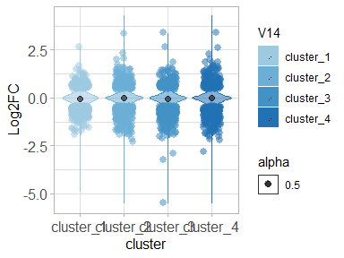
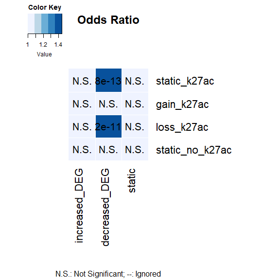
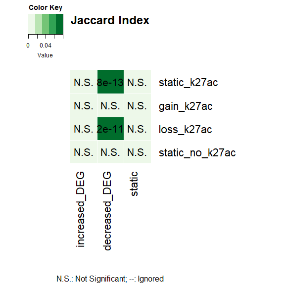
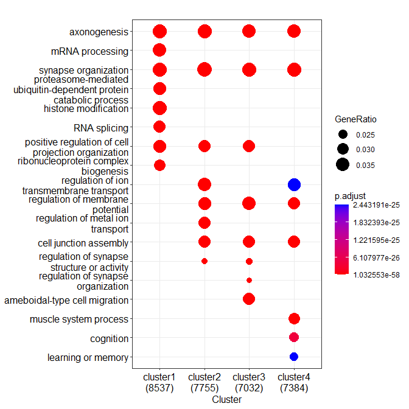

H3K24ac alterations at FOXG1 peaks upon FOXG1 KD (Figure 3)
================

load packages

``` r
library(RColorBrewer)
library(ggplot2)
library(clusterProfiler)
library(org.Mm.eg.db)
library(GeneOverlap)
library(ggVennDiagram)
library(VennDiagram)
```

## H3K27ac RELACS-seq: DIV11 Hippocampal neurons shFoxg1/shControl

### Datasets:

paired-end \* shFoxg1: 2 replicates for ChIP:
hippoN_FOxg1KD_H3K27ac_rep1/ \_rep2  
+ 2 inputs: Foxg1KD_Input_rep1, FOxg1KD_Input_rep2  
\* shControl: 2 replicates for ChIP: hippoN_Ctr_H3K27ac_rep1/ \_rep2  
+ 2 inputs: Control_Input_rep1, Control_Input_rep2 \* Mapping: Bowtie2,
using snakepipes defaults  
\*\*\* \## Quality Control (snakepipes) 1. Deeptools QC

<div class="figure" style="text-align: center">


<p class="caption">
Plot Read Coverage
</p>

</div>

<div class="figure" style="text-align: center">


<p class="caption">
Multibamsummary correlation, spearman
</p>

</div>

<div class="figure" style="text-align: center">


<p class="caption">
PCA plot
</p>

</div>

2.  Filtered Bam Files (snakepipes)

-   Filtering rules: **-q 3**  
-   meaning: remove reads with MAPQ\<3 (-q 3)  

3.  BamCoverage (snakepipes) Depth normalisation of samples. *These were
    not used in downstream analyses (IA).*  
4.  BamCompare (snakepipes) Input (control) and depth normalisation of
    ChIP-seq samples. 2 different calculations:  

-   log2Ratio of Sample over Input
-   Subtraction of Input from ChIP-sample  
    *These were preferred for downstream analyses and visualisations
    (IA).*  

5.  MACS2- Peak Calling (snakepipes) Narrow peaks and summits were
    called for each replicate separately. *These peak files were used
    for downstream analyses.*  
    \# Changes in H3K27ac at FOXG1 peaks upon Foxg1KD

-   From Galaxy
-   Tools: computeMatrix, plotHeatmap w/ K-means clustering, ChIPSeeker
    for genomic region and gene annotation  
-   Regions plotted: FOXG1 peaks (N1 filtered)
-   Score files: mean Log2FoldRatio of FOXG1/Input,
    Control_H3K27ac/Input, Foxg1KD_H3K27ac/Input,
    H3K27ac_Foxg1KD/Control
    <div class="figure">

    
    <p class="caption">
    Figure 3A: H3K27ac alterations upon Foxg1KD
    </p>

    </div>

    ## H3K27ac distribution over FOXG1 peaks under control and FOXG1 KD conditions

``` r
# upload files

k27ac_DEGs= read.table("~/Integrative-multi-omics-analyses-of-FOXG1-functions/Input Files/Figure 3/H3K27ac/Galaxy171-[K27ac_at_FOXG1_peaks_clustered_DEGs].tabular", 
                       sep="\t", quote="", fill=FALSE,)
# this dataset is an intersection of K-means clustered K27ac enrichment at FOXG1 peaks (above heatmap) and DEGs upon FOXG1 KD.
k27ac_DEG_df= as.data.frame(k27ac_DEGs)
k27ac_DEG_df[,'V14']<-factor(k27ac_DEG_df[,'V14'])
k27ac_DEG_df$V25<- as.numeric(k27ac_DEG_df$V25)
```

    ## Warning: NAs introduced by coercion

``` r
# filter by LFC and padj
k27ac_DEG_filt<- k27ac_DEG_df[(abs(k27ac_DEG_df$V25)>= 0.5 & 
                                   (k27ac_DEG_df$V28<= 0.01)),] 
    k27ac_DEG_filt_df<- as.data.frame(k27ac_DEG_filt)
k27ac_DEG_filt_df[,'V14']<-factor(k27ac_DEG_filt_df[,'V14'])
k27ac_DEG_filt_df$V25<-as.numeric(k27ac_DEG_filt_df$V25)

# Violin plot of DEG distribution in each cluster LFC.cutoff=0.5 for dots
my_palette <- brewer.pal(name="Blues",n=8)[4:8]

p_k27ac <- ggplot(k27ac_DEG_df, 
                  aes(x=V14, y=V25, fill=V14, color= V14, alpha=0.5, font=12))+ 
    scale_color_manual(values = my_palette, aesthetics = "fill")+
    scale_color_manual(values = my_palette, aesthetics = "colour")+
    geom_violin()+ 
    labs(x="cluster", y = "Log2FC")+ theme_light()+
    stat_summary(fun=median, geom="point", size=2, color="black")+
    theme(axis.text = element_text(size=12),
          axis.title = element_text(size=12))

violin_plot_k27ac<- p_k27ac + geom_jitter( data= k27ac_DEG_filt_df, 
                          shape=16, 
                          size=2.5,
                          position=position_jitter(width=0.2, height= 0.1))
violin_plot_k27ac
```

    ## Warning: Removed 4 rows containing non-finite values (`stat_ydensity()`).

    ## Warning: Removed 4 rows containing non-finite values (`stat_summary()`).

<!-- -->

``` r
# plot the violin plot and export to pdf (Figure 3E)
pdf("~/Integrative-multi-omics-analyses-of-FOXG1-functions/Output/Figure 3/violin plot_k27ac_FOXG1 peaks_filtered_051022.pdf", 
     width=4.5, 
    height=4)
print(violin_plot_k27ac)
```

    ## Warning: Removed 4 rows containing non-finite values (`stat_ydensity()`).
    ## Removed 4 rows containing non-finite values (`stat_summary()`).

``` r
dev.off()
```

    ## png 
    ##   2

### *GeneOverlap* enrichment test for DEG-peak cluster correlation

``` r
# read in K-means clustered peaks files (from the heatmap above) 
k27ac_c1<- read.table("~/Integrative-multi-omics-analyses-of-FOXG1-functions/Input Files/Figure 3/H3K27ac/Galaxy133-[K27ac_FOXG1_filtered_peaks_Cluster1].tabular",
                      header=TRUE, sep="\t", quote="", fill=FALSE,)
k27ac_c2<- read.table("~/Integrative-multi-omics-analyses-of-FOXG1-functions/Input Files/Figure 3/H3K27ac/Galaxy136-[K27ac_FOXG1_filtered_peaks_Cluster2].tabular", 
                      header=TRUE, sep="\t", quote="", fill=FALSE,)
k27ac_c3<- read.table("~/Integrative-multi-omics-analyses-of-FOXG1-functions/Input Files/Figure 3/H3K27ac/Galaxy139-[K27ac_FOXG1_filtered_peaks_Cluster3].tabular",
                      header=TRUE, sep="\t", quote="", fill=FALSE,)
k27ac_c4<- read.table("~/Integrative-multi-omics-analyses-of-FOXG1-functions/Input Files/Figure 3/H3K27ac/Galaxy142-[K27ac_FOXG1_filtered_peaks_Cluster4].tabular", 
                      header=TRUE, sep="\t", quote="", fill=FALSE,)

# h3k27ac cluster list with annotations (gain, loss, static)
k27ac_list<- list(static_k27ac= k27ac_c1$geneId,
                  gain_k27ac= k27ac_c2$geneId,
                  loss_k27ac= k27ac_c3$geneId,
                  static_no_k27ac= k27ac_c4$geneId)

# Upload DEG table (FOXG1KD/Control in DIV11 hippocampal neurons)
Foxg1_KD_DEGs<-read.table("~/Integrative-multi-omics-analyses-of-FOXG1-functions/Input Files/Figure 1/DE_genes_shrinked_apeglm_div11.tabular", 
                          sep="\t", header = TRUE,)
Foxg1_KD_DEGs_df<- as.data.frame(Foxg1_KD_DEGs)
Foxg1_KD_DEGs_df$log2FoldChange<-as.numeric(gsub(",", ".", Foxg1_KD_DEGs_df$log2FoldChange))

# filter according to increased and decreased gene expression
increased_DEG<-Foxg1_KD_DEGs_df[(Foxg1_KD_DEGs_df$log2FoldChange>=0.5 &
                                Foxg1_KD_DEGs_df$padj<=0.01),]
decreased_DEG<-Foxg1_KD_DEGs_df[(Foxg1_KD_DEGs_df$log2FoldChange<=(-0.5) &
                                  Foxg1_KD_DEGs_df$padj<=0.01),]
static_DEG<-Foxg1_KD_DEGs_df[(abs(Foxg1_KD_DEGs_df$log2FoldChange)< 0.5) & 
                                 (Foxg1_KD_DEGs_df$padj>0.01),]
# combine filtered DEGs in a list
DEG_list<- list(increased_DEG= increased_DEG$X,
                decreased_DEG=decreased_DEG$X,
                static=static_DEG$X)
# Prepare Geneoverlap matrix for enrichment test- clustered H3K27ac-DEG overlap
GO_matrix_k27ac<-newGOM(k27ac_list, DEG_list, genome.size = nrow(Foxg1_KD_DEGs_df))
GO_matrix_k27ac
```

    ## A <4 x 3> GeneOverlapMatrix object
    ## Geneset A sizes:
    ##    static_k27ac      gain_k27ac      loss_k27ac static_no_k27ac 
    ##           22224           26672           30530           28499 
    ## Geneset B sizes:
    ## increased_DEG decreased_DEG        static 
    ##           730          1782         19930

``` r
# oddsratio heatmap for strength of association between lists
heatmap_k27ac<- drawHeatmap(GO_matrix_k27ac, 
            what = c("odds.ratio"), 
            adj.p=TRUE, 
            cutoff=0.05, 
            ncolused = 5,
            grid.col = "Blues",
            note.col = "Black")
```

<!-- -->

``` r
# Jaccard heatmap for similarity between two lists
heatmap_k27ac<- drawHeatmap(GO_matrix_k27ac, 
            what = c("Jaccard"), 
            adj.p=TRUE, 
            cutoff=0.1, 
            ncolused = 5,
            grid.col = "Greens",
            note.col = "Black")
```

<!-- -->
\### GO term functional erichment analysis of clustered peaks

``` r
# annotate ENSEMBL ID to ENTREZID
c1_k27ac<-bitr(k27ac_c1$geneId, fromType="ENSEMBL", toType=c("ENTREZID","ENSEMBL"), OrgDb="org.Mm.eg.db",drop = TRUE)
```

    ## 'select()' returned 1:many mapping between keys and columns

    ## Warning in bitr(k27ac_c1$geneId, fromType = "ENSEMBL", toType = c("ENTREZID", :
    ## 13.16% of input gene IDs are fail to map...

``` r
c2_k27ac<-bitr(k27ac_c2$geneId, fromType="ENSEMBL", toType=c("ENTREZID","ENSEMBL"), OrgDb="org.Mm.eg.db",drop = TRUE)
```

    ## 'select()' returned 1:many mapping between keys and columns

    ## Warning in bitr(k27ac_c2$geneId, fromType = "ENSEMBL", toType = c("ENTREZID", :
    ## 22.78% of input gene IDs are fail to map...

``` r
c3_k27ac<-bitr(k27ac_c3$geneId, fromType="ENSEMBL", toType=c("ENTREZID","ENSEMBL"), OrgDb="org.Mm.eg.db",drop = TRUE)
```

    ## 'select()' returned 1:many mapping between keys and columns

    ## Warning in bitr(k27ac_c3$geneId, fromType = "ENSEMBL", toType = c("ENTREZID", :
    ## 25.22% of input gene IDs are fail to map...

``` r
c4_k27ac<-bitr(k27ac_c4$geneId, fromType="ENSEMBL", toType=c("ENTREZID","ENSEMBL"), OrgDb="org.Mm.eg.db",drop = TRUE)
```

    ## 'select()' returned 1:many mapping between keys and columns

    ## Warning in bitr(k27ac_c4$geneId, fromType = "ENSEMBL", toType = c("ENTREZID", :
    ## 25.64% of input gene IDs are fail to map...

``` r
# create geneCluster list with the ENTREZIDs
list_k27ac<-list(cluster1= c1_k27ac$ENTREZID, 
                         cluster2= c2_k27ac$ENTREZID,
                         cluster3= c3_k27ac$ENTREZID,
                         cluster4=c4_k27ac$ENTREZID)

# run comparecluster
    k27ac_GO <- compareCluster(geneClusters = list_k27ac,
                             fun="enrichGO",
                             OrgDb = "org.Mm.eg.db",
                             ont = "BP",
                             pAdjustMethod = "BH",
                             qvalueCutoff = 0.01,
                             pvalueCutoff = 0.01,
                             readable = TRUE)
  # simplify to avoid redundant terms
    k27ac_GO_simp<-clusterProfiler::simplify(k27ac_GO,
                                             cutoff = 0.7,
                                             by = "p.adjust",
                                             select_fun = min,
                                             measure = "Wang",
                                             semData = NULL)
#Dotplot of comparecluster
dp_k27ac<-dotplot(k27ac_GO,
                  includeAll=FALSE,
                  showCategory=8, 
                  font.size=12)
dp_k27ac
```

<!-- -->

``` r
# Dotplot of simplified terms
dp_k27ac_simp = dotplot(k27ac_GO_simp,
                        showCategory=8,
                        font.size=10,
                        includeAll=FALSE)
dp_k27ac_simp
```

<!-- -->

``` r
# export the dotplots to pdf (Figure 3C)
pdf("~/Integrative-multi-omics-analyses-of-FOXG1-functions/Output/Figure 3/H3K27ac_FOXG1_clustered_GOterms_dotplot_filtered_051022.pdf", width=5.5, height=5.5)
print(dp_k27ac)
dev.off()
```

    ## png 
    ##   2

``` r
pdf("~/Integrative-multi-omics-analyses-of-FOXG1-functions/Output/Figure 3/H3K27ac_FOXG1_clustered_GOterms_dotplot_filtered_simp_051022.pdf",
    width=5.5, 
    height=5.)
print(dp_k27ac_simp)
dev.off()
```

    ## png 
    ##   2

``` r
sessionInfo()
```

    ## R version 4.2.0 (2022-04-22 ucrt)
    ## Platform: x86_64-w64-mingw32/x64 (64-bit)
    ## Running under: Windows 10 x64 (build 17763)
    ## 
    ## Matrix products: default
    ## 
    ## locale:
    ## [1] LC_COLLATE=English_Germany.1252  LC_CTYPE=English_Germany.1252   
    ## [3] LC_MONETARY=English_Germany.1252 LC_NUMERIC=C                    
    ## [5] LC_TIME=English_Germany.1252    
    ## 
    ## attached base packages:
    ## [1] grid      stats4    stats     graphics  grDevices utils     datasets 
    ## [8] methods   base     
    ## 
    ## other attached packages:
    ##  [1] VennDiagram_1.7.3     futile.logger_1.4.3   ggVennDiagram_1.2.2  
    ##  [4] GeneOverlap_1.32.0    org.Mm.eg.db_3.15.0   AnnotationDbi_1.58.0 
    ##  [7] IRanges_2.30.1        S4Vectors_0.34.0      Biobase_2.56.0       
    ## [10] BiocGenerics_0.42.0   clusterProfiler_4.4.4 ggplot2_3.4.0        
    ## [13] RColorBrewer_1.1-3   
    ## 
    ## loaded via a namespace (and not attached):
    ##   [1] fgsea_1.22.0           colorspace_2.0-3       ggtree_3.4.4          
    ##   [4] ellipsis_0.3.2         qvalue_2.28.0          XVector_0.36.0        
    ##   [7] aplot_0.1.9            rstudioapi_0.14        farver_2.1.1          
    ##  [10] graphlayouts_0.8.4     ggrepel_0.9.2          bit64_4.0.5           
    ##  [13] fansi_1.0.3            scatterpie_0.1.8       codetools_0.2-18      
    ##  [16] splines_4.2.0          cachem_1.0.6           GOSemSim_2.22.0       
    ##  [19] knitr_1.41             polyclip_1.10-4        jsonlite_1.8.3        
    ##  [22] GO.db_3.15.0           png_0.1-7              ggforce_0.4.1         
    ##  [25] compiler_4.2.0         httr_1.4.4             assertthat_0.2.1      
    ##  [28] Matrix_1.5-3           fastmap_1.1.0          lazyeval_0.2.2        
    ##  [31] cli_3.4.1              formatR_1.12           tweenr_2.0.2          
    ##  [34] htmltools_0.5.3        tools_4.2.0            igraph_1.3.5          
    ##  [37] gtable_0.3.1           glue_1.6.2             GenomeInfoDbData_1.2.8
    ##  [40] reshape2_1.4.4         DO.db_2.9              dplyr_1.0.10          
    ##  [43] fastmatch_1.1-3        Rcpp_1.0.9             enrichplot_1.16.2     
    ##  [46] vctrs_0.5.1            Biostrings_2.64.1      ape_5.6-2             
    ##  [49] nlme_3.1-160           ggraph_2.1.0           xfun_0.35             
    ##  [52] stringr_1.4.1          lifecycle_1.0.3        gtools_3.9.3          
    ##  [55] DOSE_3.22.1            zlibbioc_1.42.0        MASS_7.3-58.1         
    ##  [58] scales_1.2.1           tidygraph_1.2.2        parallel_4.2.0        
    ##  [61] lambda.r_1.2.4         yaml_2.3.6             memoise_2.0.1         
    ##  [64] gridExtra_2.3          downloader_0.4         ggfun_0.0.9           
    ##  [67] yulab.utils_0.0.5      stringi_1.7.8          RSQLite_2.2.19        
    ##  [70] highr_0.9              tidytree_0.4.1         caTools_1.18.2        
    ##  [73] BiocParallel_1.30.4    GenomeInfoDb_1.32.4    rlang_1.0.6           
    ##  [76] pkgconfig_2.0.3        bitops_1.0-7           evaluate_0.18         
    ##  [79] lattice_0.20-45        purrr_0.3.5            labeling_0.4.2        
    ##  [82] treeio_1.20.2          patchwork_1.1.2        shadowtext_0.1.2      
    ##  [85] bit_4.0.5              tidyselect_1.2.0       plyr_1.8.8            
    ##  [88] magrittr_2.0.3         R6_2.5.1               gplots_3.1.3          
    ##  [91] generics_0.1.3         DBI_1.1.3              pillar_1.8.1          
    ##  [94] withr_2.5.0            KEGGREST_1.36.3        RCurl_1.98-1.9        
    ##  [97] tibble_3.1.8           crayon_1.5.2           futile.options_1.0.1  
    ## [100] KernSmooth_2.23-20     utf8_1.2.2             RVenn_1.1.0           
    ## [103] rmarkdown_2.18         viridis_0.6.2          data.table_1.14.6     
    ## [106] blob_1.2.3             digest_0.6.30          tidyr_1.2.1           
    ## [109] gridGraphics_0.5-1     munsell_0.5.0          viridisLite_0.4.1     
    ## [112] ggplotify_0.1.0
