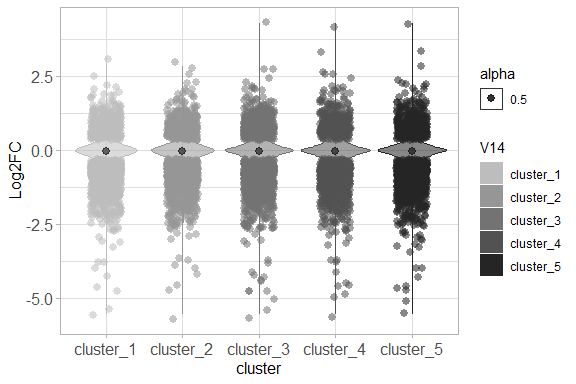
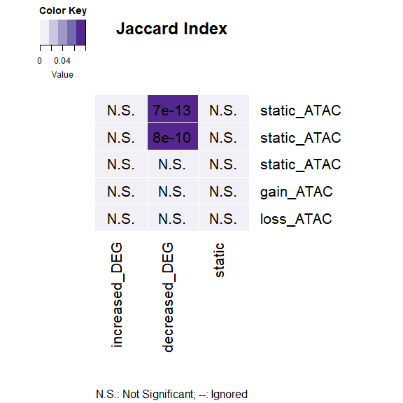
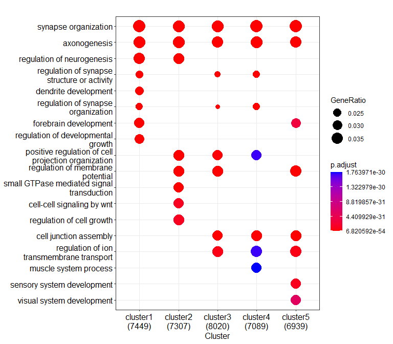
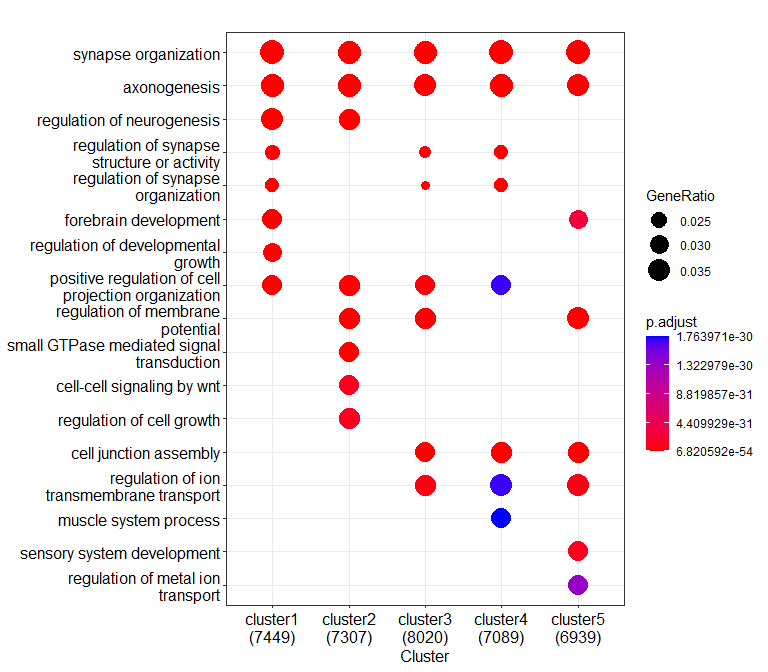

Changes in chromatin accessibility at FOXG1 peaks upon FOXG1 Knockdown
(Figure 3)
================

load packages

``` r
library(RColorBrewer)
library(ggplot2)
```

    ## Warning: package 'ggplot2' was built under R version 4.2.2

``` r
library(clusterProfiler)
```

    ## 

    ## clusterProfiler v4.4.4  For help: https://yulab-smu.top/biomedical-knowledge-mining-book/
    ## 
    ## If you use clusterProfiler in published research, please cite:
    ## T Wu, E Hu, S Xu, M Chen, P Guo, Z Dai, T Feng, L Zhou, W Tang, L Zhan, X Fu, S Liu, X Bo, and G Yu. clusterProfiler 4.0: A universal enrichment tool for interpreting omics data. The Innovation. 2021, 2(3):100141

    ## 
    ## Attaching package: 'clusterProfiler'

    ## The following object is masked from 'package:stats':
    ## 
    ##     filter

``` r
library(org.Mm.eg.db)
```

    ## Loading required package: AnnotationDbi

    ## Loading required package: stats4

    ## Loading required package: BiocGenerics

    ## 
    ## Attaching package: 'BiocGenerics'

    ## The following objects are masked from 'package:stats':
    ## 
    ##     IQR, mad, sd, var, xtabs

    ## The following objects are masked from 'package:base':
    ## 
    ##     anyDuplicated, append, as.data.frame, basename, cbind, colnames,
    ##     dirname, do.call, duplicated, eval, evalq, Filter, Find, get, grep,
    ##     grepl, intersect, is.unsorted, lapply, Map, mapply, match, mget,
    ##     order, paste, pmax, pmax.int, pmin, pmin.int, Position, rank,
    ##     rbind, Reduce, rownames, sapply, setdiff, sort, table, tapply,
    ##     union, unique, unsplit, which.max, which.min

    ## Loading required package: Biobase

    ## Welcome to Bioconductor
    ## 
    ##     Vignettes contain introductory material; view with
    ##     'browseVignettes()'. To cite Bioconductor, see
    ##     'citation("Biobase")', and for packages 'citation("pkgname")'.

    ## Loading required package: IRanges

    ## Warning: package 'IRanges' was built under R version 4.2.1

    ## Loading required package: S4Vectors

    ## 
    ## Attaching package: 'S4Vectors'

    ## The following object is masked from 'package:clusterProfiler':
    ## 
    ##     rename

    ## The following objects are masked from 'package:base':
    ## 
    ##     expand.grid, I, unname

    ## 
    ## Attaching package: 'IRanges'

    ## The following object is masked from 'package:clusterProfiler':
    ## 
    ##     slice

    ## The following object is masked from 'package:grDevices':
    ## 
    ##     windows

    ## 
    ## Attaching package: 'AnnotationDbi'

    ## The following object is masked from 'package:clusterProfiler':
    ## 
    ##     select

    ## 

``` r
library(GeneOverlap)
library(ggVennDiagram)
```

    ## Warning: package 'ggVennDiagram' was built under R version 4.2.2

``` r
library(VennDiagram)
```

    ## Loading required package: grid

    ## Loading required package: futile.logger

    ## 
    ## Attaching package: 'VennDiagram'

    ## The following object is masked from 'package:ggVennDiagram':
    ## 
    ##     ellipse

## ATAC RELACS-seq: DIV11 Hippocampal neurons shFoxg1/shControl

### Datasets:

paired-end \* shFoxg1: 2 replicates for ChIP: hippoN_FOxg1KD_ATAC_rep1/
\_rep2  
+no inputs \* shControl: 2 replicates for ChIP: hippoN_Ctr_ATAC_rep1/
\_rep2  
+ no inputs \* Mapping: Bowtie2, using snakepipes defaults  
\*\*\* \## Quality Control (snakepipes) 1. Deeptools QC

<div class="figure" style="text-align: center">


<p class="caption">
Plot Read Coverage
</p>

</div>

<div class="figure" style="text-align: center">


<p class="caption">
Multibamsummary correlation, spearman
</p>

</div>

<div class="figure" style="text-align: center">


<p class="caption">
PCA plot
</p>

</div>

2.  Filtered Bam Files (snkaepipes)

-   Filtering rules: **-q 3**  
-   meaning: remove reads with MAPQ\<3 (-q 3)  

3.  BamCoverage (snakepipes) Depth normalisation of samples. *These were
    not used in downstream analyses (IA).*  
4.  BamCompare (snakepipes) Input (control) and depth normalisation of
    ChIP-seq samples. 2 different calculations:  

-   log2Ratio of Sample over Input
-   Subtraction of Input from ChIP-sample  
    *These were preferred for downstream analyses and visualisations
    (IA).*  

5.  MACS2- Peak Calling (snakepipes) Narrow peaks and summits were
    called for each replicate separately. *These peak files were used
    for downstream analyses.*  
    \# Changes in ATAC at FOXG1 peaks upon Foxg1KD

-   From Galaxy
-   Tools: computeMatrix, plotHeatmap w/ K-means clustering, ChIPSeeker
    for region annotation  
-   Regions plotted: FOXG1 peaks (N1 filtered)
-   Score files: mean LogFoldRatio of FOXG1/Input, Control_ATAC/Input,
    Foxg1KD_ATAC/Input, ATAC_Foxg1KD/Control \## ATAC peaks at FOXG1
    binding sites Heatmap in FOXG1 KD/Control conditions (from Galaxy)

``` r
knitr::include_graphics("C:/Users/admin.ia1014/Documents/Integrative-multi-omics-analyses-of-FOXG1-functions/Input Files/Figure 3/ATAC/heatmap_ATAC at foxg1 peaks_filtered.png")
```

<div class="figure">


<p class="caption">
ATAC distribution at FOXG1 peaks and changes upon reduced levels of
FOXG1 (Figure 3K)
</p>

</div>

### ATAC over FOXG1 peaks and intersection on DEGs

``` r
# read in files
ATAC_DEGs= read.table("~/Integrative-multi-omics-analyses-of-FOXG1-functions/Input Files/Figure 3/ATAC/Galaxy169-[ATAC_at_FOXG1_peaks_clustered_DEGs].tabular", 
                      sep="\t", quote="", fill=FALSE, header=FALSE,)
ATAC_DEG_df= as.data.frame(ATAC_DEGs)
ATAC_DEG_df[,'V14']<-factor(ATAC_DEG_df[,'V14'])
ATAC_DEG_df$V25<-as.numeric(ATAC_DEG_df$V25)

# Filter the DEGs
ATAC_DEG_filt<- ATAC_DEG_df[abs(ATAC_DEG_df$V25)>0.5,] 
    ATAC_DEG_filt_df<- as.data.frame(ATAC_DEG_filt)
ATAC_DEG_filt_df[,'V14']<-factor(ATAC_DEG_filt_df[,'V14'])
ATAC_DEG_filt_df$V25<-as.numeric(ATAC_DEG_filt_df$V25)

# violin plot of DEG distribution in each cluster LFC.cutoff=0.5
my_palette <- brewer.pal(name="Greys",n=8)[4:8]

p_ATAC <- ggplot(ATAC_DEG_df, 
                  aes(x=V14, y=V25, fill=V14, color= V14, alpha=0.5, font=12))+ 
    scale_color_manual(values = my_palette, aesthetics = "fill")+
    scale_color_manual(values = my_palette, aesthetics = "colour")+
    geom_violin()+ 
    labs(x="cluster", y = "Log2FC")+ theme_light()+
    stat_summary(fun=median, geom="point", size=2.5, color="black")+
    theme(axis.text = element_text(size=12),
          axis.title = element_text(size=12))

violin_plot_ATAC<- p_ATAC + geom_jitter( data= ATAC_DEG_filt_df, 
                          shape=16, 
                          size=2.5,
                          position=position_jitter(width=0.2, height= 0.2), 
                          cex=4)
# violin plot (Figure 3O)
violin_plot_ATAC
```

<!-- -->

``` r
# export to pdf
pdf("~/Integrative-multi-omics-analyses-of-FOXG1-functions/Output/Figure 3/violin plot_ATAC_FOXG1 peaks_filtered_2006.pdf", 
    width=4.5, 
    height=4)
print(violin_plot_ATAC)
dev.off()
```

    ## png 
    ##   2

### GeneOverlap to test enrichment of DEGs in clusters

``` r
# read in clustered peaks files (coming from Figure 3K)
ATAC_c1<- read.table("~/Integrative-multi-omics-analyses-of-FOXG1-functions/Input Files/Figure 3/ATAC/Galaxy134-[ATAC_FOXG1_filtered_peaks_Cluster1].tabular", 
                     header=TRUE, sep="\t", quote="", fill=FALSE,)
ATAC_c2<- read.table("~/Integrative-multi-omics-analyses-of-FOXG1-functions/Input Files/Figure 3/ATAC/Galaxy137-[ATAC_FOXG1_filtered_peaks_Cluster2].tabular", 
                     header=TRUE, sep="\t", quote="", fill=FALSE,)
ATAC_c3<- read.table("~/Integrative-multi-omics-analyses-of-FOXG1-functions/Input Files/Figure 3/ATAC/Galaxy140-[ATAC_FOXG1_filtered_peaks_Cluster3].tabular", 
                     header=TRUE, sep="\t", quote="", fill=FALSE,)
ATAC_c4<- read.table("~/Integrative-multi-omics-analyses-of-FOXG1-functions/Input Files/Figure 3/ATAC/Galaxy143-[ATAC_FOXG1_filtered_peaks_Cluster4].tabular", 
                     header=TRUE, sep="\t", quote="", fill=FALSE,)
ATAC_c5<- read.table("~/Integrative-multi-omics-analyses-of-FOXG1-functions/Input Files/Figure 3/ATAC/Galaxy144-[ATAC_FOXG1_filtered_peaks_Cluster5].tabular",
                     header=TRUE, sep="\t", quote="", fill=FALSE,)

# ATAC cluster list
ATAC_list<- list( static_ATAC= ATAC_c1$geneId,
                  static_ATAC= ATAC_c2$geneId,
                  static_ATAC= ATAC_c3$geneId,
                  gain_ATAC= ATAC_c4$geneId,
                  loss_ATAC= ATAC_c5$geneId)

# DEG list
Foxg1_KD_DEGs<-read.table("~/Integrative-multi-omics-analyses-of-FOXG1-functions/Input Files/Figure 1/DE_genes_shrinked_apeglm_DIV11.tabular", 
                          sep="\t", header = TRUE,)
Foxg1_KD_DEGs_df<- as.data.frame(Foxg1_KD_DEGs)
Foxg1_KD_DEGs_df$log2FoldChange<-as.numeric(gsub(",", ".", Foxg1_KD_DEGs_df$log2FoldChange))

# Filter DEGs
increased_DEG<-Foxg1_KD_DEGs_df[(Foxg1_KD_DEGs_df$log2FoldChange>=0.5 &
                                Foxg1_KD_DEGs_df$padj<=0.01),]
decreased_DEG<-Foxg1_KD_DEGs_df[(Foxg1_KD_DEGs_df$log2FoldChange<=(-0.5) &
                                  Foxg1_KD_DEGs_df$padj<=0.01),]
static_DEG<-Foxg1_KD_DEGs_df[(abs(Foxg1_KD_DEGs_df$log2FoldChange)< 0.5) & (Foxg1_KD_DEGs_df$padj>0.01),]
# combine them ina list
DEG_list<- list(increased_DEG= increased_DEG$X,
                decreased_DEG=decreased_DEG$X,
                static=static_DEG$X
                )
# ATAC clusters-DEGs GO terms overrepresentation test
GO_matrix_ATAC<-newGOM(ATAC_list, DEG_list, 
                       genome.size = nrow(Foxg1_KD_DEGs_df))
GO_matrix_ATAC
```

    ## A <5 x 3> GeneOverlapMatrix object
    ## Geneset A sizes:
    ## static_ATAC static_ATAC static_ATAC   gain_ATAC   loss_ATAC 
    ##       18501       18560       26610       21705       22549 
    ## Geneset B sizes:
    ## increased_DEG decreased_DEG        static 
    ##           730          1782         19930

``` r
# oddsratio heatmap
heatmap_ATAC<- drawHeatmap(GO_matrix_ATAC, 
            what = c("odds.ratio"), 
            adj.p=TRUE, 
            cutoff=0.1, 
            ncolused = 5,
            grid.col = "Purples",
            note.col = "Black")
```

<!-- -->

``` r
# Jaccard heatmap
heatmap_ATAC<- drawHeatmap(GO_matrix_ATAC, 
            what = c("Jaccard"), 
            adj.p=TRUE, 
            cutoff=0.1, 
            ncolused = 5,
            grid.col = "Purples",
            note.col = "Black")
```

<!-- -->
\### GO term Functional enrichment test of clustered peaks

``` r
# translate ENSEMBL annotation to ENTREZIDs

c1_ATAC<-bitr(ATAC_c1$geneId, 
              fromType="ENSEMBL", 
              toType=c("ENTREZID","ENSEMBL"), 
              OrgDb="org.Mm.eg.db",
              drop = TRUE)
```

    ## 'select()' returned 1:many mapping between keys and columns

    ## Warning in bitr(ATAC_c1$geneId, fromType = "ENSEMBL", toType = c("ENTREZID", :
    ## 18.35% of input gene IDs are fail to map...

``` r
c2_ATAC<-bitr(ATAC_c2$geneId,
              fromType="ENSEMBL", 
              toType=c("ENTREZID","ENSEMBL"), 
              OrgDb="org.Mm.eg.db",
              drop = TRUE)
```

    ## 'select()' returned 1:many mapping between keys and columns

    ## Warning in bitr(ATAC_c2$geneId, fromType = "ENSEMBL", toType = c("ENTREZID", :
    ## 19.34% of input gene IDs are fail to map...

``` r
c3_ATAC<-bitr(ATAC_c3$geneId,
              fromType="ENSEMBL",
              toType=c("ENTREZID","ENSEMBL"), 
              OrgDb="org.Mm.eg.db",
              drop = TRUE)
```

    ## 'select()' returned 1:many mapping between keys and columns

    ## Warning in bitr(ATAC_c3$geneId, fromType = "ENSEMBL", toType = c("ENTREZID", :
    ## 23.66% of input gene IDs are fail to map...

``` r
c4_ATAC<-bitr(ATAC_c4$geneId,
              fromType="ENSEMBL", 
              toType=c("ENTREZID","ENSEMBL"),
              OrgDb="org.Mm.eg.db",
              drop = TRUE)
```

    ## 'select()' returned 1:many mapping between keys and columns

    ## Warning in bitr(ATAC_c4$geneId, fromType = "ENSEMBL", toType = c("ENTREZID", :
    ## 24.19% of input gene IDs are fail to map...

``` r
c5_ATAC<-bitr(ATAC_c5$geneId, 
              fromType="ENSEMBL", 
              toType=c("ENTREZID","ENSEMBL"),
              OrgDb="org.Mm.eg.db",
              drop = TRUE)
```

    ## 'select()' returned 1:many mapping between keys and columns

    ## Warning in bitr(ATAC_c5$geneId, fromType = "ENSEMBL", toType = c("ENTREZID", :
    ## 24.36% of input gene IDs are fail to map...

``` r
# create geneCluster list
list_ATAC<-list(cluster1= c1_ATAC$ENTREZID, 
                         cluster2= c2_ATAC$ENTREZID,
                         cluster3= c3_ATAC$ENTREZID,
                         cluster4=c4_ATAC$ENTREZID,
                         cluster5=c5_ATAC$ENTREZID)

# comparecluster for differential GO term enrichment analysis
  ATAC_GO <- compareCluster(geneClusters = list_ATAC,
                                 fun="enrichGO",
                                 OrgDb = "org.Mm.eg.db",
                                 ont = "BP",
                                 pAdjustMethod = "BH",
                                 qvalueCutoff = 0.01,
                                 pvalueCutoff = 0.01,
                                 readable = TRUE)

 # simplify the terms to avoid redundancy
ATAC_GO_simp<-clusterProfiler::simplify(ATAC_GO,
                                 cutoff = 0.7,
                                 by = "p.adjust",
                                 select_fun = min,
                                 measure = "Wang",
                                 semData = NULL)
# dotplot of comparecluster results
dp_ATAC = dotplot(ATAC_GO,
             showCategory=8,
             font.size=12,
             includeAll=FALSE
             )
dp_ATAC
```

<!-- -->

``` r
# dotplot of simplified comparecluster results
dp_ATAC_simp = dotplot(ATAC_GO_simp,
             showCategory=8,
             font.size=12,
             includeAll=FALSE
             )

dp_ATAC_simp
```

<!-- -->

``` r
# create reference table for clustered GO terms and export to table
df_ATAC_GO = as.data.frame(ATAC_GO)
write.table(df_ATAC_GO,
            file="~/Integrative-multi-omics-analyses-of-FOXG1-functions/Output/Figure 3/ATAC_FOXG1_clustered_GOterms_filtered_16.06.txt", 
            sep = "\t", quote = F,)

# export the dotplots to pdf
pdf("~/Integrative-multi-omics-analyses-of-FOXG1-functions/Output/Figure 3/ATAC_FOXG1_clustered_GO terms_dotplot_filtered_051022.pdf", 
    width=5.5, height=5.7)
print(dp_ATAC)
dev.off()
```

    ## png 
    ##   2

``` r
pdf("~/Integrative-multi-omics-analyses-of-FOXG1-functions/Output/Figure 3/ATAC_FOXG1_clustered_GO terms_dotplot_filtered_simp_051022.pdf", 
    width=5.5, height=5.7)
print(dp_ATAC_simp)
dev.off()
```

    ## png 
    ##   2

``` r
sessionInfo()
```

    ## R version 4.2.0 (2022-04-22 ucrt)
    ## Platform: x86_64-w64-mingw32/x64 (64-bit)
    ## Running under: Windows 10 x64 (build 17763)
    ## 
    ## Matrix products: default
    ## 
    ## locale:
    ## [1] LC_COLLATE=English_Germany.1252  LC_CTYPE=English_Germany.1252   
    ## [3] LC_MONETARY=English_Germany.1252 LC_NUMERIC=C                    
    ## [5] LC_TIME=English_Germany.1252    
    ## 
    ## attached base packages:
    ## [1] grid      stats4    stats     graphics  grDevices utils     datasets 
    ## [8] methods   base     
    ## 
    ## other attached packages:
    ##  [1] VennDiagram_1.7.3     futile.logger_1.4.3   ggVennDiagram_1.2.2  
    ##  [4] GeneOverlap_1.32.0    org.Mm.eg.db_3.15.0   AnnotationDbi_1.58.0 
    ##  [7] IRanges_2.30.1        S4Vectors_0.34.0      Biobase_2.56.0       
    ## [10] BiocGenerics_0.42.0   clusterProfiler_4.4.4 ggplot2_3.4.0        
    ## [13] RColorBrewer_1.1-3   
    ## 
    ## loaded via a namespace (and not attached):
    ##   [1] fgsea_1.22.0           colorspace_2.0-3       ggtree_3.4.4          
    ##   [4] ellipsis_0.3.2         qvalue_2.28.0          XVector_0.36.0        
    ##   [7] aplot_0.1.9            rstudioapi_0.14        farver_2.1.1          
    ##  [10] graphlayouts_0.8.4     ggrepel_0.9.2          bit64_4.0.5           
    ##  [13] fansi_1.0.3            scatterpie_0.1.8       codetools_0.2-18      
    ##  [16] splines_4.2.0          cachem_1.0.6           GOSemSim_2.22.0       
    ##  [19] knitr_1.41             polyclip_1.10-4        jsonlite_1.8.3        
    ##  [22] GO.db_3.15.0           png_0.1-7              ggforce_0.4.1         
    ##  [25] compiler_4.2.0         httr_1.4.4             assertthat_0.2.1      
    ##  [28] Matrix_1.5-3           fastmap_1.1.0          lazyeval_0.2.2        
    ##  [31] cli_3.4.1              formatR_1.12           tweenr_2.0.2          
    ##  [34] htmltools_0.5.3        tools_4.2.0            igraph_1.3.5          
    ##  [37] gtable_0.3.1           glue_1.6.2             GenomeInfoDbData_1.2.8
    ##  [40] reshape2_1.4.4         DO.db_2.9              dplyr_1.0.10          
    ##  [43] fastmatch_1.1-3        Rcpp_1.0.9             enrichplot_1.16.2     
    ##  [46] vctrs_0.5.1            Biostrings_2.64.1      ape_5.6-2             
    ##  [49] nlme_3.1-160           ggraph_2.1.0           xfun_0.35             
    ##  [52] stringr_1.4.1          lifecycle_1.0.3        gtools_3.9.3          
    ##  [55] DOSE_3.22.1            zlibbioc_1.42.0        MASS_7.3-58.1         
    ##  [58] scales_1.2.1           tidygraph_1.2.2        parallel_4.2.0        
    ##  [61] lambda.r_1.2.4         yaml_2.3.6             memoise_2.0.1         
    ##  [64] gridExtra_2.3          downloader_0.4         ggfun_0.0.9           
    ##  [67] yulab.utils_0.0.5      stringi_1.7.8          RSQLite_2.2.19        
    ##  [70] highr_0.9              tidytree_0.4.1         caTools_1.18.2        
    ##  [73] BiocParallel_1.30.4    GenomeInfoDb_1.32.4    rlang_1.0.6           
    ##  [76] pkgconfig_2.0.3        bitops_1.0-7           evaluate_0.18         
    ##  [79] lattice_0.20-45        purrr_0.3.5            labeling_0.4.2        
    ##  [82] treeio_1.20.2          patchwork_1.1.2        shadowtext_0.1.2      
    ##  [85] bit_4.0.5              tidyselect_1.2.0       plyr_1.8.8            
    ##  [88] magrittr_2.0.3         R6_2.5.1               gplots_3.1.3          
    ##  [91] generics_0.1.3         DBI_1.1.3              pillar_1.8.1          
    ##  [94] withr_2.5.0            KEGGREST_1.36.3        RCurl_1.98-1.9        
    ##  [97] tibble_3.1.8           crayon_1.5.2           futile.options_1.0.1  
    ## [100] KernSmooth_2.23-20     utf8_1.2.2             RVenn_1.1.0           
    ## [103] rmarkdown_2.18         viridis_0.6.2          data.table_1.14.6     
    ## [106] blob_1.2.3             digest_0.6.30          tidyr_1.2.1           
    ## [109] gridGraphics_0.5-1     munsell_0.5.0          viridisLite_0.4.1     
    ## [112] ggplotify_0.1.0
