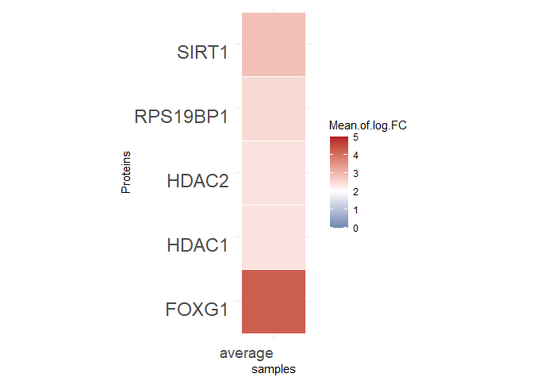
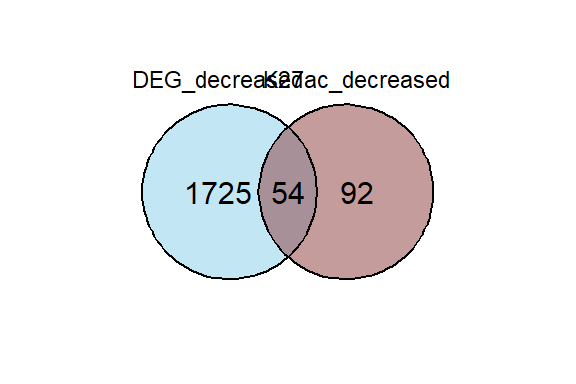
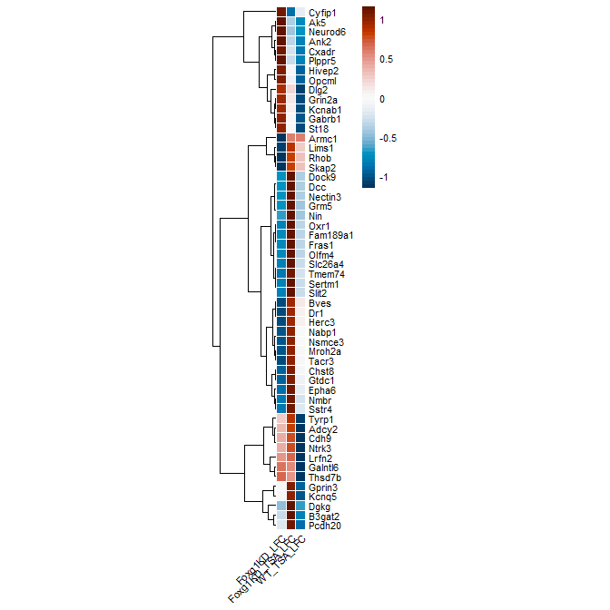
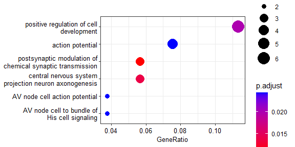
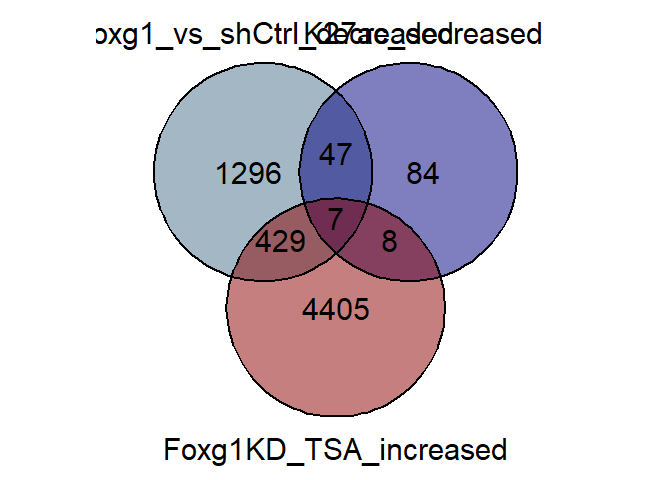
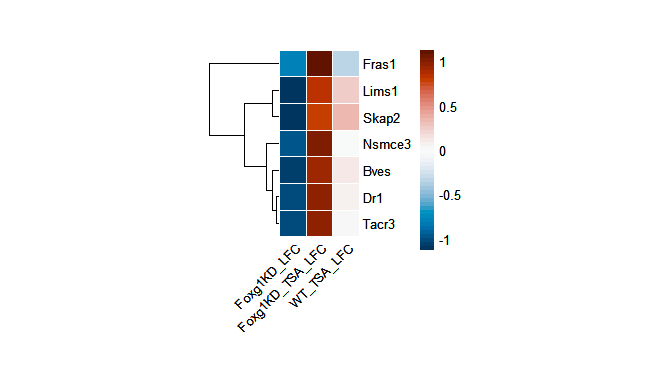
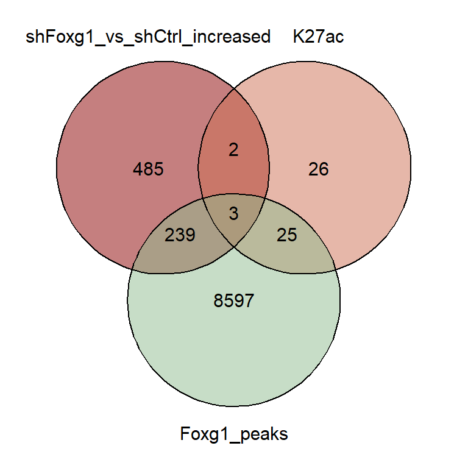
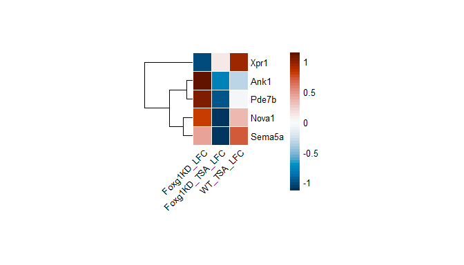

Figure 4: HDAC inhibition reverts a fraction of FOXG1 transcriptional
changes
================

## FOXG1 Interactome from SILAC-MS in N2A cells (Weise et al. 2019)

### heatmap of FOXG1-interacting proteins

``` r
Foxg1_interactome<-read.table("~/Integrative-multi-omics-analyses-of-FOXG1-functions/Input Files/Figure 4/interactome filtered_hdac_avg.txt", dec=",",sep="\t", header = TRUE, quote="", fill=FALSE,)
Foxg1_interactome_df<- as.data.frame(Foxg1_interactome)
row.names(Foxg1_interactome_df) <- make.names(Foxg1_interactome_df[,"Protein"],TRUE)
Foxg1_interactome_df$Mean.of.log.FC <- as.numeric(Foxg1_interactome_df$Mean.of.log.FC)

heatmap_interactome<- ggplot(data=Foxg1_interactome_df, aes(x=average, y=Protein, fill=Mean.of.log.FC))+
geom_tile(color = "white")+
    scale_fill_gradient2(low = "dodgerblue4", high = "firebrick", mid = "white", 
                         midpoint = 2, limit = c(0,5), space = "Lab"
                         ) +
    labs(x="samples", y = "Proteins", font=22)+
    theme_minimal()+ 
    theme(axis.text.x = element_text(vjust = 1, 
                                     size = 14, hjust = 1))+
    theme(axis.text.y = element_text(vjust = 1, 
                                     size = 18, hjust = 1))+
    coord_fixed()

pdf("~/Integrative-multi-omics-analyses-of-FOXG1-functions/Output/Figure 4/210722_FOXG1_HDAC_interactome_heatmap_mean.pdf", 
    width=4, 
    height=3)
dev.off()
```

    ## png 
    ##   2

``` r
heatmap_interactome
```

<!-- -->
\## FOXG1-HDAC effect on the transcriptome

``` r
#read in files
all_genes<- read.table("~/Integrative-multi-omics-analyses-of-FOXG1-functions/Input Files/Figure 4/Galaxy19-[all_genes_TSA_vs_DMSO].tabular",
                       header=TRUE, 
                       sep = "\t",)
shFoxg1_TSAvsDMSO<- read.table("~/Integrative-multi-omics-analyses-of-FOXG1-functions/Input Files/Figure 4/Galaxy4-[shFoxg1_TSA_vs_DMSO_DE].tabular",
                               header=TRUE,
                               sep = "\t",)
shCtrl_TSAvsDMSO<-read.table("~/Integrative-multi-omics-analyses-of-FOXG1-functions/Input Files/Figure 4/Galaxy5-[shCtrl_TSA_vs_DMSO_DE].tabular",
                             header=TRUE,
                             sep = "\t",)
shFoxg1vsshCtrl<-read.table("~/Integrative-multi-omics-analyses-of-FOXG1-functions/Input Files/Figure 4/Galaxy6-[shFoxg1_vs_shCtrl_DE].tabular",
                            header=TRUE,
                            sep = "\t",)
k27ac_loss_DE<-read.table("~/Integrative-multi-omics-analyses-of-FOXG1-functions/Input Files/Figure 4/Galaxy139-[K27ac_FOXG1_filtered_peaks_Cluster3].tabular",
                          header=FALSE,
                          sep = "\t",)
k27ac_down<-read.table("~/Integrative-multi-omics-analyses-of-FOXG1-functions/Input Files/Figure 4/Galaxy66-[down_K27ac__Annotated_Peaks].tabular",
                       header=TRUE,
                       sep = "\t",)
k27ac_up<-read.table("~/Integrative-multi-omics-analyses-of-FOXG1-functions/Input Files/Figure 4/Galaxy64-[up_K27ac__Annotated_Peaks].tabular",
                     header=TRUE,
                     sep = "\t",)
Foxg1_peaks<-read.table("~/Integrative-multi-omics-analyses-of-FOXG1-functions/Input Files/Figure 4/Galaxy638-[FOXG1_N1_filtered_annotated_peaks].tabular", header=TRUE, sep="\t",)
k27ac_increase_foxg1<- read.table("~/Integrative-multi-omics-analyses-of-FOXG1-functions/Input Files/Figure 4/Galaxy136-[K27ac_FOXG1_filtered_peaks_Cluster2].tabular",
                     header=TRUE,
                     sep = "\t",)

# Filter increased and diecreased genes upon KD and TSA treatment
Foxg1KD_decreased<-shFoxg1vsshCtrl[(shFoxg1vsshCtrl$log2FoldChange<=(-0.5) & shFoxg1vsshCtrl$padj<=0.01),]
Foxg1KD_increased<-shFoxg1vsshCtrl[(shFoxg1vsshCtrl$log2FoldChange>=(0.5) & shFoxg1vsshCtrl$padj<=0.01),]

Foxg1KD_TSA_decreased<-shFoxg1_TSAvsDMSO[(shFoxg1_TSAvsDMSO$log2FoldChange<=(-0.5) & shFoxg1_TSAvsDMSO$padj<=0.01),]
Foxg1KD_TSA_increased<-shFoxg1_TSAvsDMSO[(shFoxg1_TSAvsDMSO$log2FoldChange>=(0.5) & shFoxg1_TSAvsDMSO$padj<=0.01),]
Foxg1KD_TSA_nc<-shFoxg1_TSAvsDMSO[(abs(shFoxg1_TSAvsDMSO$log2FoldChange)<0.5 & shFoxg1_TSAvsDMSO$padj>=0.01),]

WT_TSA_decreased<- shCtrl_TSAvsDMSO[(shCtrl_TSAvsDMSO$log2FoldChange<=(-0.5) & shCtrl_TSAvsDMSO$padj<=0.01),]
WT_TSA_increased<- shCtrl_TSAvsDMSO[(shCtrl_TSAvsDMSO$log2FoldChange>=(0.5) & shCtrl_TSAvsDMSO$padj<=0.01),]

k27ac_loss_increased<- k27ac_loss_DE[(k27ac_loss_DE$V3>=0.5 & k27ac_loss_DE$V6<=0.01),]
k27ac_loss_decreased<- k27ac_loss_DE[(k27ac_loss_DE$V3<=(-0.5) & k27ac_loss_DE$V6<=0.01),]

### annotate ENSEMBL ID to gene symbol
background_genes<-bitr(all_genes$baseMean, fromType = "ENSEMBL", toType = "ENTREZID", OrgDb = org.Mm.eg.db, drop = TRUE)
k27ac_down_symbol<-bitr(k27ac_down$geneId, fromType = "ENSEMBL", toType = "SYMBOL", OrgDb = org.Mm.eg.db, drop = TRUE)
k27ac_up_symbol<-bitr(k27ac_up$geneId, fromType = "ENSEMBL", toType = "SYMBOL", OrgDb = org.Mm.eg.db, drop = TRUE)

Foxg1_peaks_symbol<-bitr(Foxg1_peaks$geneId, fromType = "ENSEMBL", toType = "SYMBOL", OrgDb = org.Mm.eg.db, drop = TRUE)
k27ac_increase_foxg1_symbol<-bitr(k27ac_increase_foxg1$geneId, fromType = "ENSEMBL", toType = "SYMBOL", OrgDb = org.Mm.eg.db, drop = TRUE)
```

### FOXG1-HDAC Repression Model: decreased expresssion+decreased K27ac upon Foxg1KD

    ## png 
    ##   2

<!-- -->

### overlap list

``` r
venn_repression_overlap<-calculate.overlap(venn_list_repression)
venn_repression_overlap_df<-data.frame(venn_repression_overlap$a3)
write.csv(venn_repression_overlap_df, "~/Integrative-multi-omics-analyses-of-FOXG1-functions/Output/Figure 4/repression_TSA_venn_overlap_reference_table.csv")
```

### Heatmap of Repression model intersection of 54 genes

<!-- -->

    ## png 
    ##   2

### GO terms enriched in the repression model

``` r
Venn_intersect_rep<-bitr(venn_repression_overlap$a3, fromType = "SYMBOL", toType = "ENTREZID", OrgDb = org.Mm.eg.db, drop = TRUE)

GO_TSA_rep<-enrichGO(gene= Venn_intersect_rep$ENTREZID, 
                 OrgDb = org.Mm.eg.db, 
                 keyType = "ENTREZID", 
                 ont="BP", 
                 pAdjustMethod = "BH",
                 qvalueCutoff = 0.05,
                 pvalueCutoff = 0.05,
                 readable = TRUE)

GO_TSA_rep_df<-data.frame(GO_TSA_rep)
#simplify to avoid redundancy
GO_TSA_rep_simp<-simplify(GO_TSA_rep,
                           cutoff = 0.5,
                                 by = "p.adjust",
                                 select_fun = min,
                                 measure = "Wang",
                                 semData = NULL)

#### Reference table of enriched GO terms
write.csv(GO_TSA_rep_simp, "~/Integrative-multi-omics-analyses-of-FOXG1-functions/Output/Figure 4/GO_TSA_repression_intersect_a3_reference-simp.csv")

write.csv(GO_TSA_rep, "~/Integrative-multi-omics-analyses-of-FOXG1-functions/Output/Figure 4/GO_TSA_repression_intersect_a3.csv")

### export the GO term dotplot to pdf
pdf("~/Integrative-multi-omics-analyses-of-FOXG1-functions/Output/Figure 4/GO_TSA_repression_intersect_dotplot_final_1606.pdf", 
    width=4, height=2.5)
dp_rep<- dotplot(GO_TSA_rep_simp, 
                 font.size=10, 
                 showCategory=6,
                 orderBy="GeneRatio")
print(dp_rep)
dev.off()
```

    ## png 
    ##   2

``` r
dp_rep
```

<!-- -->

### Rescue of downregulated genes upon Foxg1KD by TSA treatment

    ## png 
    ##   2

    ## png 
    ##   2

<!-- -->

### overlap list_repression- after rescue by TSA

### Heatmap of expression of intersected genes (after rescue)

    ## png 
    ##   2

<!-- -->

# FOXG1-HDACs Recruitment model: increased expresssion+increased K27ac upon Foxg1KD

### Recruitment model venn diagrams for intersections

    ## png 
    ##   2

### Venn diagram for the paper

``` r
pdf("~/Integrative-multi-omics-analyses-of-FOXG1-functions/Output/Figure 4/venndiagram_TSA-recruitment_diff_k27ac_foxg1_increased expression_final_1706.pdf", width=4, height=)
venn_TSA_recruitment_new<- ggvenn(venn_list_recruitment, fill_color = c( "darkred", "salmon3","darkseagreen"),
  stroke_size = 0.75, set_name_size = 8, text_size = 8, show_percentage = FALSE
  )
```

    ## Warning in sprintf("%d", n, 100 * n/sum(n)): one argument not used by format
    ## '%d'

``` r
print(venn_TSA_recruitment_new)
dev.off()
```

    ## png 
    ##   2

``` r
venn_TSA_recruitment_new
```

<!-- -->

## Heatmap of expression of intersected genes:

### significantly increased K27ac+increased expression upon Foxg1KD

<!-- -->

    ## png 
    ##   2

``` r
sessionInfo()
```

    ## R version 4.2.0 (2022-04-22 ucrt)
    ## Platform: x86_64-w64-mingw32/x64 (64-bit)
    ## Running under: Windows 10 x64 (build 17763)
    ## 
    ## Matrix products: default
    ## 
    ## locale:
    ## [1] LC_COLLATE=English_Germany.1252  LC_CTYPE=English_Germany.1252   
    ## [3] LC_MONETARY=English_Germany.1252 LC_NUMERIC=C                    
    ## [5] LC_TIME=English_Germany.1252    
    ## 
    ## attached base packages:
    ## [1] stats4    grid      stats     graphics  grDevices utils     datasets 
    ## [8] methods   base     
    ## 
    ## other attached packages:
    ##  [1] pheatmap_1.0.12       ggvenn_0.1.9          ggplot2_3.4.0        
    ##  [4] dplyr_1.0.10          org.Mm.eg.db_3.15.0   AnnotationDbi_1.58.0 
    ##  [7] IRanges_2.30.1        S4Vectors_0.34.0      Biobase_2.56.0       
    ## [10] BiocGenerics_0.42.0   clusterProfiler_4.4.4 ggVennDiagram_1.2.2  
    ## [13] VennDiagram_1.7.3     futile.logger_1.4.3  
    ## 
    ## loaded via a namespace (and not attached):
    ##   [1] fgsea_1.22.0           colorspace_2.0-3       ggtree_3.4.4          
    ##   [4] ellipsis_0.3.2         class_7.3-20           qvalue_2.28.0         
    ##   [7] XVector_0.36.0         aplot_0.1.9            proxy_0.4-27          
    ##  [10] rstudioapi_0.14        farver_2.1.1           graphlayouts_0.8.4    
    ##  [13] ggrepel_0.9.2          bit64_4.0.5            fansi_1.0.3           
    ##  [16] scatterpie_0.1.8       codetools_0.2-18       splines_4.2.0         
    ##  [19] cachem_1.0.6           GOSemSim_2.22.0        knitr_1.41            
    ##  [22] polyclip_1.10-4        jsonlite_1.8.3         GO.db_3.15.0          
    ##  [25] png_0.1-7              ggforce_0.4.1          compiler_4.2.0        
    ##  [28] httr_1.4.4             assertthat_0.2.1       Matrix_1.5-3          
    ##  [31] fastmap_1.1.0          lazyeval_0.2.2         cli_3.4.1             
    ##  [34] tweenr_2.0.2           formatR_1.12           htmltools_0.5.3       
    ##  [37] tools_4.2.0            igraph_1.3.5           gtable_0.3.1          
    ##  [40] glue_1.6.2             GenomeInfoDbData_1.2.8 reshape2_1.4.4        
    ##  [43] DO.db_2.9              fastmatch_1.1-3        Rcpp_1.0.9            
    ##  [46] enrichplot_1.16.2      vctrs_0.5.1            Biostrings_2.64.1     
    ##  [49] ape_5.6-2              nlme_3.1-160           ggraph_2.1.0          
    ##  [52] xfun_0.35              stringr_1.4.1          lifecycle_1.0.3       
    ##  [55] DOSE_3.22.1            zlibbioc_1.42.0        MASS_7.3-58.1         
    ##  [58] scales_1.2.1           tidygraph_1.2.2        parallel_4.2.0        
    ##  [61] lambda.r_1.2.4         RColorBrewer_1.1-3     yaml_2.3.6            
    ##  [64] memoise_2.0.1          gridExtra_2.3          downloader_0.4        
    ##  [67] ggfun_0.0.9            yulab.utils_0.0.5      stringi_1.7.8         
    ##  [70] RSQLite_2.2.19         highr_0.9              e1071_1.7-12          
    ##  [73] tidytree_0.4.1         BiocParallel_1.30.4    GenomeInfoDb_1.32.4   
    ##  [76] rlang_1.0.6            pkgconfig_2.0.3        bitops_1.0-7          
    ##  [79] evaluate_0.18          lattice_0.20-45        sf_1.0-9              
    ##  [82] purrr_0.3.5            labeling_0.4.2         treeio_1.20.2         
    ##  [85] patchwork_1.1.2        shadowtext_0.1.2       bit_4.0.5             
    ##  [88] tidyselect_1.2.0       plyr_1.8.8             magrittr_2.0.3        
    ##  [91] R6_2.5.1               generics_0.1.3         DBI_1.1.3             
    ##  [94] pillar_1.8.1           withr_2.5.0            units_0.8-0           
    ##  [97] KEGGREST_1.36.3        RCurl_1.98-1.9         tibble_3.1.8          
    ## [100] crayon_1.5.2           futile.options_1.0.1   KernSmooth_2.23-20    
    ## [103] utf8_1.2.2             RVenn_1.1.0            rmarkdown_2.18        
    ## [106] viridis_0.6.2          data.table_1.14.6      blob_1.2.3            
    ## [109] classInt_0.4-8         digest_0.6.30          tidyr_1.2.1           
    ## [112] gridGraphics_0.5-1     munsell_0.5.0          viridisLite_0.4.1     
    ## [115] ggplotify_0.1.0
