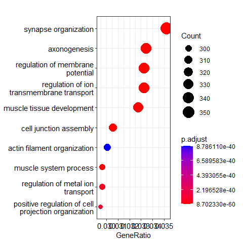
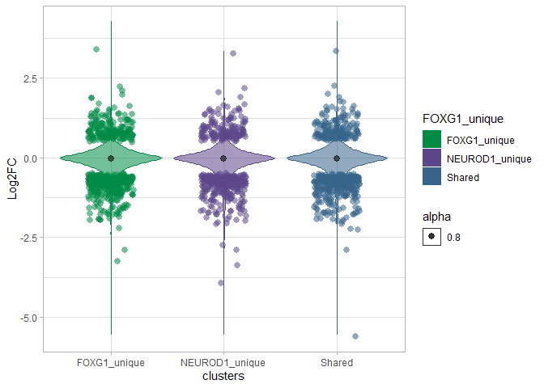
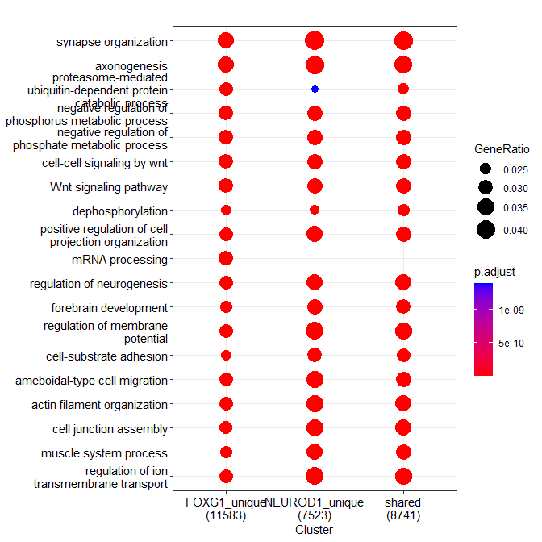
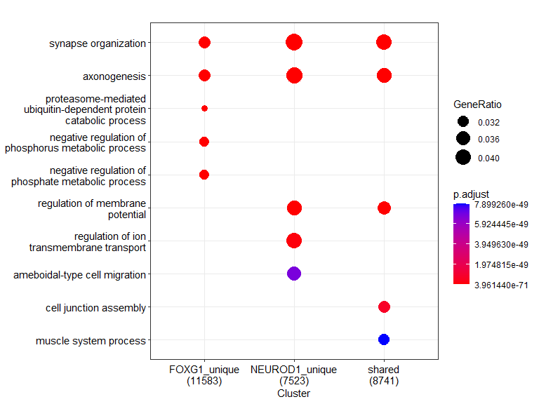
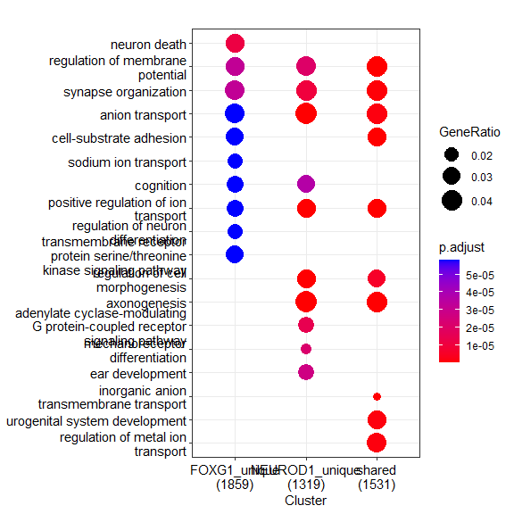
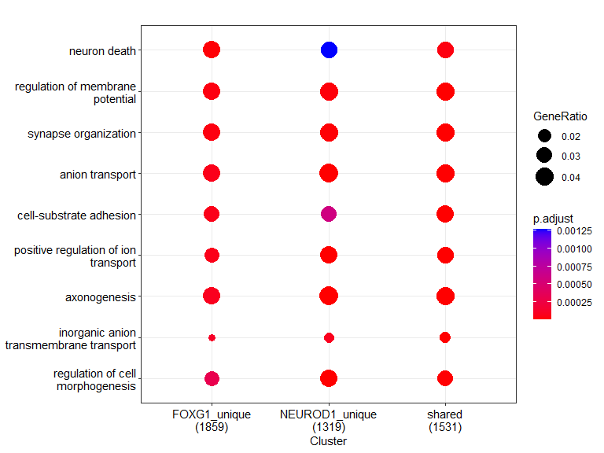
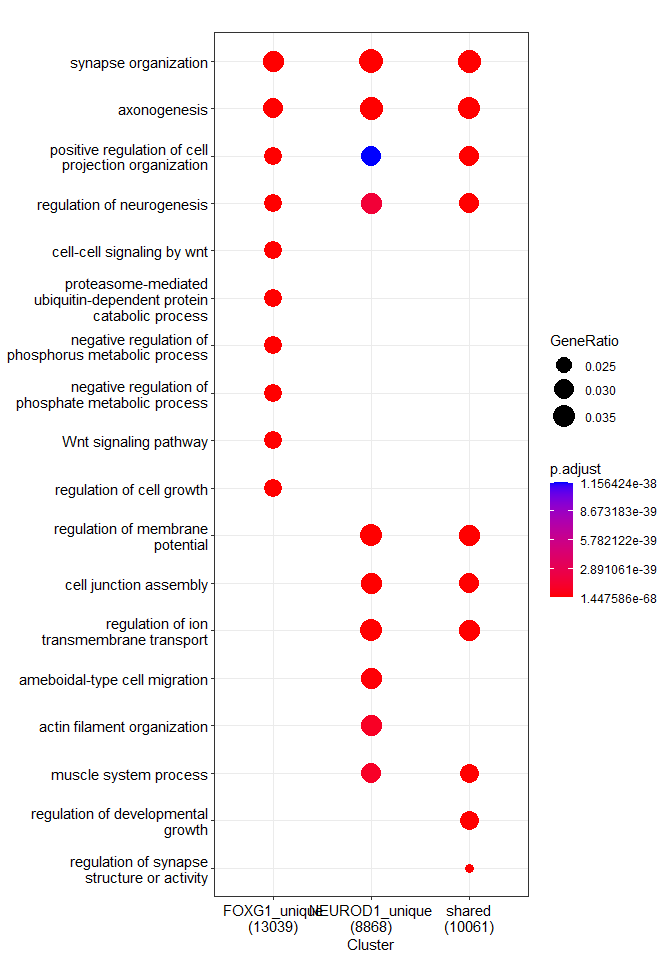
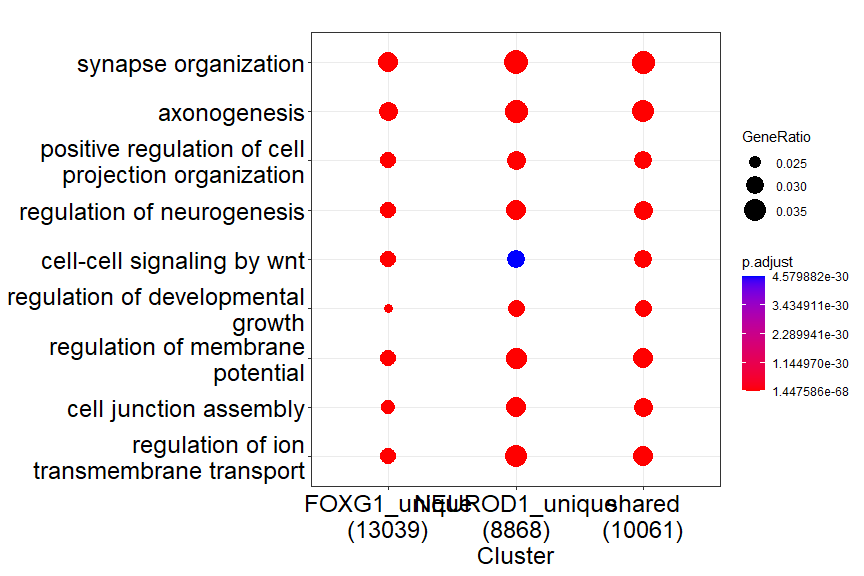

NEUROD1 and FOXG1 ChIPseq comparison (Figure 5)
================

## NEUROD1 ChIP-seq in vitro in DIV11 primary hippocampal neurons

*from 18.5 embryos* *Datasets:  
+ 2 replicates for WT NEUROD1-ChIP + 2 Inputs  
* Mapping: Bowtie2, using snakepipes defaults (FF)  
\*\*\* \## Quality Control (FF) 1. Deeptools QC

<div class="figure" style="text-align: center">


<p class="caption">
Plot Read Coverage
</p>

</div>

<div class="figure" style="text-align: center">


<p class="caption">
Multibamsummary correlation, spearman
</p>

</div>

<div class="figure" style="text-align: center">


<p class="caption">
PCA plot
</p>

</div>

2.  Filtered .bam Files (from snakepipes)

-   Filtering rules: **-F 1024 -q 3**  
-   meaning: remove optical PCR duplicates (-F 1024), remove reads with
    MAPQ\<3 (-q 3)  

3.  BamCoverage (from snakepipes) Depth normalisation of samples. *These
    were not used in downstream analyses (IA).*  
4.  BamCompare (from snakepipes) Input (control) and depth normalisation
    of ChIP-seq samples. 2 different calculations:  

-   log2Ratio of Sample over Input
-   Subtraction of Input
    fr\~/Integrative-multi-omics-analyses-of-FOXG1-functions/Input
    Files/Figure 5/NEUROD1_ChIP-seq_deepTools_qc/logs/ *These were
    preferred for downstream analyses and visualisations (IA).*  

6.  MACS2- Peak Calling (from snakepipes) Narrow peaks and summits were
    called for each replicate separately. Models are in:  
    *These peak files were used for downstream analyses.*  
    \# Downstream Analyses \## Genomic Distribution of NEUROD1 peaks
    \*From usegalaxy.eu, Tool: ChIPSeeker (v 1.28.3)
    <div class="figure" style="text-align: center">

    
    <p class="caption">
    Genomic Distribution of NEUROD1 peaks, WT in vitro
    </p>

    </div>

    ## NEUROD1 Occupancy at Transcription start sites (TSS)

-   From usegalaxy.eu  
-   Tools: computeMatrix, plotHeatmap w/ K-means clustering k=5,
    ChIPSeeker for region annotation  
    <div class="figure" style="text-align: center">

    
    <p class="caption">
    NEUROD1 peaks at TSS, in vitro
    </p>

    </div>

    ### NEUROD1 peaks GO term enrichment analysis (global)
-   read in NEUROD1 peaks file

``` r
NEUROD1_peaks <- read.table("~/Integrative-multi-omics-analyses-of-FOXG1-functions/Input Files/Figure 5/Galaxy172-[ChIPseeker_neurod1_intersect_annotated_peaks].tabular", header=TRUE, sep="\t", quote="", fill=FALSE,)
```

-   annotate ensembl ID to ENTREZID

``` r
NEUROD1_id<-bitr(NEUROD1_peaks$geneName, fromType = "ENSEMBL",
         toType = "ENTREZID",
         OrgDb = org.Mm.eg.db,
         drop = TRUE)
```

    ## 'select()' returned 1:many mapping between keys and columns

    ## Warning in bitr(NEUROD1_peaks$geneName, fromType = "ENSEMBL", toType =
    ## "ENTREZID", : 24.38% of input gene IDs are fail to map...

-   Functional enrichment of NEUROD1 peaks

``` r
NEUROD1_GO<-enrichGO(gene = NEUROD1_id$ENTREZID,
                     keyType = "ENTREZID",
                     ont = "BP",
                     OrgDb =  "org.Mm.eg.db",
                     pvalueCutoff = 0.01,
                     qvalueCutoff = 0.01,
                      pAdjustMethod = "BH",
                     readable = TRUE)
```

-   create reference table for enriched GO terms and export to csv

``` r
NEUROD1_GO_df<- as.data.frame(NEUROD1_GO)
write.csv(NEUROD1_GO_df, file="~/Integrative-multi-omics-analyses-of-FOXG1-functions/Output/Figure 5/NEUROD1_GOterms_reference_2206.csv")
```

-   simplify the terms to avoid redundancy

``` r
NEUROD1_GO_simp<-simplify(NEUROD1_GO,
                                 cutoff = 0.7,
                                 by = "p.adjust",
                                 select_fun = min,
                                 measure = "Wang",
                                 semData = NULL)
```

-   embed dotplot of simplified terms

``` r
dp_neurod1 = dotplot(NEUROD1_GO_simp,
             showCategory=10,
             font.size=11,
             orderBy="GeneRatio"
             )
plot(dp_neurod1)
```

<!-- -->
\* export the dotplot to pdf

``` r
pdf("~/Integrative-multi-omics-analyses-of-FOXG1-functions/Output/Figure 5/NEUROD1_peaks_GOterms_dotplot_simp_2206.pdf", width=4.5, height=3.5)
print(dp_neurod1)
dev.off()
```

    ## png 
    ##   2

## Overlap of FOXG1 and NEUROD1 peaks

-   Overlapping and unique FOXG1 and NEUROD1 peaks were analysed using
    bedtools in usegalaxy.eu (at least 1 bp overlap)
-   read in files from Galaxy

``` r
FOXG1_NEUROD1_clustered_DEG<- read.table("~/Integrative-multi-omics-analyses-of-FOXG1-functions/Input Files/Figure 5/Galaxy280-[FOXG1-NEUROD1-shared_peak-DEG-intersection_long_file].tabular", header=TRUE, sep="\t", quote="", fill=FALSE,)
FOXG1_NEUROD1_clustered_DEG_df= as.data.frame(FOXG1_NEUROD1_clustered_DEG)
FOXG1_NEUROD1_clustered_DEG_df[,'FOXG1_unique']<-factor(FOXG1_NEUROD1_clustered_DEG_df[,'FOXG1_unique'])

FOXG1_NEUROD1_clustered_DEG_df$log2FoldChange<-as.numeric(gsub(",", ".", FOXG1_NEUROD1_clustered_DEG_df$log2FoldChange))
FOXG1_NEUROD1_clustered_DEG_df$log2FoldChange<-as.numeric(as.character(FOXG1_NEUROD1_clustered_DEG_df$log2FoldChange))
```

-   Filter according to LFC and p.adjusted

``` r
FOXG1_NEUROD1_clustered_DEG_LFC<-FOXG1_NEUROD1_clustered_DEG_df[
    (abs(FOXG1_NEUROD1_clustered_DEG_df$log2FoldChange)>= 0.58 & 
         FOXG1_NEUROD1_clustered_DEG_df$padj<=0.01),]
FOXG1_NEUROD1_clustered_DEG_LFC_df<- as.data.frame(FOXG1_NEUROD1_clustered_DEG_LFC)
FOXG1_NEUROD1_clustered_DEG_LFC_df[,'FOXG1_unique']<-factor(FOXG1_NEUROD1_clustered_DEG_LFC_df[,'FOXG1_unique'])
FOXG1_NEUROD1_clustered_DEG_LFC_df$log2FoldChange<-as.numeric(FOXG1_NEUROD1_clustered_DEG_LFC_df$log2FoldChange)
```

## Violin plot of DEG dsitribution in FOXG1- NEUROD1 peaks

``` r
my_palette <- brewer.pal(name="Dark2",n=6)[2:6]
violin_plot_vitro <- ggplot(FOXG1_NEUROD1_clustered_DEG_df, aes(x=FOXG1_unique, y=log2FoldChange, fill=FOXG1_unique, color=FOXG1_unique, alpha=0.8, font=12))+ 
    scale_color_manual(values = c("springgreen4","mediumpurple4", "steelblue4"), aesthetics = "fill")+
    scale_color_manual(values = c("springgreen4","mediumpurple4", "steelblue4"), aesthetics = "colour")+
    geom_violin()+ 
    labs(x="clusters", y = "Log2FC", font=12)+ theme_light()+
    stat_summary(fun=median, 
                 geom="point", 
                 size=2.5, 
                 color="black")

violin_plot_vitro_dots<-violin_plot_vitro +
    geom_jitter(data= FOXG1_NEUROD1_clustered_DEG_LFC_df, shape=16,
                 size=2.5, 
                 position=position_jitter(width=0.2, height= 0.1))
```

-   embed the vioin plot

``` r
plot(violin_plot_vitro_dots)
```

<!-- -->
\* export to pdf

``` r
pdf("~/Integrative-multi-omics-analyses-of-FOXG1-functions/Output/Figure 5/violin plot_NEUROD1_FOXG1_DEG_clusters_2206_2.pdf", 
    width=4.5, 
    height=4.5)
print(violin_plot_vitro_dots)
dev.off()
```

    ## png 
    ##   2

\#upload separate files for each cluster

``` r
FOXG1_unique_DEGS <- read.table("~/Integrative-multi-omics-analyses-of-FOXG1-functions/Input Files/Figure 5/Galaxy266-[FOXG1_unique_DEG_intersection].tabular", header=TRUE, sep="\t", quote="", fill=FALSE,)
NEUROD1_unique_DEGS <- read.table("~/Integrative-multi-omics-analyses-of-FOXG1-functions/Input Files/Figure 5/Galaxy267-[NEUROD1_unique_DEG_intersection].tabular", header=TRUE, sep="\t", quote="", fill=FALSE,)
shared_DEGS <- read.table("~/Integrative-multi-omics-analyses-of-FOXG1-functions/Input Files/Figure 5/Galaxy265-[FOXG1-NEUROD1-shared_DEG_intersection].tabular", header=TRUE, sep="\t", quote="", fill=FALSE,)


FOXG1_unique_DEGS$log2FoldChange<-as.numeric(FOXG1_unique_DEGS$log2FoldChange)
NEUROD1_unique_DEGS$log2FoldChange<-as.numeric(NEUROD1_unique_DEGS$log2FoldChange)
shared_DEGS$log2FoldChange<-as.numeric(shared_DEGS$log2FoldChange)

FOXG1_unique_p<-FOXG1_unique_DEGS[FOXG1_unique_DEGS$padj<=0.01,]
      NEUROD1_unique_p<-NEUROD1_unique_DEGS[NEUROD1_unique_DEGS$padj<=0.01,]
shared_p<-shared_DEGS[shared_DEGS$padj<=0.01,]
```

-   read in clustered annotated peaks

``` r
FOXG1_unique_peaks<-read.table("~/Integrative-multi-omics-analyses-of-FOXG1-functions/Input Files/Figure 5/Galaxy13-[FOXG1_unique_peaks].tabular", header=FALSE, sep="\t", quote="", fill=FALSE,)
NEUROD1_unique_peaks<-read.table("~/Integrative-multi-omics-analyses-of-FOXG1-functions/Input Files/Figure 5/Galaxy15-[neurod1_unique_peaks].tabular", header=FALSE, sep="\t", quote="", fill=FALSE,)
shared_peaks<-read.table("~/Integrative-multi-omics-analyses-of-FOXG1-functions/Input Files/Figure 5/Galaxy14-[shared_peaks].tabular", header=FALSE, sep="\t", quote="", fill=FALSE,)
```

-   annotate peaks belonging to different clusters to entrezid

``` r
FOXG1_peaks_id<-bitr(FOXG1_unique_peaks$V13, fromType = "ENSEMBL",
         toType = "ENTREZID",
         OrgDb = org.Mm.eg.db,
         drop = TRUE)
```

    ## 'select()' returned 1:many mapping between keys and columns

    ## Warning in bitr(FOXG1_unique_peaks$V13, fromType = "ENSEMBL", toType =
    ## "ENTREZID", : 20.82% of input gene IDs are fail to map...

``` r
NEUROD1_peaks_id<-bitr(NEUROD1_unique_peaks$V13, fromType = "ENSEMBL",
         toType = "ENTREZID",
         OrgDb = org.Mm.eg.db,
         drop = TRUE)
```

    ## 'select()' returned 1:many mapping between keys and columns

    ## Warning in bitr(NEUROD1_unique_peaks$V13, fromType = "ENSEMBL", toType =
    ## "ENTREZID", : 25.56% of input gene IDs are fail to map...

``` r
shared_peaks_id<-bitr(shared_peaks$V13, fromType = "ENSEMBL",
         toType = "ENTREZID",
         OrgDb = org.Mm.eg.db,
         drop = TRUE)
```

    ## 'select()' returned 1:many mapping between keys and columns

    ## Warning in bitr(shared_peaks$V13, fromType = "ENSEMBL", toType = "ENTREZID", :
    ## 24.43% of input gene IDs are fail to map...

-   annotate DEGs belonging to different clusters to entrezid

``` r
FOXG1_unique_id<-bitr(FOXG1_unique_DEGS$geneName, fromType = "ENSEMBL",
         toType = "ENTREZID",
         OrgDb = org.Mm.eg.db,
         drop = TRUE)
```

    ## 'select()' returned 1:many mapping between keys and columns

    ## Warning in bitr(FOXG1_unique_DEGS$geneName, fromType = "ENSEMBL", toType =
    ## "ENTREZID", : 6.83% of input gene IDs are fail to map...

``` r
NEUROD1_unique_id<-bitr(NEUROD1_unique_DEGS$geneName, fromType = "ENSEMBL",
         toType = "ENTREZID",
         OrgDb = org.Mm.eg.db,
         drop = TRUE)
```

    ## 'select()' returned 1:many mapping between keys and columns

    ## Warning in bitr(NEUROD1_unique_DEGS$geneName, fromType = "ENSEMBL", toType =
    ## "ENTREZID", : 7.93% of input gene IDs are fail to map...

``` r
shared_id<-bitr(shared_DEGS$geneName, fromType = "ENSEMBL",
         toType = "ENTREZID",
         OrgDb = org.Mm.eg.db,
         drop = TRUE)
```

    ## 'select()' returned 1:many mapping between keys and columns

    ## Warning in bitr(shared_DEGS$geneName, fromType = "ENSEMBL", toType =
    ## "ENTREZID", : 8.07% of input gene IDs are fail to map...

-   annotate DEGs with p\<0.01 cutoff to entrezid

``` r
FOXG1_unique_id_p<-bitr(FOXG1_unique_p$geneName, fromType = "ENSEMBL",
                        toType = "ENTREZID",
                        OrgDb = org.Mm.eg.db,
                        drop = TRUE)
```

    ## 'select()' returned 1:many mapping between keys and columns

    ## Warning in bitr(FOXG1_unique_p$geneName, fromType = "ENSEMBL", toType =
    ## "ENTREZID", : 14.73% of input gene IDs are fail to map...

``` r
NEUROD1_unique_id_p<-bitr(NEUROD1_unique_p$geneName, fromType = "ENSEMBL",
                          toType = "ENTREZID",
                          OrgDb = org.Mm.eg.db,
                          drop = TRUE)
```

    ## 'select()' returned 1:many mapping between keys and columns

    ## Warning in bitr(NEUROD1_unique_p$geneName, fromType = "ENSEMBL", toType =
    ## "ENTREZID", : 16.3% of input gene IDs are fail to map...

``` r
shared_id_p<-bitr(shared_p$geneName, fromType = "ENSEMBL",
                  toType = "ENTREZID",
                  OrgDb = org.Mm.eg.db,
                  drop = TRUE)
```

    ## 'select()' returned 1:many mapping between keys and columns

    ## Warning in bitr(shared_p$geneName, fromType = "ENSEMBL", toType = "ENTREZID", :
    ## 16.38% of input gene IDs are fail to map...

### compare functional terms among DEGs belonging to different clusters

``` r
list_FOXG1_NEUROD1_DEG<-list(FOXG1_unique=FOXG1_unique_id$ENTREZID,
                             NEUROD1_unique=NEUROD1_unique_id$ENTREZID,
                             shared=shared_id$ENTREZID
                        
)
FOXG1_NEUROD1_DEG_cc<-compareCluster(geneClusters= list_FOXG1_NEUROD1_DEG,
                            fun = "enrichGO",
                            OrgDb = "org.Mm.eg.db",
                             ont = "BP",
                             pAdjustMethod = "BH",
                             qvalueCutoff = 0.01,
                             pvalueCutoff = 0.01,
                             readable = TRUE)
```

-   create a reference table for clustered GO terms and export to csv

``` r
FOXG1_NEUROD1_DEG_cc_df<- as.data.frame(FOXG1_NEUROD1_DEG_cc)
write.csv(FOXG1_NEUROD1_DEG_cc_df, file="~/Integrative-multi-omics-analyses-of-FOXG1-functions/Output/Figure 5/FOXG1_NEUROD1_DEG_clustered_GOterms_220622.csv")
```

-   simplify the terms to avoid redundancy

``` r
FOXG1_NEUROD1_DEG_cc_simp<-simplify(FOXG1_NEUROD1_DEG_cc,
                                 cutoff = 0.7,
                                 by = "p.adjust",
                                 select_fun = min,
                                 measure = "Wang",
                                 semData = NULL)
```

\#embed dotplot of simplified terms

``` r
dp = dotplot(FOXG1_NEUROD1_DEG_cc_simp,
             showCategory=10,
             font.size=11)
dp
```

<!-- -->
\* embed dotplot of simplified terms only 5 categories

``` r
dp_5_nd1 = dotplot(FOXG1_NEUROD1_DEG_cc_simp,
             showCategory=5,
             font.size=11,
             includeAll=FALSE
             )
dp_5_nd1
```

<!-- -->
\* export the dotplot_5 categories to pdf

``` r
pdf("~/Integrative-multi-omics-analyses-of-FOXG1-functions/Output/Figure 5/FOXG1_NEUROD1_clustered_DEGs_GOterms_dotplot_simp_2206.pdf", width=5, height=5.5)
print(dp)
dev.off()
```

    ## png 
    ##   2

### compare functional terms among DEGs p\<0.01 belonging to different clusters

``` r
list_FOXG1_NEUROD1_DEG_p<-list( 
                          FOXG1_unique=FOXG1_unique_id_p$ENTREZID,
                          NEUROD1_unique=NEUROD1_unique_id_p$ENTREZID,
                          shared=shared_id_p$ENTREZID)
FOXG1_NEUROD1_DEG_cc_p<-compareCluster(
                            geneClusters= list_FOXG1_NEUROD1_DEG_p,
                            fun = "enrichGO",
                            OrgDb = "org.Mm.eg.db",
                             ont = "BP",
                             pAdjustMethod = "BH",
                             qvalueCutoff = 0.01,
                             pvalueCutoff = 0.01,
                             readable = TRUE)
```

-   create reference table for clustered GO terms (DEGs p\<0.01) and
    export to csv

``` r
FOXG1_NEUROD1_DEG_cc_p_df<- as.data.frame(FOXG1_NEUROD1_DEG_cc)
write.csv(FOXG1_NEUROD1_DEG_cc_p_df, file="~/Integrative-multi-omics-analyses-of-FOXG1-functions/Output/Figure 5/FOXG1_NEUROD1_clustered_DEGs_p001_GOterms.csv")
```

-   simplify the terms to avoid redundancy

``` r
FOXG1_NEUROD1_DEG_cc_p_simp<-simplify(FOXG1_NEUROD1_DEG_cc_p,
                                 cutoff = 0.7,
                                 by = "p.adjust",
                                 select_fun = min,
                                 measure = "Wang",
                                 semData = NULL)
```

-   embed dotplot of simplified terms

``` r
dp_DEG_p = dotplot(FOXG1_NEUROD1_DEG_cc_p_simp,
             showCategory=10,
             font.size=11,
             includeAll=FALSE
             )
dp_DEG_p
```

<!-- -->
\* embed dotplot of simplified terms only 5 categories

``` r
dp_5_nd1_p = dotplot(FOXG1_NEUROD1_DEG_cc_p_simp,
             showCategory=5,
             font.size=11,
             )
dp_5_nd1_p
```

<!-- -->
\* export the dotplot categories to pdf

``` r
pdf("~/Integrative-multi-omics-analyses-of-FOXG1-functions/Output/Figure 5/FOXG1_NEUROD1_clustered_DEGs_p001_GOterms_excl_dotplot_2206.pdf", width=5, height=5.5)
print(dp_DEG_p)
dev.off()
```

    ## png 
    ##   2

### compare functional terms among peaks belonging to different clusters

``` r
list_FOXG1_NEUROD1_peaks<-list(FOXG1_unique=FOXG1_peaks_id$ENTREZID,
                               NEUROD1_unique=NEUROD1_peaks_id$ENTREZID,
                               shared=shared_peaks_id$ENTREZID
                          )
FOXG1_NEUROD1_peak_cc<-compareCluster(geneClusters= list_FOXG1_NEUROD1_peaks,
                            fun = "enrichGO",
                            OrgDb = "org.Mm.eg.db",
                             ont = "BP",
                             pAdjustMethod = "BH",
                             qvalueCutoff = 0.001,
                             pvalueCutoff = 0.001,
                             readable = TRUE)
```

-   create reference table for GO terms and export to csv

``` r
FOXG1_NEUROD1_peaks_cc_df<- as.data.frame(FOXG1_NEUROD1_peak_cc)
write.csv(FOXG1_NEUROD1_peaks_cc_df, file="~/Integrative-multi-omics-analyses-of-FOXG1-functions/Output/Figure 5/FOXG1_NEUROD1_clustered_peaks_GOterms.csv")
```

-   simplify the terms to avoid redundancy

``` r
FOXG1_NEUROD1_peaks_cc_simp<-simplify(FOXG1_NEUROD1_peak_cc,
                                 cutoff = 0.7,
                                 by = "p.adjust",
                                 select_fun = min,
                                 measure = "Wang",
                                 semData = NULL)
```

-   embed dotplot of simplified terms

``` r
dp_peaks = dotplot(FOXG1_NEUROD1_peaks_cc_simp,
             showCategory=10,
             font.size=11,
             includeAll=FALSE
             )
dp_peaks
```

<!-- -->
\* export the dotplot to pdf

``` r
pdf("~/Integrative-multi-omics-analyses-of-FOXG1-functions/Output/Figure 5/FOXG1_NEUROD1_clustered_peaks_GOterms_dotplot_excl_simp_2206.pdf", width=5, height=5.5)
print(dp_peaks)
dev.off()
```

    ## png 
    ##   2

-   embed dotplot of simplified terms only 5 categories

``` r
dp_5_nd1_peak = dotplot(FOXG1_NEUROD1_peaks_cc_simp,
             showCategory=5,
             font.size=18,
             )
dp_5_nd1_peak
```

<!-- -->
\* export the dotplot_5 categories to pdf

``` r
pdf("~/Integrative-multi-omics-analyses-of-FOXG1-functions/Output/Figure 5/FOXG1_NEUROD1_clustered_peaks_GOterms_dotplot_simp_5categories", width=10, height=5)
print(dp_5_nd1_peak)
dev.off()
```

    ## png 
    ##   2

``` r
sessionInfo()
```

    ## R version 4.2.0 (2022-04-22 ucrt)
    ## Platform: x86_64-w64-mingw32/x64 (64-bit)
    ## Running under: Windows 10 x64 (build 17763)
    ## 
    ## Matrix products: default
    ## 
    ## locale:
    ## [1] LC_COLLATE=English_Germany.1252  LC_CTYPE=English_Germany.1252   
    ## [3] LC_MONETARY=English_Germany.1252 LC_NUMERIC=C                    
    ## [5] LC_TIME=English_Germany.1252    
    ## 
    ## attached base packages:
    ## [1] stats4    stats     graphics  grDevices utils     datasets  methods  
    ## [8] base     
    ## 
    ## other attached packages:
    ##  [1] ggplot2_3.4.0         RColorBrewer_1.1-3    GeneOverlap_1.32.0   
    ##  [4] org.Mm.eg.db_3.15.0   AnnotationDbi_1.58.0  IRanges_2.30.1       
    ##  [7] S4Vectors_0.34.0      Biobase_2.56.0        BiocGenerics_0.42.0  
    ## [10] clusterProfiler_4.4.4
    ## 
    ## loaded via a namespace (and not attached):
    ##   [1] fgsea_1.22.0           colorspace_2.0-3       ggtree_3.4.4          
    ##   [4] ellipsis_0.3.2         qvalue_2.28.0          XVector_0.36.0        
    ##   [7] aplot_0.1.9            rstudioapi_0.14        farver_2.1.1          
    ##  [10] graphlayouts_0.8.4     ggrepel_0.9.2          bit64_4.0.5           
    ##  [13] fansi_1.0.3            scatterpie_0.1.8       codetools_0.2-18      
    ##  [16] splines_4.2.0          cachem_1.0.6           GOSemSim_2.22.0       
    ##  [19] knitr_1.41             polyclip_1.10-4        jsonlite_1.8.3        
    ##  [22] GO.db_3.15.0           png_0.1-7              ggforce_0.4.1         
    ##  [25] compiler_4.2.0         httr_1.4.4             assertthat_0.2.1      
    ##  [28] Matrix_1.5-3           fastmap_1.1.0          lazyeval_0.2.2        
    ##  [31] cli_3.4.1              tweenr_2.0.2           htmltools_0.5.3       
    ##  [34] tools_4.2.0            igraph_1.3.5           gtable_0.3.1          
    ##  [37] glue_1.6.2             GenomeInfoDbData_1.2.8 reshape2_1.4.4        
    ##  [40] DO.db_2.9              dplyr_1.0.10           fastmatch_1.1-3       
    ##  [43] Rcpp_1.0.9             enrichplot_1.16.2      vctrs_0.5.1           
    ##  [46] Biostrings_2.64.1      ape_5.6-2              nlme_3.1-160          
    ##  [49] ggraph_2.1.0           xfun_0.35              stringr_1.4.1         
    ##  [52] lifecycle_1.0.3        gtools_3.9.3           DOSE_3.22.1           
    ##  [55] zlibbioc_1.42.0        MASS_7.3-58.1          scales_1.2.1          
    ##  [58] tidygraph_1.2.2        parallel_4.2.0         yaml_2.3.6            
    ##  [61] memoise_2.0.1          gridExtra_2.3          downloader_0.4        
    ##  [64] ggfun_0.0.9            yulab.utils_0.0.5      stringi_1.7.8         
    ##  [67] RSQLite_2.2.19         highr_0.9              tidytree_0.4.1        
    ##  [70] caTools_1.18.2         BiocParallel_1.30.4    GenomeInfoDb_1.32.4   
    ##  [73] rlang_1.0.6            pkgconfig_2.0.3        bitops_1.0-7          
    ##  [76] evaluate_0.18          lattice_0.20-45        purrr_0.3.5           
    ##  [79] labeling_0.4.2         treeio_1.20.2          patchwork_1.1.2       
    ##  [82] shadowtext_0.1.2       bit_4.0.5              tidyselect_1.2.0      
    ##  [85] plyr_1.8.8             magrittr_2.0.3         R6_2.5.1              
    ##  [88] gplots_3.1.3           generics_0.1.3         DBI_1.1.3             
    ##  [91] pillar_1.8.1           withr_2.5.0            KEGGREST_1.36.3       
    ##  [94] RCurl_1.98-1.9         tibble_3.1.8           crayon_1.5.2          
    ##  [97] KernSmooth_2.23-20     utf8_1.2.2             rmarkdown_2.18        
    ## [100] viridis_0.6.2          grid_4.2.0             data.table_1.14.6     
    ## [103] blob_1.2.3             digest_0.6.30          tidyr_1.2.1           
    ## [106] gridGraphics_0.5-1     munsell_0.5.0          viridisLite_0.4.1     
    ## [109] ggplotify_0.1.0
