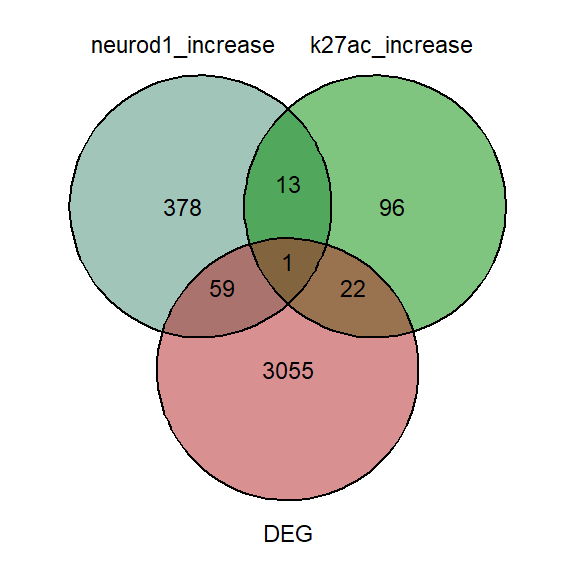

Differential NEUROD1 peaks upon FOXG1 KD (Figure 6)
================

load packages

``` r
library(RColorBrewer)
library(ggplot2)
library(clusterProfiler)
library(org.Mm.eg.db)
library(GeneOverlap)
library(ggVennDiagram)
library(VennDiagram)
library(ggvenn)
```

# Differential NEUROD1 binding upon Foxg1KD

<div class="figure">


<p class="caption">
Fig6D: Differential NEUROD1 binding upon Foxg1KD
</p>

</div>

#### Distribution of DEGs at differential NEUROD1 binding genes (from Fig 6D)

``` r
# Read the long file of DEG-clustered peak intersection           
Neurod1_DEGs= read.table("~/Integrative-multi-omics-analyses-of-FOXG1-functions/Input Files/Figure 6/Diff_NEUROD1_DEG_long file.tabular", 
                         sep="\t", quote="", fill=FALSE, header=TRUE,)
Neurod1_DEG_df= as.data.frame(Neurod1_DEGs)
Neurod1_DEG_df[,'cluster_1']<-factor(Neurod1_DEG_df[,'cluster_1'])
Neurod1_DEG_df$log2FoldChange<-as.numeric(Neurod1_DEG_df$log2FoldChange)

# Filter the DEGs
Neurod1_DEG_filt<- Neurod1_DEG_df[(abs(Neurod1_DEG_df$log2FoldChange)>0.5 & 
                                       Neurod1_DEG_df$padj<=0.01),] 
    Neurod1_DEG_filt_df<- as.data.frame(Neurod1_DEG_filt)
Neurod1_DEG_filt_df[,'cluster_1']<-factor(Neurod1_DEG_filt_df[,'cluster_1'])
Neurod1_DEG_filt_df$log2FoldChange<-as.numeric(Neurod1_DEG_filt_df$log2FoldChange)

# violin plot of DEG distribution in each cluster: LFC.cutoff=0.5
my_palette_2 <- c("darkgreen", "plum4", "darkred")

p_Neurod1 <- ggplot(Neurod1_DEG_df, 
                  aes(x=cluster_1, y=log2FoldChange, fill=cluster_1, color= cluster_1, alpha=0.5, font=20))+ 
    scale_color_manual(values = my_palette_2, aesthetics = "fill")+
    scale_color_manual(values = my_palette_2, aesthetics = "colour")+
    geom_violin()+ 
    labs(x="cluster", y = "Log2FC")+ theme_light()+
    stat_summary(fun=median, geom="point", size=3, color="black")+
    theme(axis.text = element_text(size=20),
          axis.title = element_text(size=20))
violin_plot_Neurod1<- p_Neurod1 + geom_jitter( data= Neurod1_DEG_filt_df, 
                          shape=16, 
                          size=6,
                          position=position_jitter(width=0.2, height= 0.1)
                          )
# Violin plot: Differentially expressed genes corresponding to clustered H3Neurod1 at FOXG1 binding sites
violin_plot_Neurod1
```

<!-- -->

``` r
# export the plot to pdf
pdf("~/Integrative-multi-omics-analyses-of-FOXG1-functions/Output/Figure 6/NEUROD1_DEGs_violin plot.pdf", 
    width=10, 
    height=10)
print(violin_plot_Neurod1)
dev.off()
```

    ## png 
    ##   2

### GeneOverlap to test enrichment of DEGs in differential NEUROD1 clusters

``` r
# read in clustered peak files 
nd1_diff<- read.table("~/Integrative-multi-omics-analyses-of-FOXG1-functions/Input Files/Figure 6/Galaxy979-[ChIPseeker_on_NEUROD1_diffbind].tabular", 
                      header=TRUE, sep="\t", quote="", fill=FALSE,)

nd1_c1<-read.table("~/Integrative-multi-omics-analyses-of-FOXG1-functions/Input Files/Figure 6/Galaxy1137-[Diff_NEUROD1_annotated_peaks_cluster1].tabular", 
                   header=TRUE, sep="\t", quote="", fill=FALSE,)

nd1_c2<-read.table("~/Integrative-multi-omics-analyses-of-FOXG1-functions/Input Files/Figure 6/Galaxy1138-[Diff_NEUROD1_annotated_peaks_cluster2].tabular",
                   header=TRUE, sep="\t", quote="", fill=FALSE,)

nd1_c3<-read.table("~/Integrative-multi-omics-analyses-of-FOXG1-functions/Input Files/Figure 6/Galaxy1139-[Diff_NEUROD1_annotated_peaks_cluster3].tabular",
                   header=TRUE, sep="\t", quote="", fill=FALSE,)

#NEUROD1 differential peak cluster list
Neurod1_list<- list(Neurod1_c1= nd1_c1$geneId,
                  Neurod1_c2= nd1_c2$geneId,
                  Neurod1_c3= nd1_c3$geneId)

# DEG list
Foxg1_KD_DEGs<-read.table("~/Integrative-multi-omics-analyses-of-FOXG1-functions/Input Files/Figure 1/DE_genes_shrinked_apeglm_DIV11.tabular", sep="\t", header = TRUE, fill = FALSE,)
Foxg1_KD_DEGs_df<- as.data.frame(Foxg1_KD_DEGs)
Foxg1_KD_DEGs_df$log2FoldChange<-as.numeric(gsub(",", ".", Foxg1_KD_DEGs_df$log2FoldChange))
# Filter increased and decreased DEGs
increased_DEG<-Foxg1_KD_DEGs_df[(Foxg1_KD_DEGs_df$log2FoldChange>=0.5 &
                                Foxg1_KD_DEGs_df$padj<=0.05),]
decreased_DEG<-Foxg1_KD_DEGs_df[(Foxg1_KD_DEGs_df$log2FoldChange<=(-0.5) &
                                  Foxg1_KD_DEGs_df$padj<=0.05),]
DEGs<-Foxg1_KD_DEGs_df[(abs(Foxg1_KD_DEGs_df$log2FoldChange)>=0.5 &
                                Foxg1_KD_DEGs_df$padj<=0.05),]
static_DEG<-Foxg1_KD_DEGs_df[(abs(Foxg1_KD_DEGs_df$log2FoldChange)< 0.5) & (Foxg1_KD_DEGs_df$padj>0.05),]
# combine them in a list
DEG_list<- list(increased_DEG= increased_DEG$X,
                decreased_DEG=decreased_DEG$X,
                static=static_DEG$X
                )

## DEG enrichment test in clustered differential NEUROD1 peaks
GO_matrix_Neurod1<-newGOM(Neurod1_list, 
                          DEG_list, 
                          genome.size = nrow(Foxg1_KD_DEGs_df))
GO_matrix_Neurod1
```

    ## A <3 x 3> GeneOverlapMatrix object
    ## Geneset A sizes:
    ## Neurod1_c1 Neurod1_c2 Neurod1_c3 
    ##       1452        321       2554 
    ## Geneset B sizes:
    ## increased_DEG decreased_DEG        static 
    ##          1012          2130         18772

``` r
# oddsratio heatmap
heatmap_Neurod1<- drawHeatmap(GO_matrix_Neurod1, 
            what = c("odds.ratio"), 
            adj.p=TRUE, 
            cutoff=0.1, 
            ncolused = 5,
            grid.col = "Purples",
            note.col = "Black")
```

<!-- -->

``` r
# Jaccard heatmap
heatmap_Neurod1<- drawHeatmap(GO_matrix_Neurod1, 
            what = c("Jaccard"), 
            adj.p=TRUE, 
            cutoff=0.1, 
            ncolused = 5,
            grid.col = "Purples",
            note.col = "Black")
```

<!-- -->

### GO term functional erichment analysis of clustered peaks

``` r
# annotate ENSEMBL IDs of all clusters to ENTREZIDs
nd1_c1_id<-bitr(nd1_c1$geneId, fromType = "ENSEMBL",
         toType = "ENTREZID",
         OrgDb = org.Mm.eg.db,
         drop = TRUE)
```

    ## 'select()' returned 1:many mapping between keys and columns

    ## Warning in bitr(nd1_c1$geneId, fromType = "ENSEMBL", toType = "ENTREZID", :
    ## 25.65% of input gene IDs are fail to map...

``` r
nd1_c2_id<-bitr(nd1_c2$geneId, fromType = "ENSEMBL",
         toType = "ENTREZID",
         OrgDb = org.Mm.eg.db,
         drop = TRUE)
```

    ## 'select()' returned 1:many mapping between keys and columns

    ## Warning in bitr(nd1_c2$geneId, fromType = "ENSEMBL", toType = "ENTREZID", :
    ## 24.6% of input gene IDs are fail to map...

``` r
nd1_c3_id<-bitr(nd1_c3$geneId, fromType = "ENSEMBL",
         toType = "ENTREZID",
         OrgDb = org.Mm.eg.db,
         drop = TRUE)
```

    ## 'select()' returned 1:many mapping between keys and columns

    ## Warning in bitr(nd1_c3$geneId, fromType = "ENSEMBL", toType = "ENTREZID", :
    ## 25.47% of input gene IDs are fail to map...

``` r
# combine clusters from Fig6D in one list
list_nd1_diff<-list( c1=nd1_c1_id$ENTREZID,
                     c2=nd1_c2_id$ENTREZID,
                     c3=nd1_c3_id$ENTREZID)

# comparecluster for differential GO term enrichment analysis of these 3 clusters (coming from Fig6D)
nd1_diff_cc<-compareCluster(geneClusters= list_nd1_diff,
                            fun = "enrichGO",
                            OrgDb = "org.Mm.eg.db",
                            ont = "BP",
                            pAdjustMethod = "BH",
                            qvalueCutoff = 0.01,
                            pvalueCutoff = 0.01,
                            readable = TRUE)

# simplify the terms to avoid redundancy
nd1_diff_cc_simp<-clusterProfiler::simplify(nd1_diff_cc,
                                            cutoff = 0.7,
                                            by = "p.adjust",
                                            select_fun = min,
                                            measure = "Wang",
                                            semData = NULL)
    
# dotplot of BP GO terms
nd1_dp = dotplot(nd1_diff_cc,
                 showCategory=10,
                 font.size=18,
                 )
nd1_dp
```

<!-- -->

``` r
#dotplot of simplified BP GO terms
nd1_dp_simp = dotplot(nd1_diff_cc_simp,
             showCategory=10,
             font.size=18,
             )
nd1_dp_simp
```

<!-- -->

``` r
#create reference table forclustered GO terms and export to table
nd1_diff_cc_df<- as.data.frame(nd1_diff_cc)
write.table(nd1_diff_cc_df, 
            file="~/Integrative-multi-omics-analyses-of-FOXG1-functions/Output/Figure 6/neurod1_diff_clustered_goterms.txt",
            sep = "\t", quote = F,)

# export the dotplots to pdf
pdf("~/Integrative-multi-omics-analyses-of-FOXG1-functions/Output/Figure 6/neurod1_diff_clustered_GOterms_dotplot_051022.pdf", 
    width=8, height=12.5)
print(nd1_dp)
dev.off()
```

    ## png 
    ##   2

``` r
pdf("~/Integrative-multi-omics-analyses-of-FOXG1-functions/Output/Figure 6/neurod1_diff_GOterms_dotplot_simp_051022.pdf",
    width=7, height=8)
print(nd1_dp_simp)
dev.off()
```

    ## png 
    ##   2

### GO term analysis with clusterProfiler-compare for clusters of gain and loss of NEUROD1

``` r
# separate increased and decreased NEUROD1 binding upon FOXG1 KD
nd1_up<- nd1_diff[(nd1_diff$Fold>0)&
                      (nd1_diff$FDR<=0.05),]
nd1_down<- nd1_diff[(nd1_diff$Fold<0)&
                        (nd1_diff$FDR<=0.05),]

# annotate ENSEMBL IDs to ENTREZIDs for clusterprofiler
nd1_up_id<-bitr(nd1_up$geneId, fromType = "ENSEMBL",
         toType = "ENTREZID",
         OrgDb = org.Mm.eg.db,
         drop = TRUE)
```

    ## 'select()' returned 1:many mapping between keys and columns

    ## Warning in bitr(nd1_up$geneId, fromType = "ENSEMBL", toType = "ENTREZID", :
    ## 25.28% of input gene IDs are fail to map...

``` r
nd1_down_id<- bitr(nd1_down$geneId, fromType = "ENSEMBL",
         toType = "ENTREZID",
         OrgDb = org.Mm.eg.db,
         drop = TRUE)
```

    ## 'select()' returned 1:many mapping between keys and columns

    ## Warning in bitr(nd1_down$geneId, fromType = "ENSEMBL", toType = "ENTREZID", :
    ## 25.56% of input gene IDs are fail to map...

``` r
# list them together
list_nd1_up_down<-list( increased=nd1_up_id$ENTREZID,
                          decreased=nd1_down_id$ENTREZID)

# comparecluster for differential GO term enrichment analysis of gain/loss of NEUROD1
nd1_diff_GO_2<-compareCluster(geneClusters= list_nd1_up_down,
                            fun = "enrichGO",
                            OrgDb = "org.Mm.eg.db",
                            ont = "BP",
                            pAdjustMethod = "BH",
                            qvalueCutoff = 0.01,
                            pvalueCutoff = 0.01,
                            readable = TRUE)

# simplify the terms to avoid redundancy
nd1_diff_GO_2_simp<-simplify(nd1_diff_GO_2,
                                 cutoff = 0.7,
                                 by = "p.adjust",
                                 select_fun = min,
                                 measure = "Wang",
                                 semData = NULL)


# dotplot of GO terms of NEUROD1 Gain/loss clusters
nd1_dp_2 = dotplot(nd1_diff_GO_2,
             showCategory=10,
             font.size=10,
             )
nd1_dp_2
```

<!-- -->

``` r
# dotplot of simplified GO terms of NEUROD1 Gain/loss clusters
nd1_dp_simp_2 = dotplot(nd1_diff_GO_2_simp,
             showCategory=10,
             font.size=10,
             )
nd1_dp_simp_2
```

<!-- -->

``` r
# create dataframe for GO terms and export to table
nd1_diff_GO_2_df<- as.data.frame(nd1_diff_GO_2)
write.table(nd1_diff_GO_2_df, file="~/Integrative-multi-omics-analyses-of-FOXG1-functions/Output/Figure 6/neurod1_diff_GO_ugain_loss.txt",
            sep = "\t", quote = F,)

# export the dotplots to pdf
pdf("~/Integrative-multi-omics-analyses-of-FOXG1-functions/Output/Figure 6/neurod1_diff_GOterms_gain_loss_dotplot_100522.pdf", 
    width=6, height=8)
print(nd1_dp_2)
dev.off()
```

    ## png 
    ##   2

``` r
pdf("~/Integrative-multi-omics-analyses-of-FOXG1-functions/Output/Figure 6/neurod1_diff_GOterms_gain_loss_simp_dotplot_051022.pdf", 
    width=6, height=8)
print(nd1_dp_simp_2)
dev.off()
```

    ## png 
    ##   2

### Intersection of Differential NEUROD1 peaks and differential H3K27ac regions

``` r
# Upload gain/loss peak files of H3K27ac upon FOXG1 KD (supp fig 5)
k27ac_diff_up<- read.table("~/Integrative-multi-omics-analyses-of-FOXG1-functions/Input Files/SF3/Galaxy64-[up_K27ac__Annotated_Peaks].tabular", 
                           sep="\t", header = TRUE, quote="", fill=FALSE,)
k27ac_diff_down<-read.table("~/Integrative-multi-omics-analyses-of-FOXG1-functions/Input Files/SF3/Galaxy66-[down_K27ac__Annotated_Peaks].tabular", 
                            sep="\t", header = TRUE, quote="", fill=FALSE,) #differential H3K27ac files

# Increase of NEUROD1 and H3K27ac
neurod1.k27ac.increase.list<- list(neurod1_increase=nd1_up$geneId, 
                                   k27ac_increase=k27ac_diff_up$geneId)
venn_neurod1_increase<- ggvenn(neurod1.k27ac.increase.list, 
                               c("neurod1_increase", "k27ac_increase"), 
                               fill_color = c("aquamarine4", "coral3"),
                               text_size = 6, 
                               show_percentage = FALSE)
```

    ## Warning in sprintf("%d", n, 100 * n/sum(n)): one argument not used by format
    ## '%d'

``` r
# Venn diagram of Increase of NEUROD1 and H3K27ac
venn_neurod1_increase
```

<!-- -->

``` r
# Decrease of NEUROD1 and H3K27ac
neurod1.k27ac.decrease.list<- list(neurod1_decrease=nd1_down$geneId,
                                   k27ac_decrease=k27ac_diff_down$geneId)
venn_neurod1_decrease<- ggvenn(neurod1.k27ac.decrease.list,
                               c("neurod1_decrease", "k27ac_decrease"),
                               fill_color = c("aquamarine4", "coral3"),
                               text_size = 6, 
                               show_percentage = FALSE)
```

    ## Warning in sprintf("%d", n, 100 * n/sum(n)): one argument not used by format
    ## '%d'

``` r
# Venn diagram of Decrease of NEUROD1 and H3K27ac
venn_neurod1_decrease
```

<!-- -->

``` r
# Calculating the overlap of increased/decreased NEUROD1 and H3K27ac regions and DEGs
overlap.decrease<-calculate.overlap(neurod1.k27ac.decrease.list)
overlap.increase<-calculate.overlap(neurod1.k27ac.increase.list)

neurod1.k27ac.change<-list(decrease=overlap.decrease$a3,
                           increase=overlap.increase$a3)

GO_matrix_Neurod1_k27ac<-newGOM(neurod1.k27ac.change,
                                DEG_list, 
                                genome.size = nrow(Foxg1_KD_DEGs_df))
# Statistical testing of the overlap:
GO_matrix_Neurod1_k27ac
```

    ## A <2 x 3> GeneOverlapMatrix object
    ## Geneset A sizes:
    ## decrease increase 
    ##       94       14 
    ## Geneset B sizes:
    ## increased_DEG decreased_DEG        static 
    ##          1012          2130         18772

``` r
# Venn diagrams of increased/decreased NEUROD1 and H3K27ac regions and DEGs intersection

venn.neurod1.k27ac.deg.dec<-list(neurod1_decrease=nd1_down$geneId, 
                                 k27ac_decrease=k27ac_diff_down$geneId, 
                                 DEG=DEGs$X)

# Venn of H3k27ac and NEUROD1 decrease and DEGs
venn_neurod1_k27ac_deg_dec_plot<- ggvenn(venn.neurod1.k27ac.deg.dec, 
                                         c("neurod1_decrease", "k27ac_decrease", "DEG"),
                                         fill_color = c("deeppink4", "yellow4", "firebrick"),
                                         text_size = 6, 
                                         show_percentage = FALSE)
```

    ## Warning in sprintf("%d", n, 100 * n/sum(n)): one argument not used by format
    ## '%d'

``` r
venn_neurod1_k27ac_deg_dec_plot
```

<!-- -->

``` r
venn.neurod1.k27ac.deg.inc<-list(neurod1_increase=nd1_up$geneId, 
                                 k27ac_increase=k27ac_diff_up$geneId, 
                                 DEG=DEGs$X)

# Venn of H3k27ac and NEUROD1 increase and DEGs
venn_neurod1_k27ac_deg_inc_plot<- ggvenn(venn.neurod1.k27ac.deg.inc, 
                                         c("neurod1_increase", "k27ac_increase", "DEG"), 
                                         fill_color = c("aquamarine4", "green4", "firebrick"),
                                         text_size = 6,
                                         show_percentage = FALSE)
```

    ## Warning in sprintf("%d", n, 100 * n/sum(n)): one argument not used by format
    ## '%d'

``` r
venn_neurod1_k27ac_deg_inc_plot
```

<!-- -->

``` r
# export venn diagrams
pdf("~/Integrative-multi-omics-analyses-of-FOXG1-functions/Output/Revision/venn_neurod1_k27ac_intersection_decrease_051022.pdf",
    width=4, height=4)
print(venn_neurod1_k27ac_deg_dec_plot)
dev.off()
```

    ## png 
    ##   2

``` r
pdf("~/Integrative-multi-omics-analyses-of-FOXG1-functions/Output/Revision/venn_neurod1_k27ac_intersection_increase_051022.pdf",
    width=4, height=4)
print(venn_neurod1_k27ac_deg_inc_plot)
dev.off()
```

    ## png 
    ##   2

``` r
sessionInfo()
```

    ## R version 4.2.0 (2022-04-22 ucrt)
    ## Platform: x86_64-w64-mingw32/x64 (64-bit)
    ## Running under: Windows 10 x64 (build 17763)
    ## 
    ## Matrix products: default
    ## 
    ## locale:
    ## [1] LC_COLLATE=English_Germany.1252  LC_CTYPE=English_Germany.1252   
    ## [3] LC_MONETARY=English_Germany.1252 LC_NUMERIC=C                    
    ## [5] LC_TIME=English_Germany.1252    
    ## 
    ## attached base packages:
    ## [1] grid      stats4    stats     graphics  grDevices utils     datasets 
    ## [8] methods   base     
    ## 
    ## other attached packages:
    ##  [1] ggvenn_0.1.9          dplyr_1.0.10          VennDiagram_1.7.3    
    ##  [4] futile.logger_1.4.3   ggVennDiagram_1.2.2   GeneOverlap_1.32.0   
    ##  [7] org.Mm.eg.db_3.15.0   AnnotationDbi_1.58.0  IRanges_2.30.1       
    ## [10] S4Vectors_0.34.0      Biobase_2.56.0        BiocGenerics_0.42.0  
    ## [13] clusterProfiler_4.4.4 ggplot2_3.4.0         RColorBrewer_1.1-3   
    ## 
    ## loaded via a namespace (and not attached):
    ##   [1] fgsea_1.22.0           colorspace_2.0-3       ggtree_3.4.4          
    ##   [4] ellipsis_0.3.2         qvalue_2.28.0          XVector_0.36.0        
    ##   [7] aplot_0.1.9            rstudioapi_0.14        farver_2.1.1          
    ##  [10] graphlayouts_0.8.4     ggrepel_0.9.2          bit64_4.0.5           
    ##  [13] fansi_1.0.3            scatterpie_0.1.8       codetools_0.2-18      
    ##  [16] splines_4.2.0          cachem_1.0.6           GOSemSim_2.22.0       
    ##  [19] knitr_1.41             polyclip_1.10-4        jsonlite_1.8.3        
    ##  [22] GO.db_3.15.0           png_0.1-7              ggforce_0.4.1         
    ##  [25] compiler_4.2.0         httr_1.4.4             assertthat_0.2.1      
    ##  [28] Matrix_1.5-3           fastmap_1.1.0          lazyeval_0.2.2        
    ##  [31] cli_3.4.1              formatR_1.12           tweenr_2.0.2          
    ##  [34] htmltools_0.5.3        tools_4.2.0            igraph_1.3.5          
    ##  [37] gtable_0.3.1           glue_1.6.2             GenomeInfoDbData_1.2.8
    ##  [40] reshape2_1.4.4         DO.db_2.9              fastmatch_1.1-3       
    ##  [43] Rcpp_1.0.9             enrichplot_1.16.2      vctrs_0.5.1           
    ##  [46] Biostrings_2.64.1      ape_5.6-2              nlme_3.1-160          
    ##  [49] ggraph_2.1.0           xfun_0.35              stringr_1.4.1         
    ##  [52] lifecycle_1.0.3        gtools_3.9.3           DOSE_3.22.1           
    ##  [55] zlibbioc_1.42.0        MASS_7.3-58.1          scales_1.2.1          
    ##  [58] tidygraph_1.2.2        parallel_4.2.0         lambda.r_1.2.4        
    ##  [61] yaml_2.3.6             memoise_2.0.1          gridExtra_2.3         
    ##  [64] downloader_0.4         ggfun_0.0.9            yulab.utils_0.0.5     
    ##  [67] stringi_1.7.8          RSQLite_2.2.19         highr_0.9             
    ##  [70] tidytree_0.4.1         caTools_1.18.2         BiocParallel_1.30.4   
    ##  [73] GenomeInfoDb_1.32.4    rlang_1.0.6            pkgconfig_2.0.3       
    ##  [76] bitops_1.0-7           evaluate_0.18          lattice_0.20-45       
    ##  [79] purrr_0.3.5            labeling_0.4.2         treeio_1.20.2         
    ##  [82] patchwork_1.1.2        shadowtext_0.1.2       bit_4.0.5             
    ##  [85] tidyselect_1.2.0       plyr_1.8.8             magrittr_2.0.3        
    ##  [88] R6_2.5.1               gplots_3.1.3           generics_0.1.3        
    ##  [91] DBI_1.1.3              pillar_1.8.1           withr_2.5.0           
    ##  [94] KEGGREST_1.36.3        RCurl_1.98-1.9         tibble_3.1.8          
    ##  [97] crayon_1.5.2           futile.options_1.0.1   KernSmooth_2.23-20    
    ## [100] utf8_1.2.2             RVenn_1.1.0            rmarkdown_2.18        
    ## [103] viridis_0.6.2          data.table_1.14.6      blob_1.2.3            
    ## [106] digest_0.6.30          tidyr_1.2.1            gridGraphics_0.5-1    
    ## [109] munsell_0.5.0          viridisLite_0.4.1      ggplotify_0.1.0
