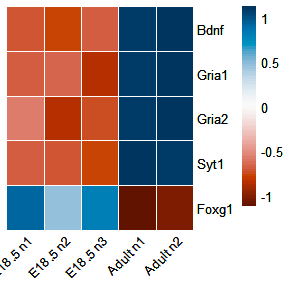

Hippocampus development genes: difference in expression between E18.5
and 6 week old WT mouse hippocampus (supplementary figure 4)
================

Packages

``` r
library(GeneOverlap)
library(clusterProfiler)
library(org.Mm.eg.db)
library(ggplot2)
library(ggvenn)
library(ggVennDiagram)
library(VennDiagram)
library(reshape2)
library(scales)
library(plyr)
library(pheatmap)
```

Read in the file (rlog normalised count table for the targets)

``` r
rlog.counts.age<-read.table("~/Integrative-multi-omics-analyses-of-FOXG1-functions/Input Files/Revision/Galaxy43-[hippocampus_target_genes_e18.5_and_adult_rlog_counts].tabular", 
                            sep="\t", header = TRUE, fill = FALSE,)
rlog.counts.age<- as.data.frame(rlog.counts.age)

rownames(rlog.counts.age) <- rlog.counts.age$SYMBOL
rlog.counts.age.m<- as.matrix(rlog.counts.age[,-1])
```

Plot heatmap

``` r
hipp.dev.heatmap<- pheatmap(rlog.counts.age.m, 
                            cluster_cols = FALSE, 
                            border_color = "white", 
                            cluster_rows = FALSE, 
                            clustering_distance_rows = "euclidean", 
                            color = hcl.colors(80, "RdBu", fixup = TRUE), 
                            scale = "row",
                            labels_col = c("E18.5 n1", "E18.5 n2","E18.5 n3", "Adult n1", "Adult n2"), 
                            angle_col = 45,
                            show_rownames = TRUE, 
                            fontsize = 10, 
                            fontsize_row = 10)
                                    
hipp.dev.heatmap
```



``` r
pdf("~/Integrative-multi-omics-analyses-of-FOXG1-functions/Output/Revision/developmental_genes_rlog_heatmap_chipqpcr_targets.pdf", 
    width=2.5, 
    height=2.5)
print(hipp.dev.heatmap)
dev.off()
```

    ## png 
    ##   2

``` r
sessionInfo()
```

    ## R version 4.2.0 (2022-04-22 ucrt)
    ## Platform: x86_64-w64-mingw32/x64 (64-bit)
    ## Running under: Windows 10 x64 (build 17763)
    ## 
    ## Matrix products: default
    ## 
    ## locale:
    ## [1] LC_COLLATE=English_Germany.1252  LC_CTYPE=English_Germany.1252   
    ## [3] LC_MONETARY=English_Germany.1252 LC_NUMERIC=C                    
    ## [5] LC_TIME=English_Germany.1252    
    ## 
    ## attached base packages:
    ## [1] grid      stats4    stats     graphics  grDevices utils     datasets 
    ## [8] methods   base     
    ## 
    ## other attached packages:
    ##  [1] pheatmap_1.0.12       plyr_1.8.8            scales_1.2.1         
    ##  [4] reshape2_1.4.4        VennDiagram_1.7.3     futile.logger_1.4.3  
    ##  [7] ggVennDiagram_1.2.2   ggvenn_0.1.9          dplyr_1.0.10         
    ## [10] ggplot2_3.4.0         org.Mm.eg.db_3.15.0   AnnotationDbi_1.58.0 
    ## [13] IRanges_2.30.1        S4Vectors_0.34.0      Biobase_2.56.0       
    ## [16] BiocGenerics_0.42.0   clusterProfiler_4.4.4 GeneOverlap_1.32.0   
    ## 
    ## loaded via a namespace (and not attached):
    ##   [1] fgsea_1.22.0           colorspace_2.0-3       ggtree_3.4.4          
    ##   [4] qvalue_2.28.0          XVector_0.36.0         aplot_0.1.9           
    ##   [7] rstudioapi_0.14        farver_2.1.1           graphlayouts_0.8.4    
    ##  [10] ggrepel_0.9.2          bit64_4.0.5            fansi_1.0.3           
    ##  [13] scatterpie_0.1.8       codetools_0.2-18       splines_4.2.0         
    ##  [16] cachem_1.0.6           GOSemSim_2.22.0        knitr_1.41            
    ##  [19] polyclip_1.10-4        jsonlite_1.8.3         GO.db_3.15.0          
    ##  [22] png_0.1-7              ggforce_0.4.1          compiler_4.2.0        
    ##  [25] httr_1.4.4             assertthat_0.2.1       Matrix_1.5-3          
    ##  [28] fastmap_1.1.0          lazyeval_0.2.2         cli_3.4.1             
    ##  [31] formatR_1.12           tweenr_2.0.2           htmltools_0.5.3       
    ##  [34] tools_4.2.0            igraph_1.3.5           gtable_0.3.1          
    ##  [37] glue_1.6.2             GenomeInfoDbData_1.2.8 DO.db_2.9             
    ##  [40] fastmatch_1.1-3        Rcpp_1.0.9             enrichplot_1.16.2     
    ##  [43] vctrs_0.5.1            Biostrings_2.64.1      ape_5.6-2             
    ##  [46] nlme_3.1-160           ggraph_2.1.0           xfun_0.35             
    ##  [49] stringr_1.4.1          lifecycle_1.0.3        gtools_3.9.3          
    ##  [52] DOSE_3.22.1            zlibbioc_1.42.0        MASS_7.3-58.1         
    ##  [55] tidygraph_1.2.2        parallel_4.2.0         lambda.r_1.2.4        
    ##  [58] RColorBrewer_1.1-3     yaml_2.3.6             memoise_2.0.1         
    ##  [61] gridExtra_2.3          downloader_0.4         ggfun_0.0.9           
    ##  [64] yulab.utils_0.0.5      stringi_1.7.8          RSQLite_2.2.19        
    ##  [67] highr_0.9              tidytree_0.4.1         caTools_1.18.2        
    ##  [70] BiocParallel_1.30.4    GenomeInfoDb_1.32.4    rlang_1.0.6           
    ##  [73] pkgconfig_2.0.3        bitops_1.0-7           evaluate_0.18         
    ##  [76] lattice_0.20-45        purrr_0.3.5            treeio_1.20.2         
    ##  [79] patchwork_1.1.2        shadowtext_0.1.2       bit_4.0.5             
    ##  [82] tidyselect_1.2.0       magrittr_2.0.3         R6_2.5.1              
    ##  [85] gplots_3.1.3           generics_0.1.3         DBI_1.1.3             
    ##  [88] pillar_1.8.1           withr_2.5.0            KEGGREST_1.36.3       
    ##  [91] RCurl_1.98-1.9         tibble_3.1.8           crayon_1.5.2          
    ##  [94] futile.options_1.0.1   KernSmooth_2.23-20     utf8_1.2.2            
    ##  [97] RVenn_1.1.0            rmarkdown_2.18         viridis_0.6.2         
    ## [100] data.table_1.14.6      blob_1.2.3             digest_0.6.30         
    ## [103] tidyr_1.2.1            gridGraphics_0.5-1     munsell_0.5.0         
    ## [106] viridisLite_0.4.1      ggplotify_0.1.0
